# 宝藏问题

- **作者**：b站**海安雨**。
- **使用方法**：点击**宝藏论文链接大全**文件夹可阅读所有论文，点击**观看视频**可跳转到b站视频。
- **下载方式**：点击右上角的`<>code`按钮，选择`Download Zip`。或直接`git clone`。
- **迄今为止**：已经整理了**148**个宝藏问题`手稿`和**95**篇宝藏论文的`参考文献`。

## 每天一个宝藏问题

### 171. 如何可视化 DeepSeek MLA（简化版）？【每天一个宝藏问题】
- 观看视频：[视频BV1MRTd6bEbH](https://www.bilibili.com/video/BV1MRTd6bEbH)
- 查看手稿：[图片BV1MRTd6bEbH](./assets/questions/BV1MRTd6bEbH.jpg)

[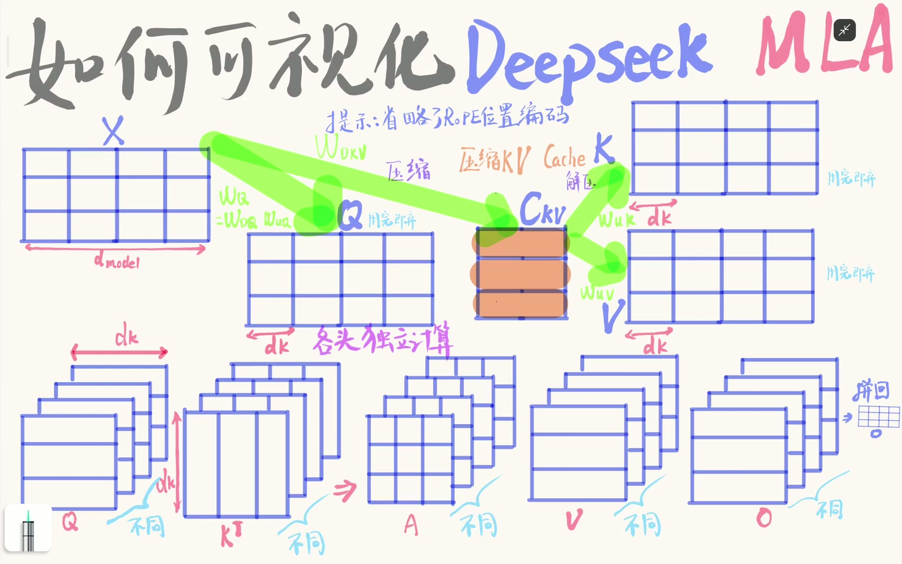](https://www.bilibili.com/video/BV1MRTd6bEbH)
---

### 170. vLLM 投机解码首token合并 prefill 这个小技巧是怎么来的？【每天一个宝藏问题】
- 观看视频：[视频BV1hETD6mERB](https://www.bilibili.com/video/BV1hETD6mERB)
- 查看手稿：[图片BV1hETD6mERB](./assets/questions/BV1hETD6mERB.jpg)

[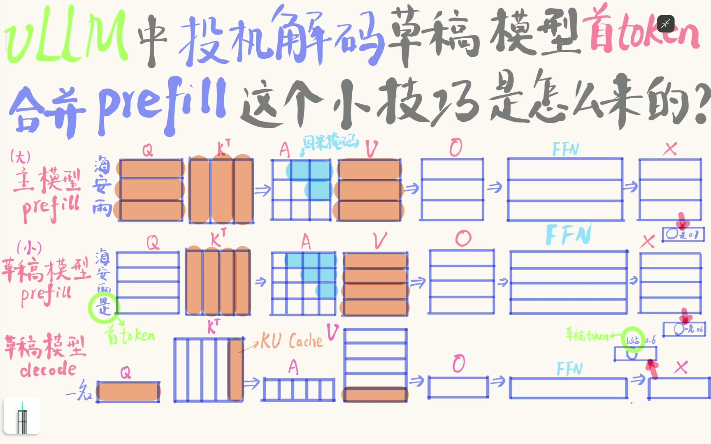](https://www.bilibili.com/video/BV1hETD6mERB)
---

### 169. MTP为什么能一次预测多个未来 token？【每天一个宝藏问题】
- 观看视频：[视频BV1aDMu6BEDb](https://www.bilibili.com/video/BV1aDMu6BEDb)
- 查看手稿：[图片BV1aDMu6BEDb](./assets/questions/BV1aDMu6BEDb.jpg)

[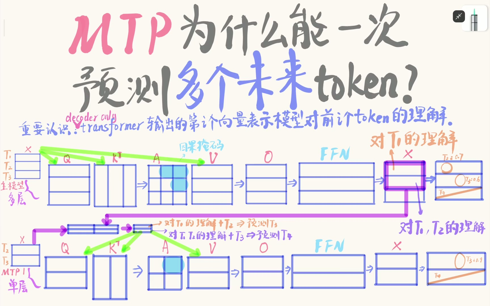](https://www.bilibili.com/video/BV1aDMu6BEDb)
---

### 168. Megatron张量并行如何用列切分加行切分降低FFN层的通信？【每天一个宝藏问题】
- 观看视频：[视频BV1zTMP6YEqg](https://www.bilibili.com/video/BV1zTMP6YEqg)
- 查看手稿：[图片BV1zTMP6YEqg](./assets/questions/BV1zTMP6YEqg.jpg)

[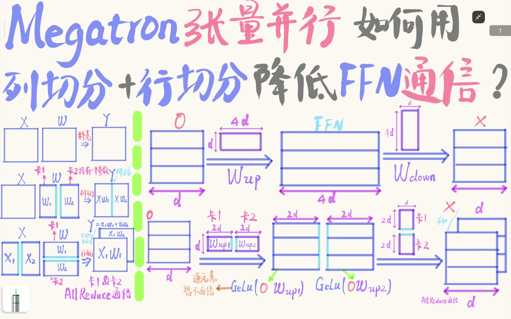](https://www.bilibili.com/video/BV1zTMP6YEqg)
---

### 167. 为什么KL散度非负和信息熵是最优码长这两件事是等价的？【每天一个宝藏问题】
- 观看视频：[视频BV1fTMP6YEtZ](https://www.bilibili.com/video/BV1fTMP6YEtZ)
- 查看手稿：[图片BV1fTMP6YEtZ](./assets/questions/BV1fTMP6YEtZ.jpg)

[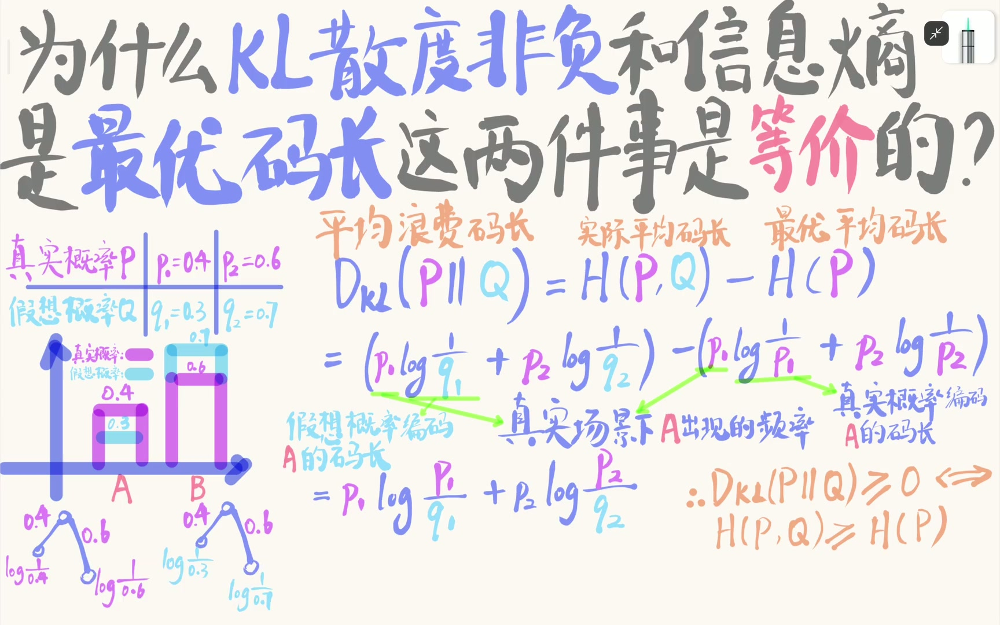](https://www.bilibili.com/video/BV1fTMP6YEtZ)
---

### 166. 如何用双缓冲优化GEMM？【每天一个宝藏问题】
- 观看视频：[视频BV1WzMP6rEN6](https://www.bilibili.com/video/BV1WzMP6rEN6)
- 查看手稿：[图片BV1WzMP6rEN6](./assets/questions/BV1WzMP6rEN6.jpg)

[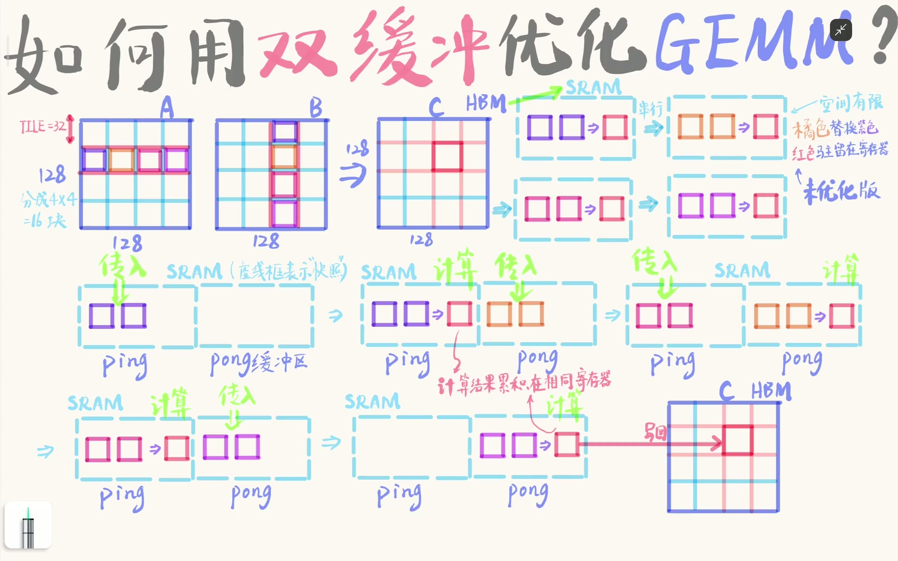](https://www.bilibili.com/video/BV1WzMP6rEN6)
---

### 165. 残差连接在Transformer反向传播中可视化出来是什么样的？【每天一个宝藏问题】
- 观看视频：[视频BV1AzMP6kE62](https://www.bilibili.com/video/BV1AzMP6kE62)
- 查看手稿：[图片BV1AzMP6kE62](./assets/questions/BV1AzMP6kE62.jpg)

[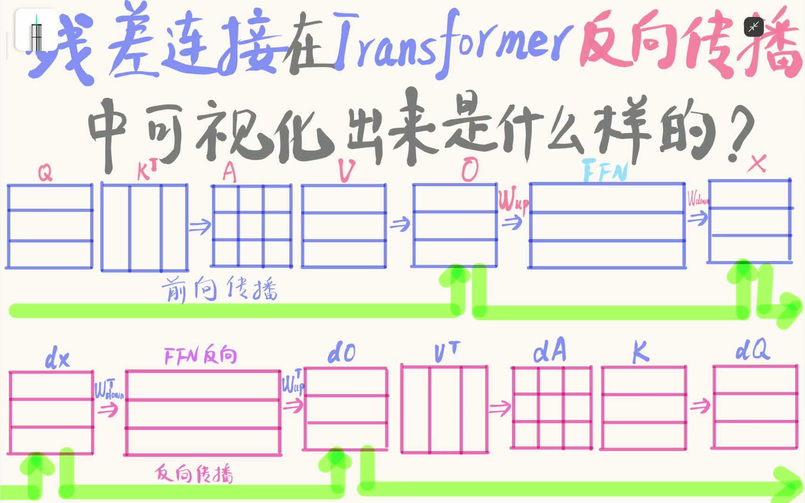](https://www.bilibili.com/video/BV1AzMP6kE62)
---

### 164. 为什么环形All-Reduce 时，4卡和128卡单卡通信量差不多？【每天一个宝藏问题】
- 观看视频：[视频BV1AzMP6rE61](https://www.bilibili.com/video/BV1AzMP6rE61)
- 查看手稿：[图片BV1AzMP6rE61](./assets/questions/BV1AzMP6rE61.jpg)

[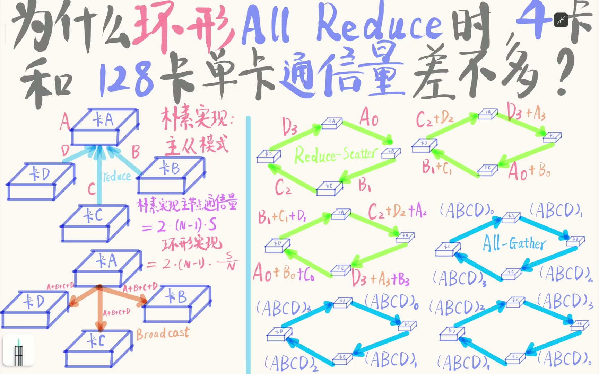](https://www.bilibili.com/video/BV1AzMP6rE61)
---

### 163. 张量并行中的列并行和行并行是如何切分W和X矩阵的？【每天一个宝藏问题】
- 观看视频：[视频BV1rJTb6qEYr](https://www.bilibili.com/video/BV1rJTb6qEYr)
- 查看手稿：[图片BV1rJTb6qEYr](./assets/questions/BV1rJTb6qEYr.jpg)

[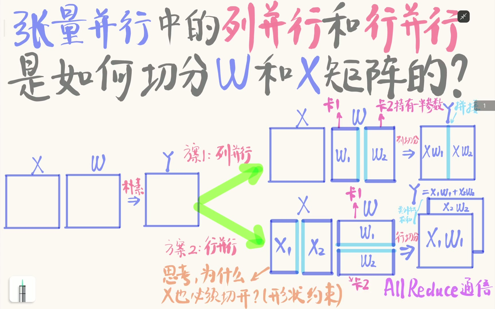](https://www.bilibili.com/video/BV1rJTb6qEYr)
---

### 162. 如何可视化GEMM？【每天一个宝藏问题】
- 观看视频：[视频BV1tWTj6jEGU](https://www.bilibili.com/video/BV1tWTj6jEGU)
- 查看手稿：[图片BV1tWTj6jEGU](./assets/questions/BV1tWTj6jEGU.jpg)

[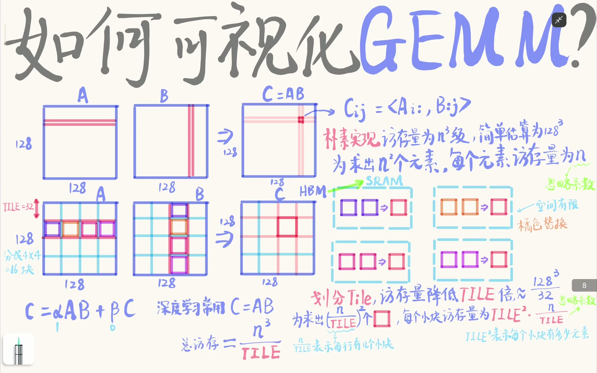](https://www.bilibili.com/video/BV1tWTj6jEGU)
---

### 161. MoE每个token都要选专家，那prefill要如何并行？【每天一个宝藏问题】
- 观看视频：[视频BV1foTi6sEyH](https://www.bilibili.com/video/BV1foTi6sEyH)
- 查看手稿：[图片BV1foTi6sEyH](./assets/questions/BV1foTi6sEyH.jpg)

[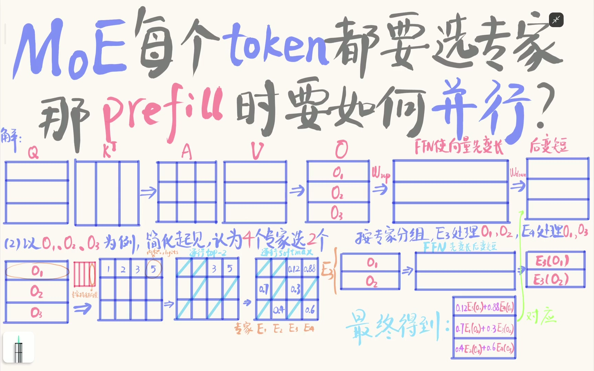](https://www.bilibili.com/video/BV1foTi6sEyH)
---

### 160. 如何对注意力头剪枝？【每天一个宝藏问题】
- 观看视频：[视频BV1YCTY6qEMZ](https://www.bilibili.com/video/BV1YCTY6qEMZ)
- 查看手稿：[图片BV1YCTY6qEMZ](./assets/questions/BV1YCTY6qEMZ.jpg)

[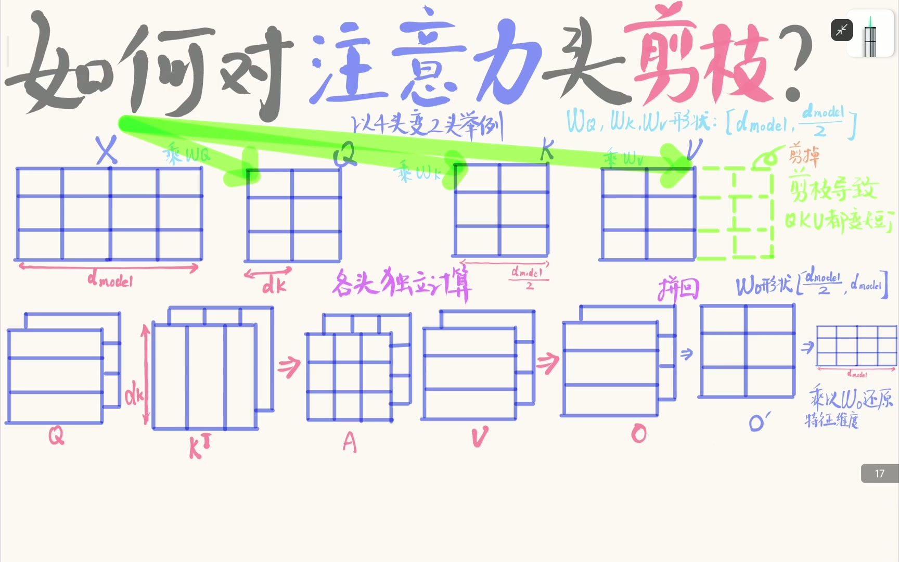](https://www.bilibili.com/video/BV1YCTY6qEMZ)
---

### 159. 如何可视化MTP？【每天一个宝藏问题】
- 观看视频：[视频BV1rtTc6tEqd](https://www.bilibili.com/video/BV1rtTc6tEqd)
- 查看手稿：[图片BV1rtTc6tEqd](./assets/questions/BV1rtTc6tEqd.jpg)

[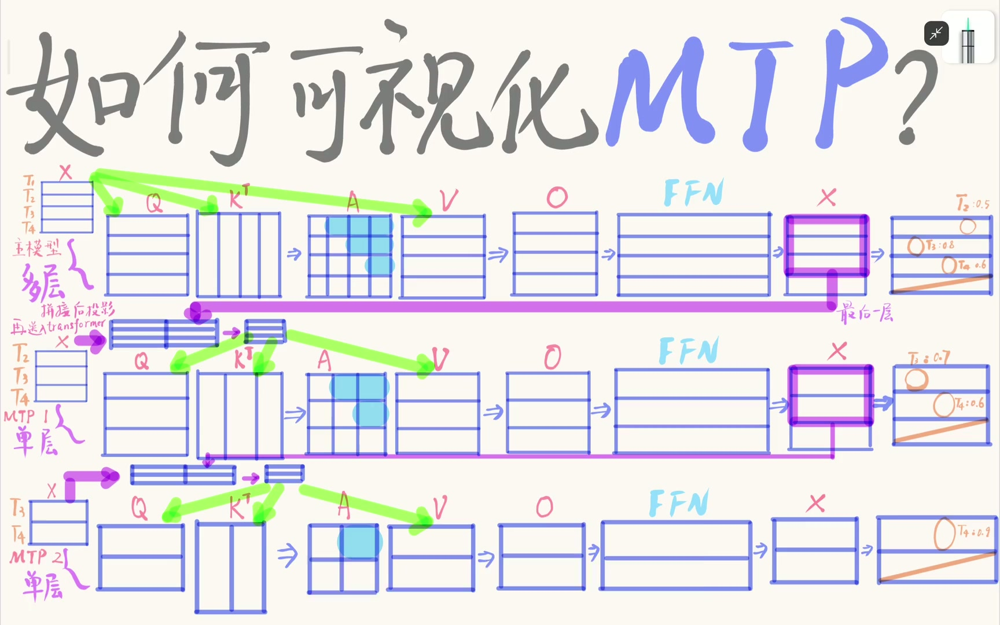](https://www.bilibili.com/video/BV1rtTc6tEqd)
---

### 158. 最简单的含RoPE的Transformer可视化有多简单？【每天一个宝藏问题】
- 观看视频：[视频BV18e7p6FEeD](https://www.bilibili.com/video/BV18e7p6FEeD)
- 查看手稿：[图片BV18e7p6FEeD](./assets/questions/BV18e7p6FEeD.jpg)

[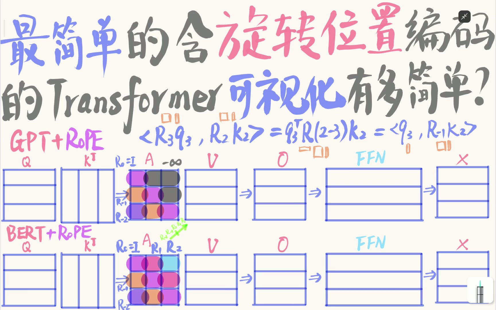](https://www.bilibili.com/video/BV18e7p6FEeD)
---

### 157. 为什么Adam除以√vt让稳定的梯度项归一化，振荡的梯度项归零化【每天一个宝藏问题】
- 观看视频：[视频BV13e7p6cEF4](https://www.bilibili.com/video/BV13e7p6cEF4)
- 查看手稿：[图片BV13e7p6cEF4](./assets/questions/BV13e7p6cEF4.jpg)

[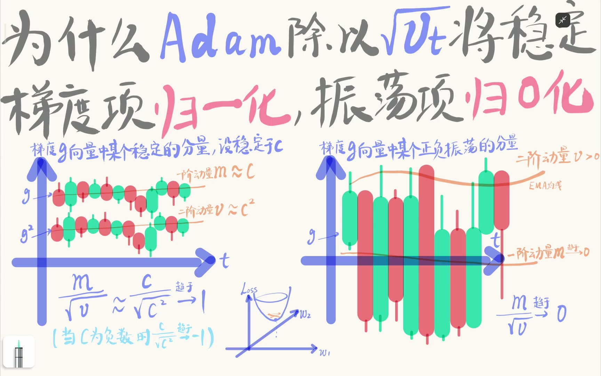](https://www.bilibili.com/video/BV13e7p6cEF4)
---

### 156. 最简单的transformer反向传播可视化能有多简单？【每天一个宝藏问题】
- 观看视频：[视频BV18e7p6FE1J](https://www.bilibili.com/video/BV18e7p6FE1J)
- 查看手稿：[图片BV18e7p6FE1J](./assets/questions/BV18e7p6FE1J.jpg)

[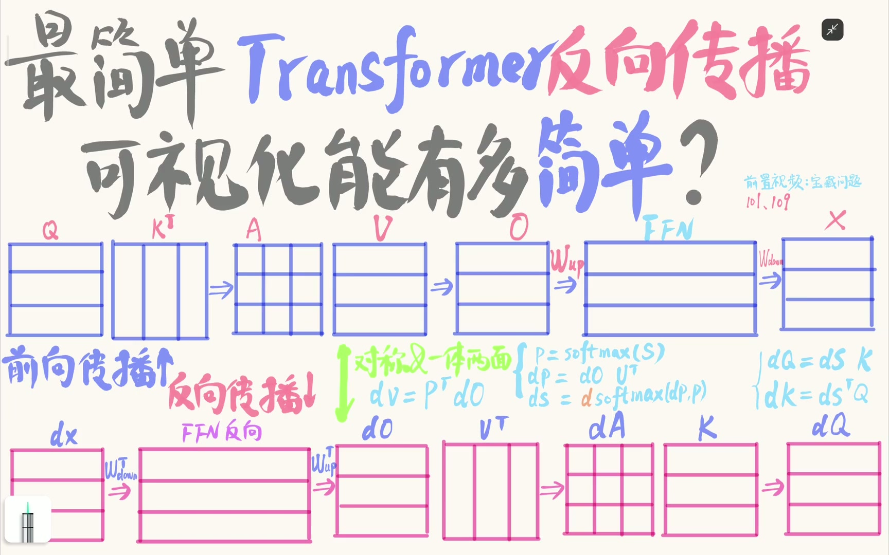](https://www.bilibili.com/video/BV18e7p6FE1J)
---

### 155. 为什么信息熵=最优码长，交叉熵=实际码长，KL散度=浪费码长【每天一个宝藏问题】
- 观看视频：[视频BV18e7p6FEZ1](https://www.bilibili.com/video/BV18e7p6FEZ1)
- 查看手稿：[图片BV18e7p6FEZ1](./assets/questions/BV18e7p6FEZ1.jpg)

[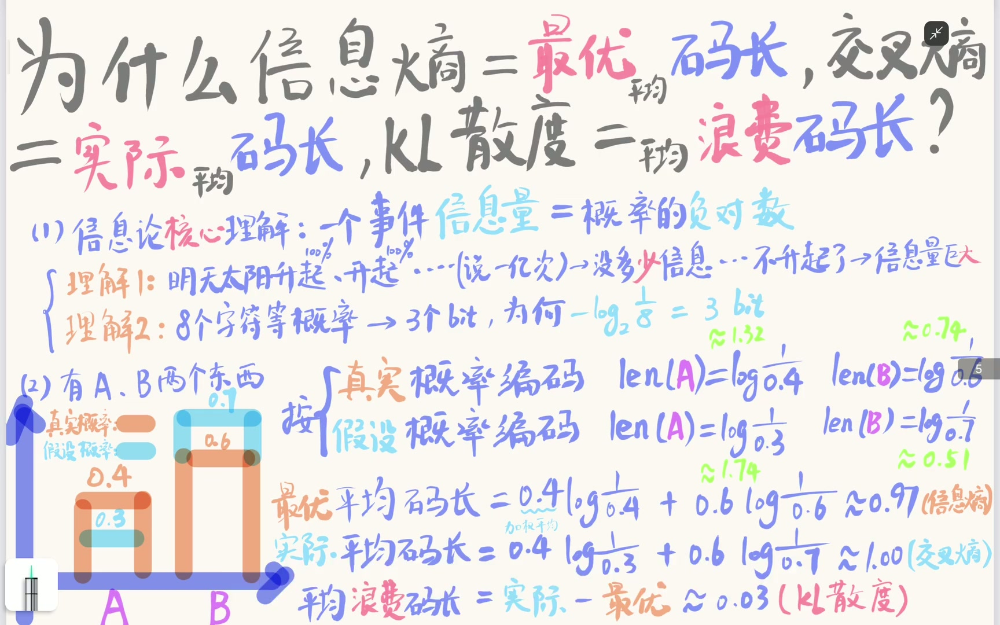](https://www.bilibili.com/video/BV18e7p6FEZ1)
---

### 154. 为什么投机解码确保每轮至少产出一个 token？【每天一个宝藏问题】
- 观看视频：[视频BV1De7p6FEL3](https://www.bilibili.com/video/BV1De7p6FEL3)
- 查看手稿：[图片BV1De7p6FEL3](./assets/questions/BV1De7p6FEL3.jpg)

[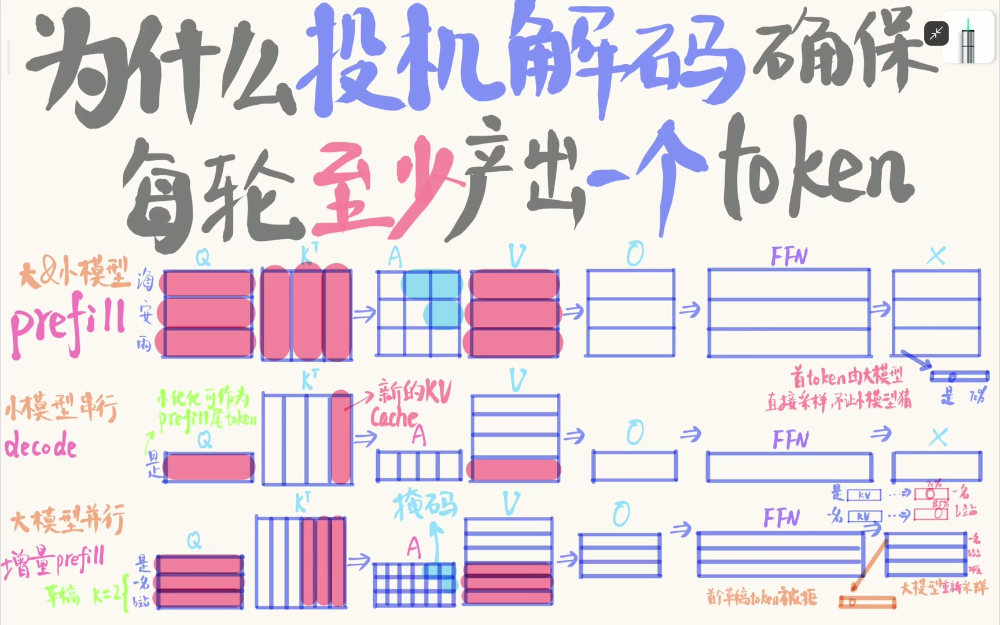](https://www.bilibili.com/video/BV1De7p6FEL3)
---

### 153. 从等比数列求和理解Adam优化器训练初期动量修正【每天一个宝藏问题】
- 观看视频：[视频BV1he7p6FEp1](https://www.bilibili.com/video/BV1he7p6FEp1)
- 查看手稿：[图片BV1he7p6FEp1](./assets/questions/BV1he7p6FEp1.jpg)

[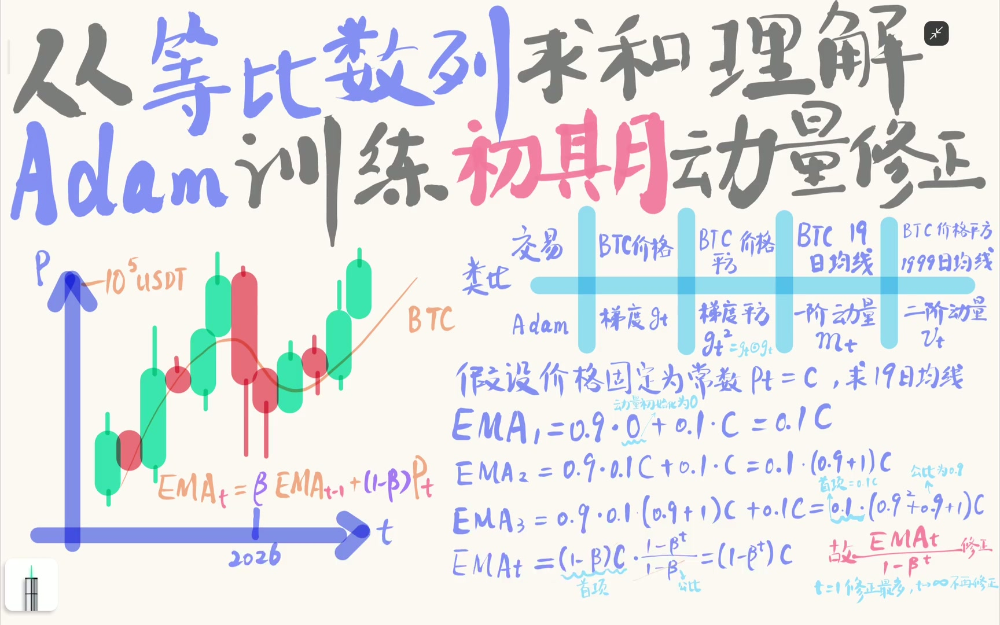](https://www.bilibili.com/video/BV1he7p6FEp1)
---

### 152. 为什么前向残差连接对应反向残差连接【每天一个宝藏问题】
- 观看视频：[视频BV1bv7p6bEeG](https://www.bilibili.com/video/BV1bv7p6bEeG)
- 查看手稿：[图片BV1bv7p6bEeG](./assets/questions/BV1bv7p6bEeG.jpg)

[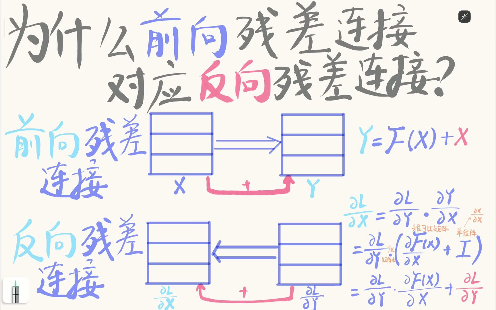](https://www.bilibili.com/video/BV1bv7p6bEeG)
---

### 151. 如何可视化MQA？【每天一个宝藏问题】
- 观看视频：[视频BV1gAj36ZEmj](https://www.bilibili.com/video/BV1gAj36ZEmj)
- 查看手稿：[图片BV1gAj36ZEmj](./assets/questions/BV1gAj36ZEmj.jpg)

[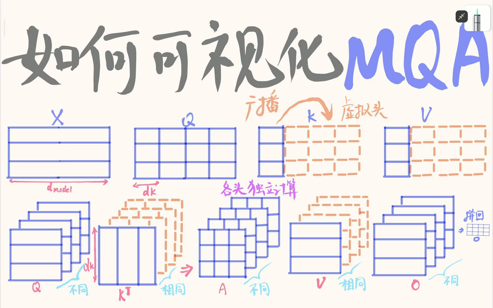](https://www.bilibili.com/video/BV1gAj36ZEmj)
---

### 150. 对比注意力池和注意力温度对注意力汇聚有什么影响？【每天一个宝藏问题】
- 观看视频：[视频BV1hAj36ZE8a](https://www.bilibili.com/video/BV1hAj36ZE8a)
- 查看手稿：[图片BV1hAj36ZE8a](./assets/questions/BV1hAj36ZE8a.jpg)

[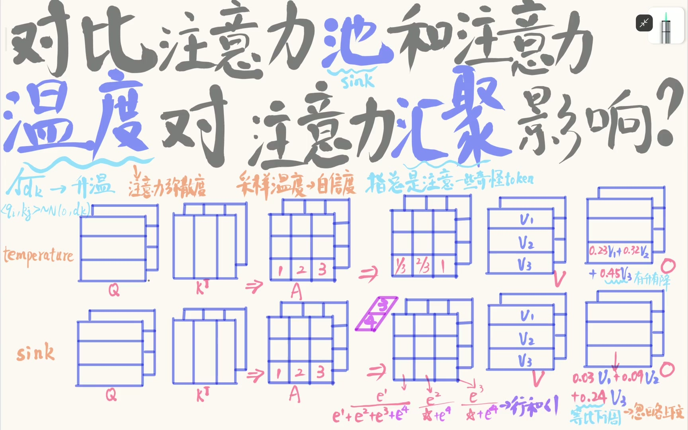](https://www.bilibili.com/video/BV1hAj36ZE8a)
---

### 149. 为什么投机解码最多可以比K个Token多生成一个Token？【每天一个宝藏问题】
- 观看视频：[视频BV1gAj36ZEY3](https://www.bilibili.com/video/BV1gAj36ZEY3)
- 查看手稿：[图片BV1gAj36ZEY3](./assets/questions/BV1gAj36ZEY3.jpg)

[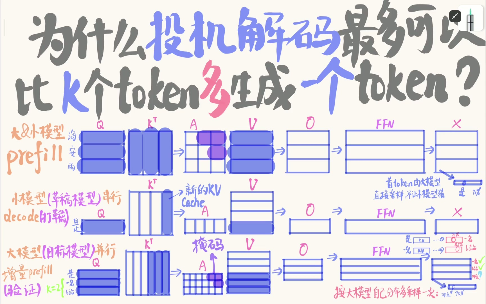](https://www.bilibili.com/video/BV1gAj36ZEY3)
---

### 148. 超连接中的连边和感知机的连边有何异同？【每天一个宝藏问题】
- 观看视频：[视频BV1DAj36ZEZD](https://www.bilibili.com/video/BV1DAj36ZEZD)
- 查看手稿：[图片BV1DAj36ZEZD](./assets/questions/BV1DAj36ZEZD.jpg)

[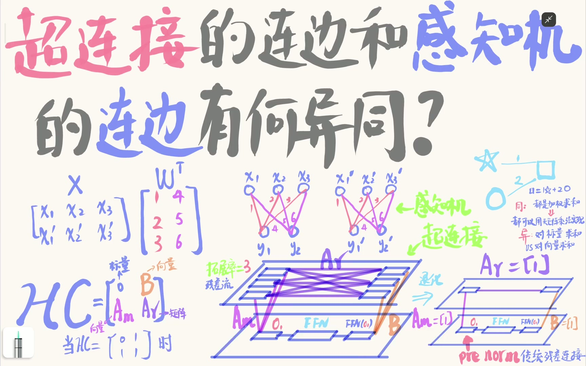](https://www.bilibili.com/video/BV1DAj36ZEZD)
---

### 147. 如何直观理解RoPE的平移不变性【每天一个宝藏问题】
- 观看视频：[视频BV18Aj36ZEZP](https://www.bilibili.com/video/BV18Aj36ZEZP)
- 查看手稿：[图片BV18Aj36ZEZP](./assets/questions/BV18Aj36ZEZP.jpg)

[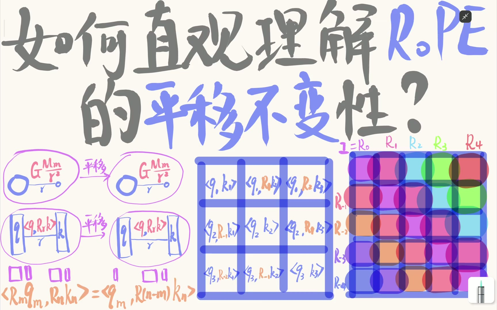](https://www.bilibili.com/video/BV18Aj36ZEZP)
---

### 146. 能否有一种方法同时可视化注意力的前向和反向传播？【每天一个宝藏问题】
- 观看视频：[视频BV1gAj36ZEUA](https://www.bilibili.com/video/BV1gAj36ZEUA)
- 查看手稿：[图片BV1gAj36ZEUA](./assets/questions/BV1gAj36ZEUA.jpg)

[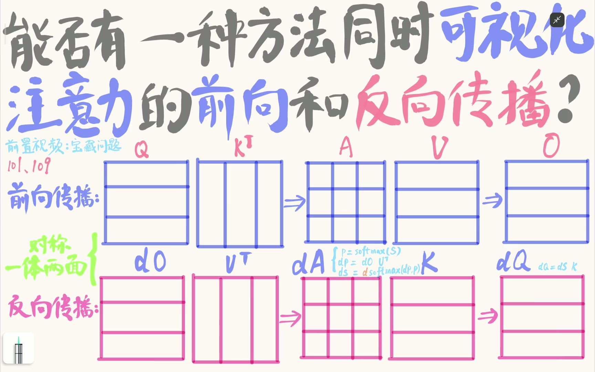](https://www.bilibili.com/video/BV1gAj36ZEUA)
---

### 145. 从prefill和decode角度理解投机解码何以加速？【每天一个宝藏问题】
- 观看视频：[视频BV1hAj36ZE7E](https://www.bilibili.com/video/BV1hAj36ZE7E)
- 查看手稿：[图片BV1hAj36ZE7E](./assets/questions/BV1hAj36ZE7E.jpg)

[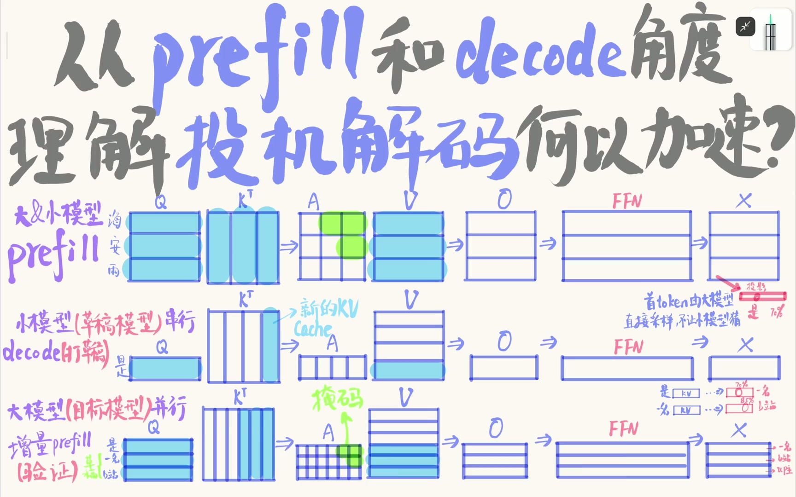](https://www.bilibili.com/video/BV1hAj36ZE7E)
---

### 144. 如何可视化Transformer的残差连接？【每天一个宝藏问题】
- 观看视频：[视频BV1DAj36ZE2E](https://www.bilibili.com/video/BV1DAj36ZE2E)
- 查看手稿：[图片BV1DAj36ZE2E](./assets/questions/BV1DAj36ZE2E.jpg)

---

### 143. 如何可视化SGLang中的KV Cache？【每天一个宝藏问题】
- 观看视频：[视频BV13Aj36ZEcC](https://www.bilibili.com/video/BV13Aj36ZEcC)
- 查看手稿：[图片BV13Aj36ZEcC](./assets/questions/BV13Aj36ZEcC.jpg)

[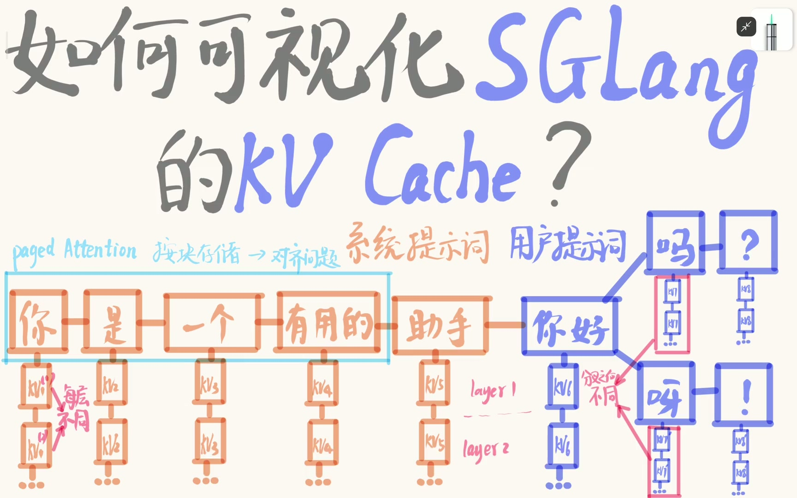](https://www.bilibili.com/video/BV13Aj36ZEcC)
---

### 142. 如何可视化前馈网络｜线性层的反向传播？【每天一个宝藏问题】
- 观看视频：[视频BV1gAj36ZELC](https://www.bilibili.com/video/BV1gAj36ZELC)
- 查看手稿：[图片BV1gAj36ZELC](./assets/questions/BV1gAj36ZELC.jpg)

[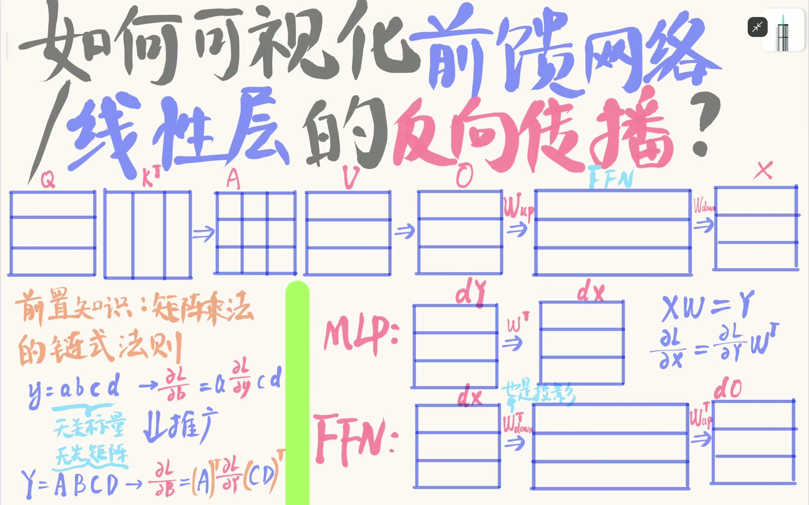](https://www.bilibili.com/video/BV1gAj36ZELC)
---

### 141. 多轮对话中Decode之后还要增量Prefill，那新的KV如何并入KV Cache？【每天一个宝藏问题】
- 观看视频：[视频BV1zCjg6rE9F](https://www.bilibili.com/video/BV1zCjg6rE9F)
- 查看手稿：[图片BV1zCjg6rE9F](./assets/questions/BV1zCjg6rE9F.jpg)

[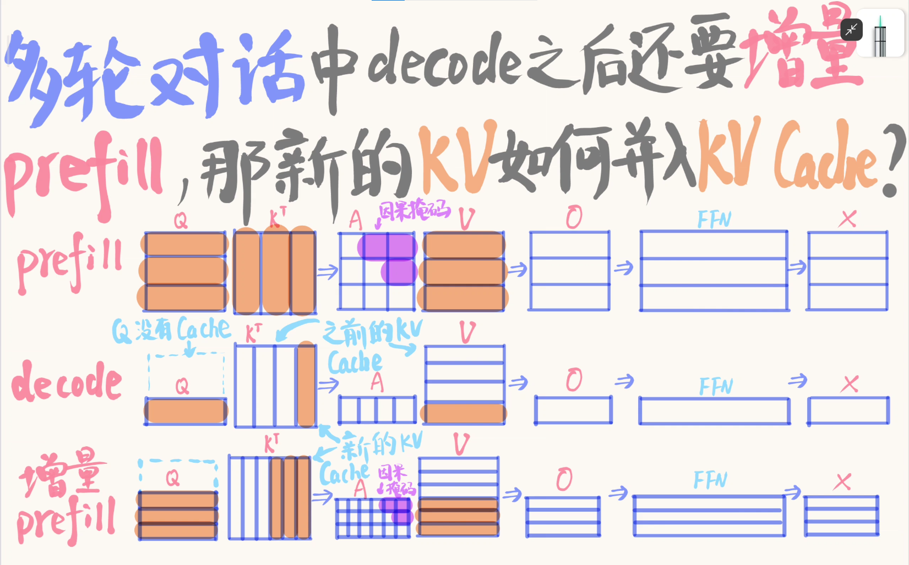](https://www.bilibili.com/video/BV1zCjg6rE9F)
---

### 140. 稀疏矩阵乘稠密向量SpMV是如何跳过0值计算的？【每天一个宝藏问题】
- 观看视频：[视频BV1AG7m6HEEW](https://www.bilibili.com/video/BV1AG7m6HEEW)
- 查看手稿：[图片BV1AG7m6HEEW](./assets/questions/BV1AG7m6HEEW.jpg)

[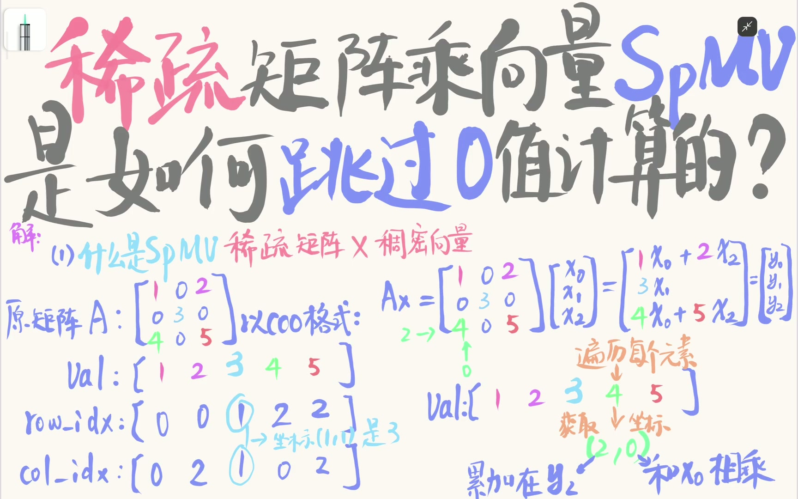](https://www.bilibili.com/video/BV1AG7m6HEEW)
---

### 139. 为什么传统残差连接是mhc残差流扩展率=1 的特例？【每天一个宝藏问题】
- 观看视频：[视频BV1zRVE6sExg](https://www.bilibili.com/video/BV1zRVE6sExg)
- 查看手稿：[图片BV1zRVE6sExg](./assets/questions/BV1zRVE6sExg.jpg)

[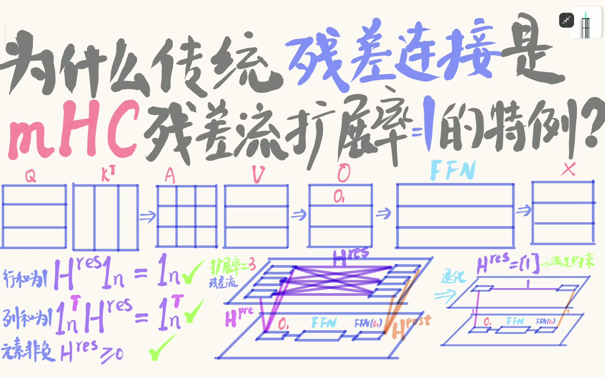](https://www.bilibili.com/video/BV1zRVE6sExg)
---

### 138. 如何可视化含RoPE的注意力分数矩阵【每天一个宝藏问题】
- 观看视频：[视频BV1FRVE6xEap](https://www.bilibili.com/video/BV1FRVE6xEap)
- 查看手稿：[图片BV1FRVE6xEap](./assets/questions/BV1FRVE6xEap.jpg)

[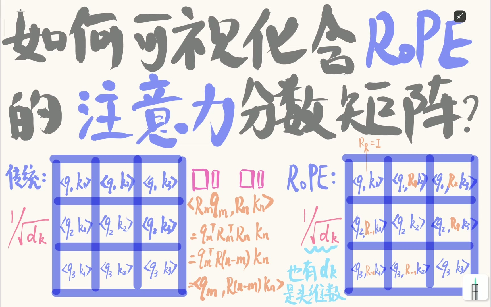](https://www.bilibili.com/video/BV1FRVE6xEap)
---

### 137. HC=？会让超连接退化为preNorm传统残差连接？【每天一个宝藏问题】
- 观看视频：[视频BV1zRVE6sE2x](https://www.bilibili.com/video/BV1zRVE6sE2x)
- 查看手稿：[图片BV1zRVE6sE2x](./assets/questions/BV1zRVE6sE2x.jpg)

[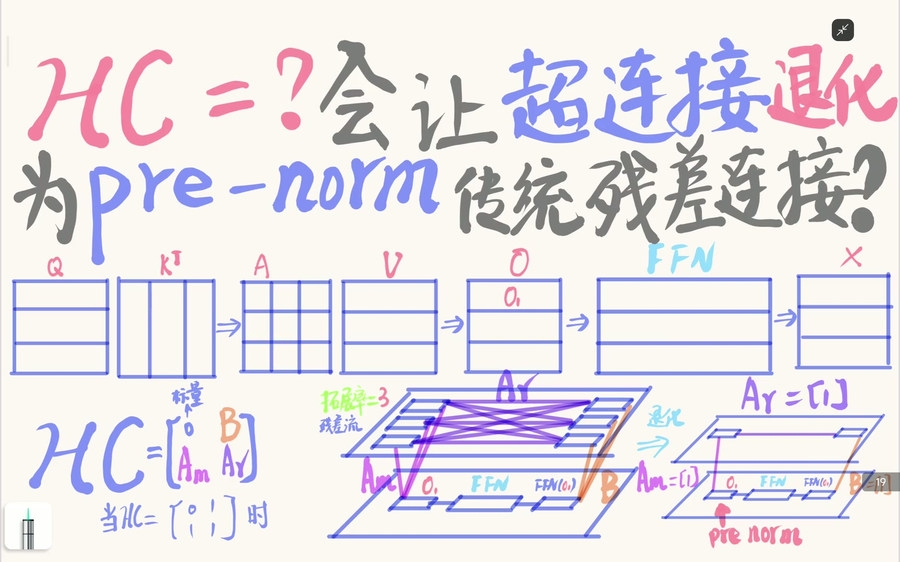](https://www.bilibili.com/video/BV1zRVE6sE2x)
---

### 136. BERT和GPT的可视化有多像？【每天一个宝藏问题】
- 观看视频：[视频BV1LsG26dEuq](https://www.bilibili.com/video/BV1LsG26dEuq)
- 查看手稿：[图片BV1LsG26dEuq](./assets/questions/BV1LsG26dEuq.jpg)

[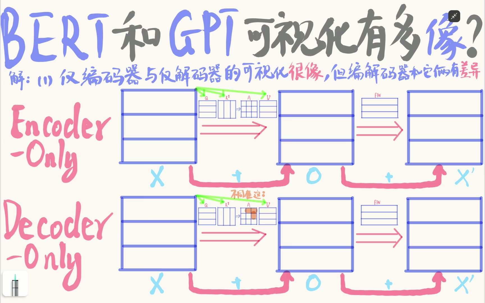](https://www.bilibili.com/video/BV1LsG26dEuq)
---

### 135. 如何直观理解超连接中的残差流？【每天一个宝藏问题】
- 观看视频：[视频BV1bGVK6iE2B](https://www.bilibili.com/video/BV1bGVK6iE2B)
- 查看手稿：[图片BV1bGVK6iE2B](./assets/questions/BV1bGVK6iE2B.jpg)

[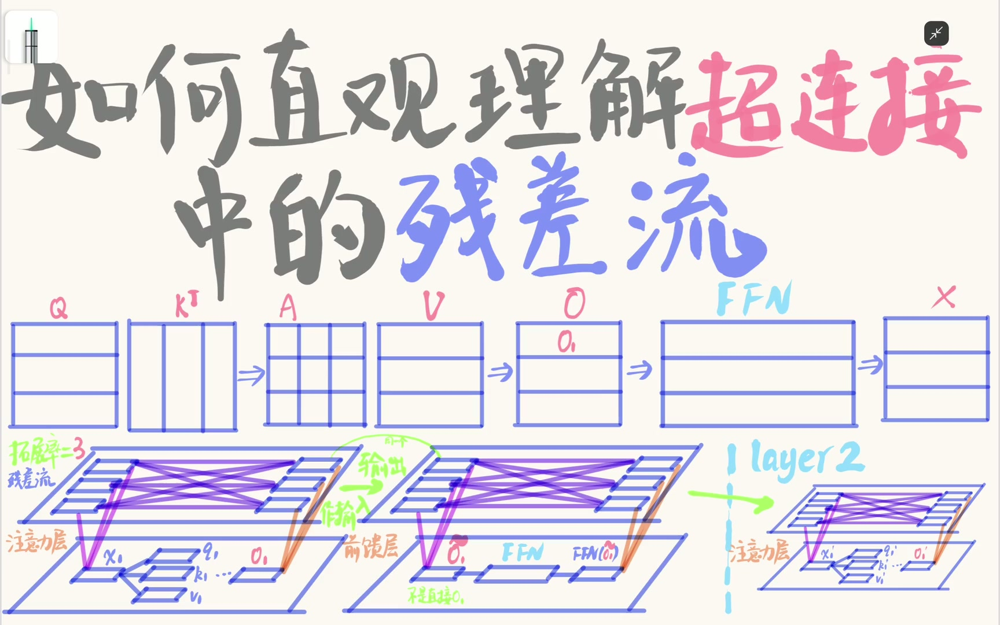](https://www.bilibili.com/video/BV1bGVK6iE2B)
---

### 134. 为什么RoPE中旋转矩阵R0是单位阵？【每天一个宝藏问题】
- 观看视频：[视频BV1UGVK6vEzn](https://www.bilibili.com/video/BV1UGVK6vEzn)
- 查看手稿：[图片BV1UGVK6vEzn](./assets/questions/BV1UGVK6vEzn.jpg)

[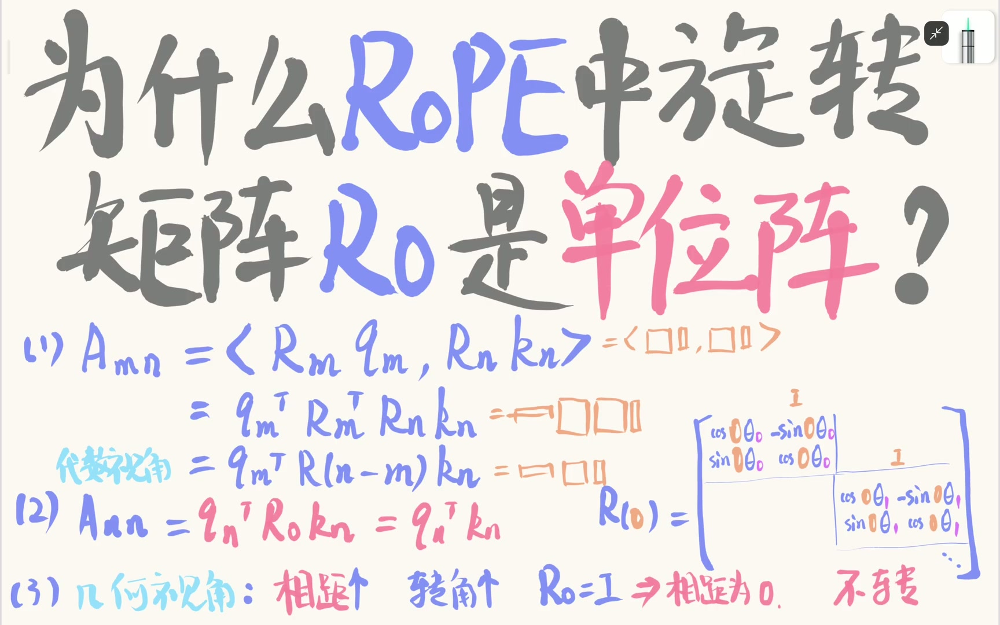](https://www.bilibili.com/video/BV1UGVK6vEzn)
---

### 133. 如何可视化超连接？【每天一个宝藏问题】
- 观看视频：[视频BV1h1GE6BEMm](https://www.bilibili.com/video/BV1h1GE6BEMm)
- 查看手稿：[图片BV1h1GE6BEMm](./assets/questions/BV1h1GE6BEMm.jpg)

[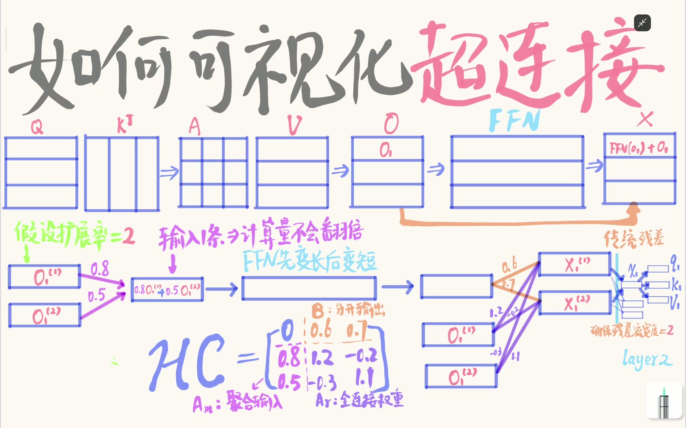](https://www.bilibili.com/video/BV1h1GE6BEMm)
---

### 132. 为什么只用柱状图就能证明投机解码是无损的？【每天一个宝藏问题】
- 观看视频：[视频BV1UHGB6REeL](https://www.bilibili.com/video/BV1UHGB6REeL)
- 查看手稿：[图片BV1UHGB6REeL](./assets/questions/BV1UHGB6REeL.jpg)

---

### 131. 折扣因子γ是如何改变未来的奖励重要程度的？【每天一个宝藏问题】
- 观看视频：[视频BV1AtGe6KEuk](https://www.bilibili.com/video/BV1AtGe6KEuk)
- 查看手稿：[图片BV1AtGe6KEuk](./assets/questions/BV1AtGe6KEuk.jpg)

[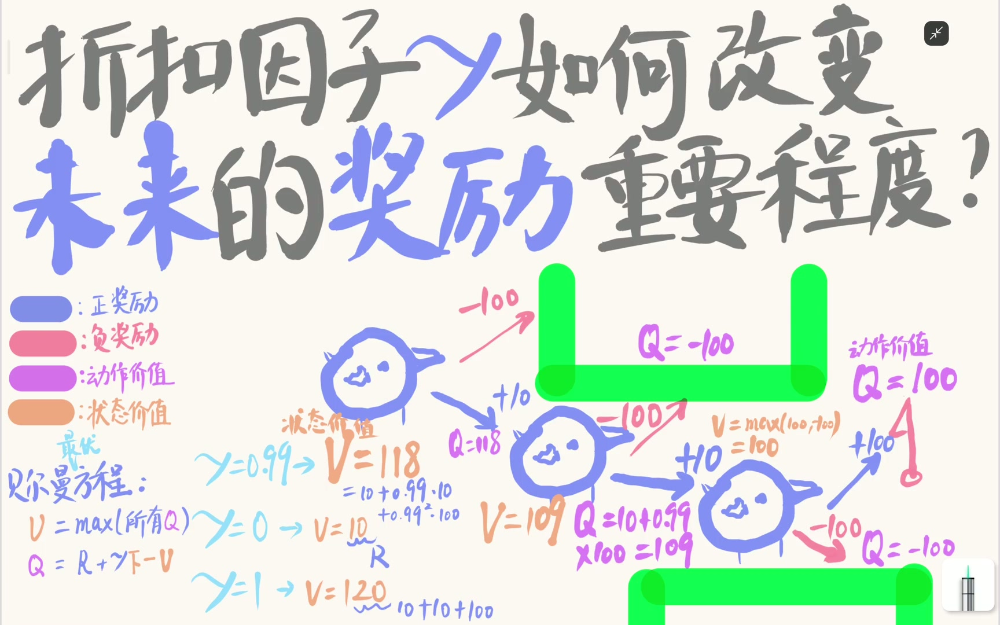](https://www.bilibili.com/video/BV1AtGe6KEuk)
---

### 130. 如何从概率树理解投机解码是无损的？【每天一个宝藏问题】
- 观看视频：[视频BV1ktGe6NEtg](https://www.bilibili.com/video/BV1ktGe6NEtg)
- 查看手稿：[图片BV1ktGe6NEtg](./assets/questions/BV1ktGe6NEtg.jpg)

[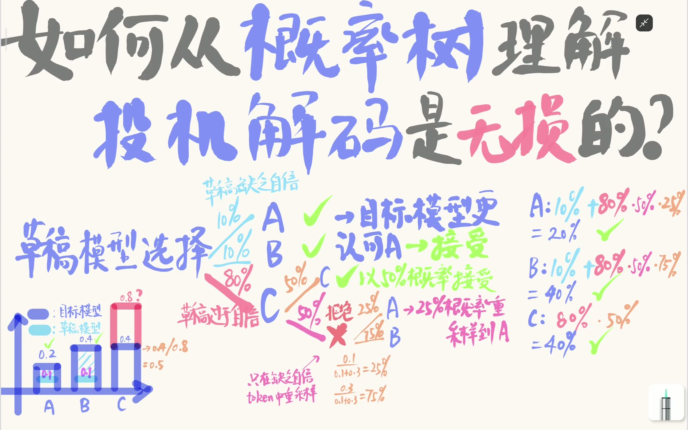](https://www.bilibili.com/video/BV1ktGe6NEtg)
---

### 129. 举例说明DPO论文里三行核心代码是啥意思？【每天一个宝藏问题】
- 观看视频：[视频BV1AtGe6KEbW](https://www.bilibili.com/video/BV1AtGe6KEbW)
- 查看手稿：[图片BV1AtGe6KEbW](./assets/questions/BV1AtGe6KEbW.jpg)

[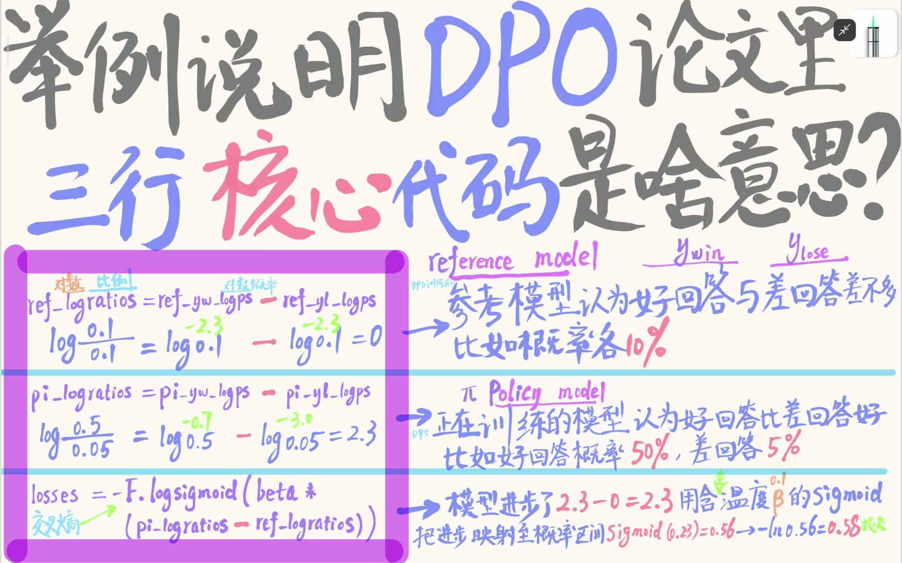](https://www.bilibili.com/video/BV1AtGe6KEbW)
---

### 128. 为什么4D并行的四个任务划分维度是正交的？【每天一个宝藏问题】
- 观看视频：[视频BV1ZzLC6bEbU](https://www.bilibili.com/video/BV1ZzLC6bEbU)
- 查看手稿：[图片BV1ZzLC6bEbU](./assets/questions/BV1ZzLC6bEbU.jpg)

[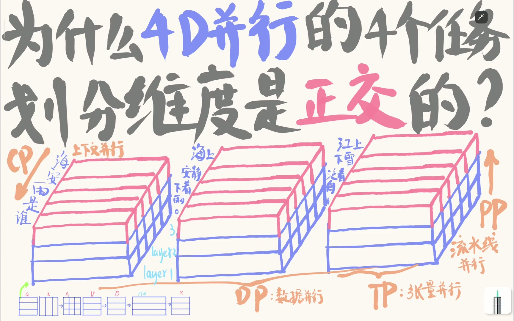](https://www.bilibili.com/video/BV1ZzLC6bEbU)
---

### 127. 为什么Adam优化器相当于在求19日EMA均线？【每天一个宝藏问题】
- 观看视频：[视频BV1FGLM6wEbm](https://www.bilibili.com/video/BV1FGLM6wEbm)
- 查看手稿：[图片BV1FGLM6wEbm](./assets/questions/BV1FGLM6wEbm.jpg)

[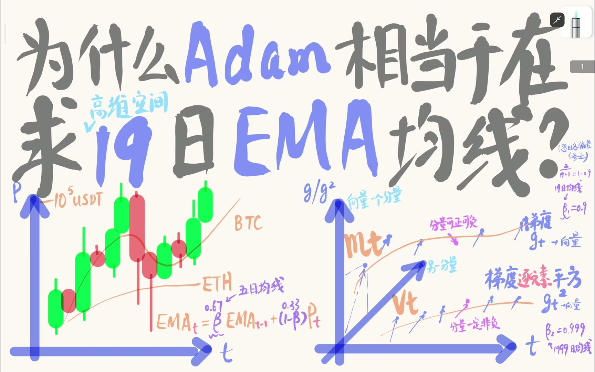](https://www.bilibili.com/video/BV1FGLM6wEbm)
---

### 126. 举例说明投机解码如何拒绝采样？【每天一个宝藏问题】
- 观看视频：[视频BV1EVLM6bEuU](https://www.bilibili.com/video/BV1EVLM6bEuU)
- 查看手稿：[图片BV1EVLM6bEuU](./assets/questions/BV1EVLM6bEuU.jpg)

[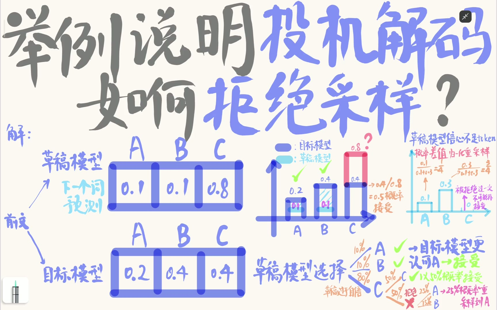](https://www.bilibili.com/video/BV1EVLM6bEuU)
---

### 125. 为什么Token数相同的批次未必是负载均衡的？以WLB LLM为例【每天一个宝藏问题】
- 观看视频：[视频BV1FXLJ6YEiX](https://www.bilibili.com/video/BV1FXLJ6YEiX)
- 查看手稿：[图片BV1FXLJ6YEiX](./assets/questions/BV1FXLJ6YEiX.jpg)

[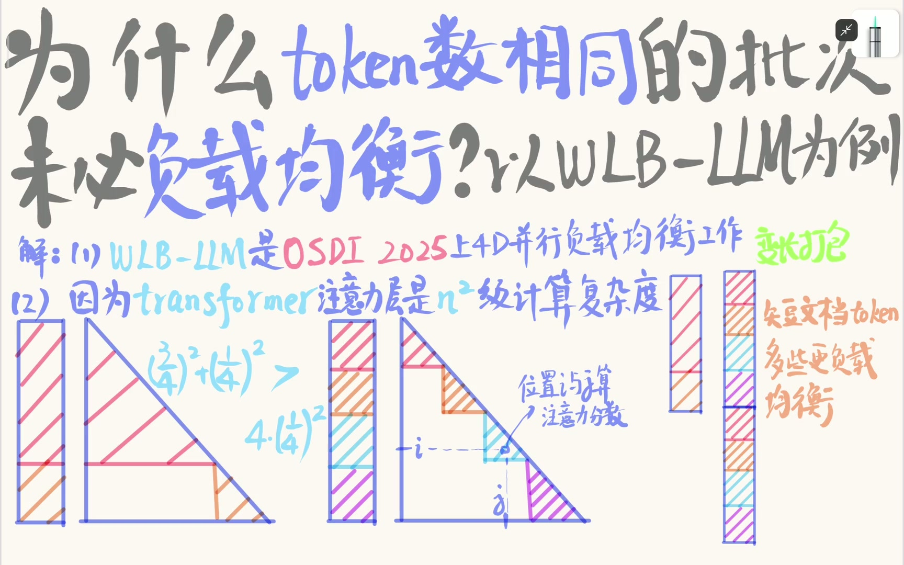](https://www.bilibili.com/video/BV1FXLJ6YEiX)
---

### 124. 训练时是如何恰好错开一个token的？【每天一个宝藏问题】
- 观看视频：[视频BV1FXLJ6YE1L](https://www.bilibili.com/video/BV1FXLJ6YE1L)
- 查看手稿：[图片BV1FXLJ6YE1L](./assets/questions/BV1FXLJ6YE1L.jpg)

[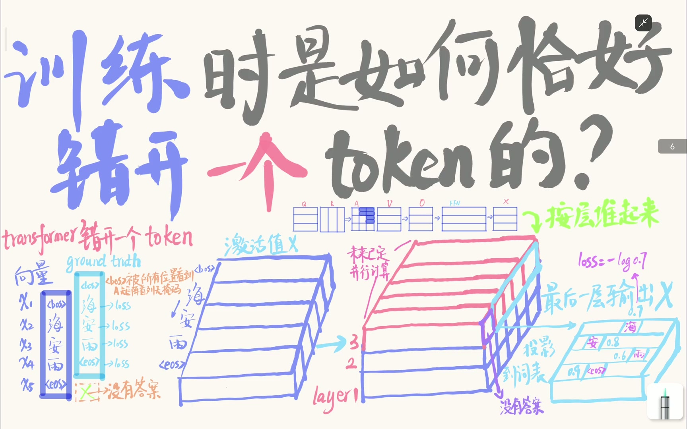](https://www.bilibili.com/video/BV1FXLJ6YE1L)
---

### 123. 如何用CPU内存的残差修正量化误差？以DecDEC为例【每天一个宝藏问题】
- 观看视频：[视频BV1FXLJ6YEEv](https://www.bilibili.com/video/BV1FXLJ6YEEv)
- 查看手稿：[图片BV1FXLJ6YEEv](./assets/questions/BV1FXLJ6YEEv.jpg)

[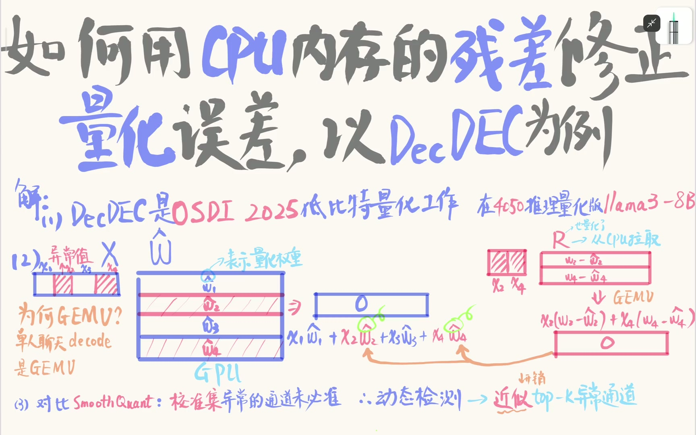](https://www.bilibili.com/video/BV1FXLJ6YEEv)
---

### 122. 为什么只有单个词嵌入就能构成二元语言模型？【每天一个宝藏问题】
- 观看视频：[视频BV1FXLJ6YEwC](https://www.bilibili.com/video/BV1FXLJ6YEwC)
- 查看手稿：[图片BV1FXLJ6YEwC](./assets/questions/BV1FXLJ6YEwC.jpg)

[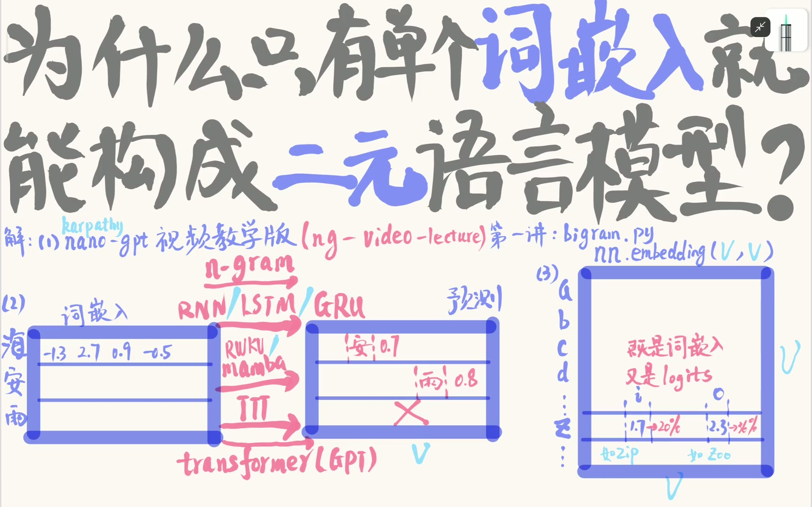](https://www.bilibili.com/video/BV1FXLJ6YEwC)
---

### 121. 为什么GQA是MQA过渡到MHA的插值？【每天一个宝藏问题】
- 观看视频：[视频BV16XLJ6YEVP](https://www.bilibili.com/video/BV16XLJ6YEVP)
- 查看手稿：[图片BV16XLJ6YEVP](./assets/questions/BV16XLJ6YEVP.jpg)

[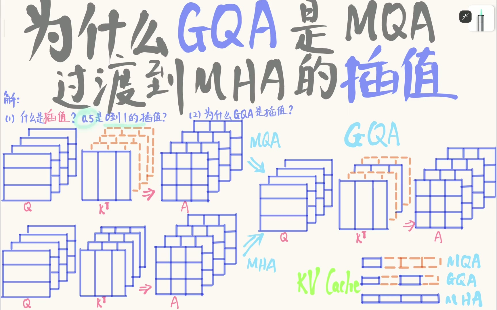](https://www.bilibili.com/video/BV16XLJ6YEVP)
---

### 120. 任意矩阵满足什么性质就能成为RoPE旋转矩阵？【每天一个宝藏问题】
- 观看视频：[视频BV1TN5b6YE5q](https://www.bilibili.com/video/BV1TN5b6YE5q)
- 查看手稿：[图片BV1TN5b6YE5q](./assets/questions/BV1TN5b6YE5q.jpg)

[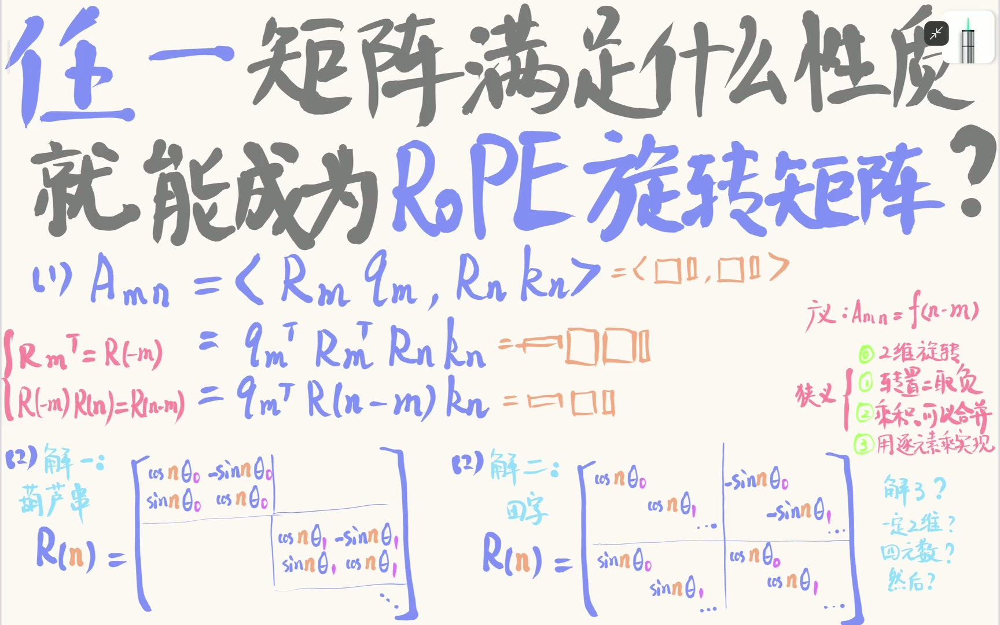](https://www.bilibili.com/video/BV1TN5b6YE5q)
---

### 119. 如何可视化多头注意力？【每天一个宝藏问题】
- 观看视频：[视频BV1235J6qENx](https://www.bilibili.com/video/BV1235J6qENx)
- 查看手稿：[图片BV1235J6qENx](./assets/questions/BV1235J6qENx.jpg)

[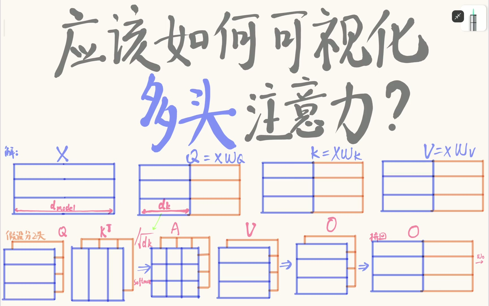](https://www.bilibili.com/video/BV1235J6qENx)
---

### 118. 为什么Deepseek V3不用辅助损失也能做到MoE负载均衡？【每天一个宝藏问题】
- 观看视频：[视频BV1MyRXBvEG1](https://www.bilibili.com/video/BV1MyRXBvEG1)
- 查看手稿：[图片BV1MyRXBvEG1](./assets/questions/BV1MyRXBvEG1.jpg)

[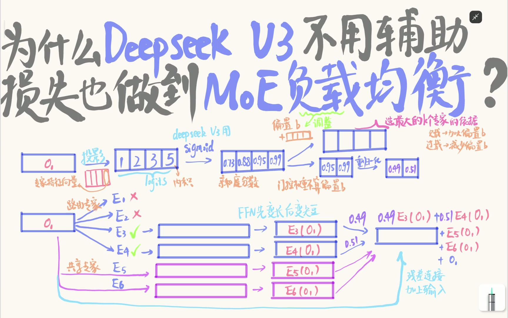](https://www.bilibili.com/video/BV1MyRXBvEG1)
---

### 117. 如何用动态规划理解在线softmax的循环与归约？【每天一个宝藏问题】
- 观看视频：[视频BV1SHR9BuEBH](https://www.bilibili.com/video/BV1SHR9BuEBH)
- 查看手稿：[图片BV1SHR9BuEBH](./assets/questions/BV1SHR9BuEBH.jpg)

[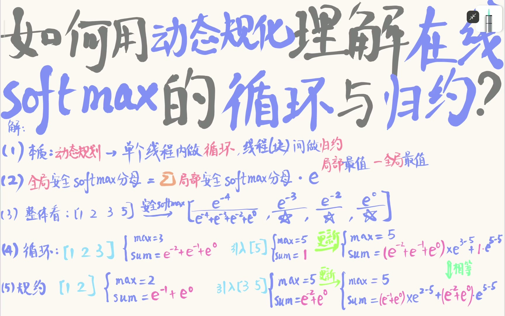](https://www.bilibili.com/video/BV1SHR9BuEBH)
---

### 116. 如何从动态规划和记忆化搜索理解DQN？【每天一个宝藏问题】
- 观看视频：[视频BV1ygRXBZEQf](https://www.bilibili.com/video/BV1ygRXBZEQf)
- 查看手稿：[图片BV1ygRXBZEQf](./assets/questions/BV1ygRXBZEQf.jpg)

[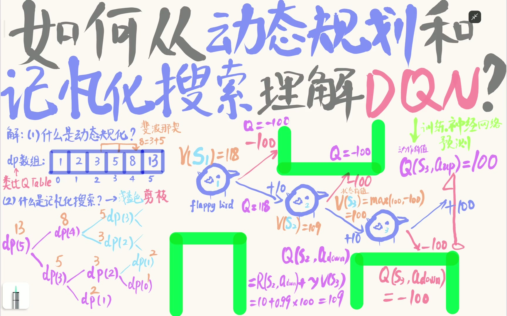](https://www.bilibili.com/video/BV1ygRXBZEQf)
---

### 115. 为什么梯度下降、泰勒展开、正态分布都有多元扩展？【每天一个宝藏问题】
- 观看视频：[视频BV1M5RmBDENg](https://www.bilibili.com/video/BV1M5RmBDENg)
- 查看手稿：[图片BV1M5RmBDENg](./assets/questions/BV1M5RmBDENg.jpg)

[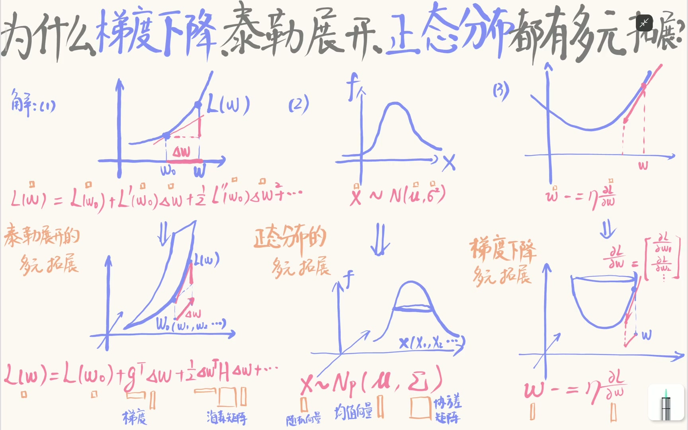](https://www.bilibili.com/video/BV1M5RmBDENg)
---

### 114. 为什么除以√dk是在给注意力升温？【每天一个宝藏问题】
- 观看视频：[视频BV1m5RmBSEkF](https://www.bilibili.com/video/BV1m5RmBSEkF)
- 查看手稿：[图片BV1m5RmBSEkF](./assets/questions/BV1m5RmBSEkF.jpg)

[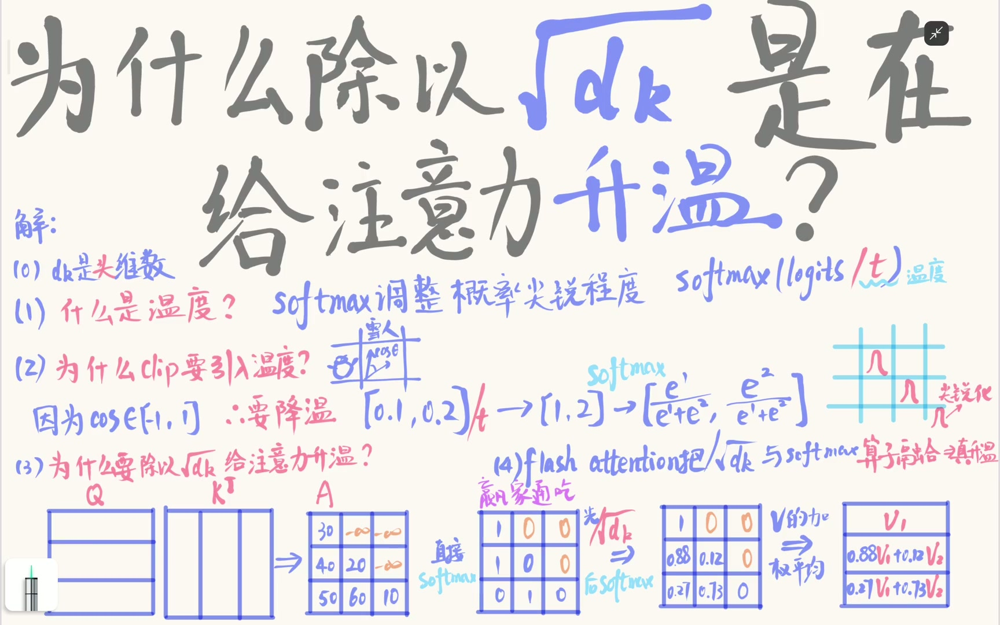](https://www.bilibili.com/video/BV1m5RmBSEkF)
---

### 113. 如何理解梯度下降的多元函数扩展？【每天一个宝藏问题】
- 观看视频：[视频BV1m5RmBSENE](https://www.bilibili.com/video/BV1m5RmBSENE)
- 查看手稿：[图片BV1m5RmBSENE](./assets/questions/BV1m5RmBSENE.jpg)

[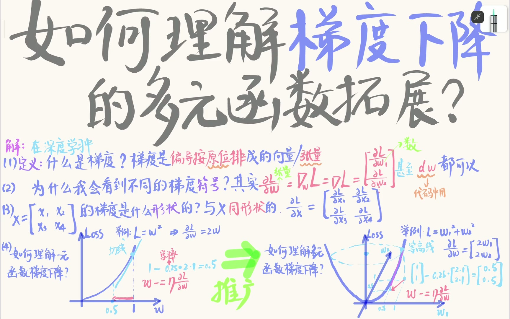](https://www.bilibili.com/video/BV1m5RmBSENE)
---

### 112. 如何可视化MOE？【每天一个宝藏问题】
- 观看视频：[视频BV1uGdgBnE65](https://www.bilibili.com/video/BV1uGdgBnE65)
- 查看手稿：[图片BV1uGdgBnE65](./assets/questions/BV1uGdgBnE65.jpg)

[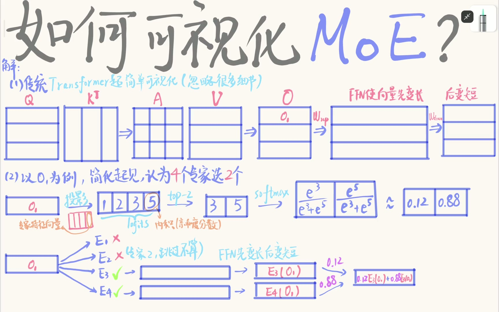](https://www.bilibili.com/video/BV1uGdgBnE65)
---

### 111. 如何直观理解KV Cache的显存计算公式？以Llama2-7B为例。【每天一个宝藏问题】
- 观看视频：[视频BV1Tf9XBwEzM](https://www.bilibili.com/video/BV1Tf9XBwEzM)
- 查看手稿：[图片BV1Tf9XBwEzM](./assets/questions/BV1Tf9XBwEzM.jpg)

[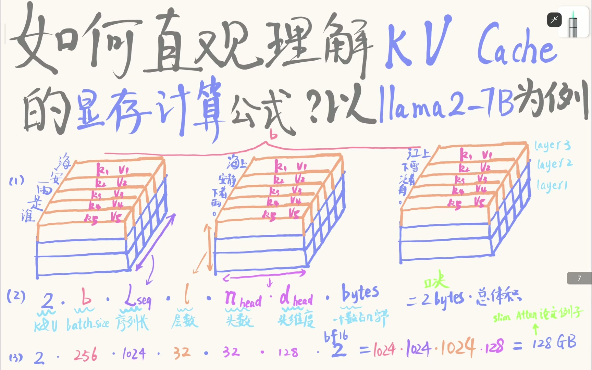](https://www.bilibili.com/video/BV1Tf9XBwEzM)
---

### 110. 为什么激活值per channel量化比per token量化难加速得多？【每天一个宝藏问题】
- 观看视频：[视频BV1k7RuBPEqt](https://www.bilibili.com/video/BV1k7RuBPEqt)
- 查看手稿：[图片BV1k7RuBPEqt](./assets/questions/BV1k7RuBPEqt.jpg)

[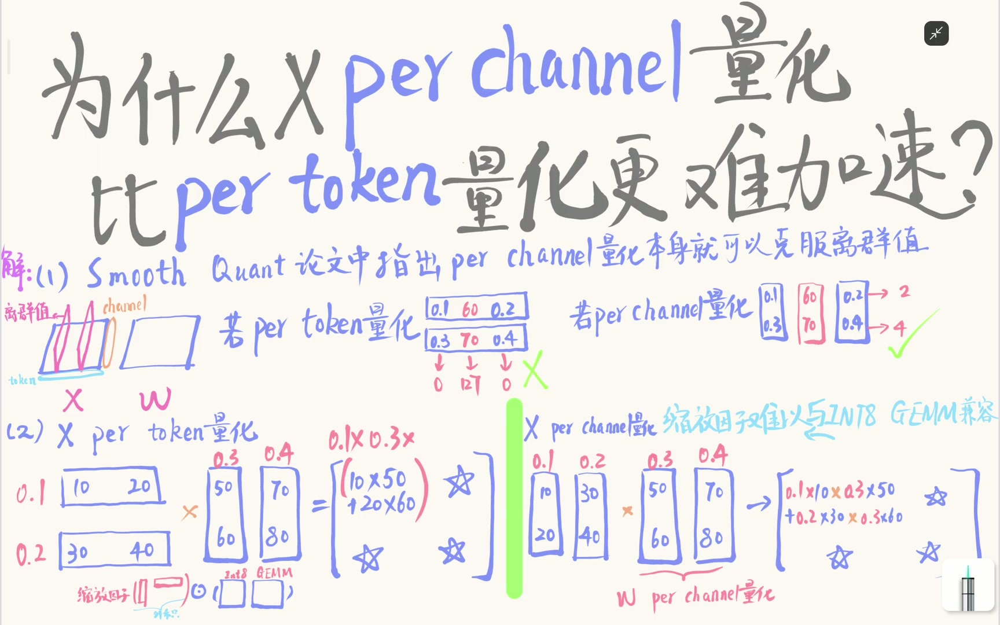](https://www.bilibili.com/video/BV1k7RuBPEqt)
---

### 109. 最简单的Transformer可视化能有多简单？【每天一个宝藏问题】
- 观看视频：[视频BV1A7RuBNETS](https://www.bilibili.com/video/BV1A7RuBNETS)
- 查看手稿：[图片BV1A7RuBNETS](./assets/questions/BV1A7RuBNETS.jpg)

[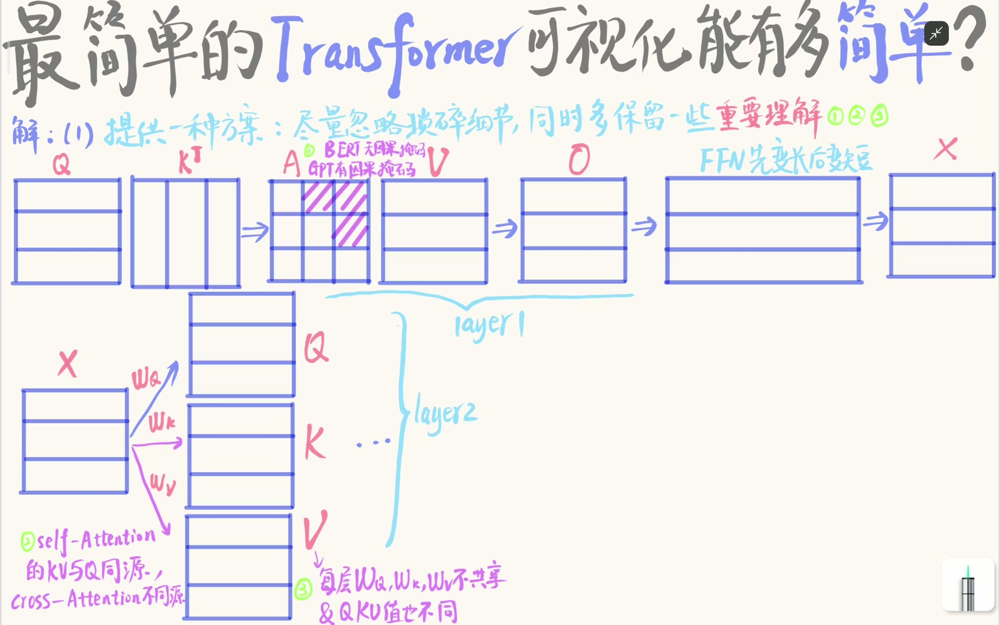](https://www.bilibili.com/video/BV1A7RuBNETS)
---

### 108. 如何用前缀和理解稀疏矩阵的CSR格式？【每天一个宝藏问题】
- 观看视频：[视频BV1k7RuBPEsV](https://www.bilibili.com/video/BV1k7RuBPEsV)
- 查看手稿：[图片BV1k7RuBPEsV](./assets/questions/BV1k7RuBPEsV.jpg)

[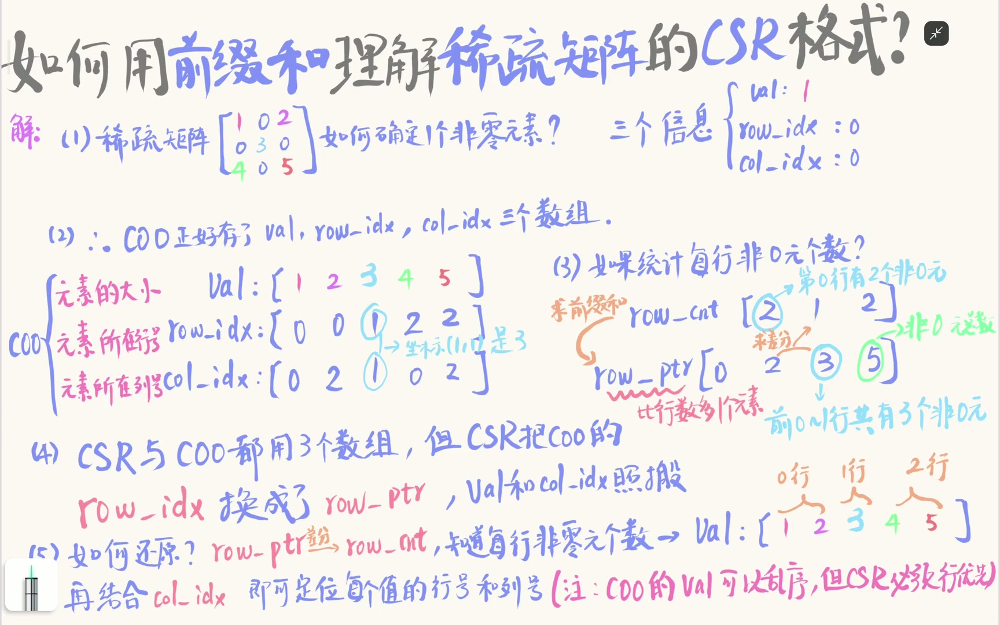](https://www.bilibili.com/video/BV1k7RuBPEsV)
---

### 107. DeepSeek V4如何使用Attention Sink忽略上下文？【每天一个宝藏问题】
- 观看视频：[视频BV1389kB3Ek4](https://www.bilibili.com/video/BV1389kB3Ek4)
- 查看手稿：[图片BV1389kB3Ek4](./assets/questions/BV1389kB3Ek4.jpg)

[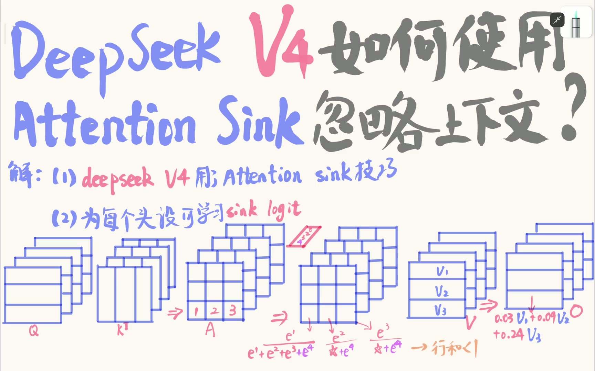](https://www.bilibili.com/video/BV1389kB3Ek4)
---

### 106. Flash Attention反向传播也做到线性显存了吗？【每天一个宝藏问题】
- 观看视频：[视频BV1a89kB3EVu](https://www.bilibili.com/video/BV1a89kB3EVu)
- 查看手稿：[图片BV1a89kB3EVu](./assets/questions/BV1a89kB3EVu.jpg)

[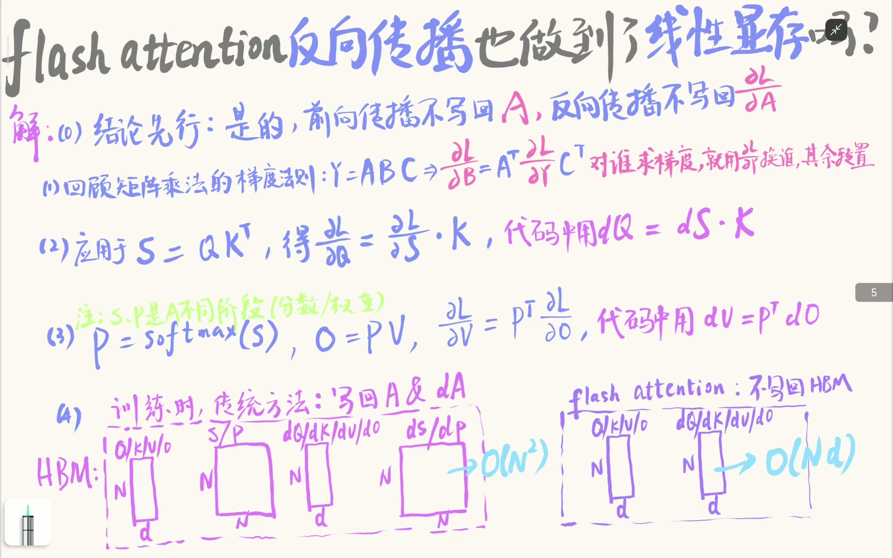](https://www.bilibili.com/video/BV1a89kB3EVu)
---

### 105. K-Means聚类和中垂线有什么关系？【每天一个宝藏问题】
- 观看视频：[视频BV1Kk9kBAEnC](https://www.bilibili.com/video/BV1Kk9kBAEnC)
- 查看手稿：[图片BV1Kk9kBAEnC](./assets/questions/BV1Kk9kBAEnC.jpg)

[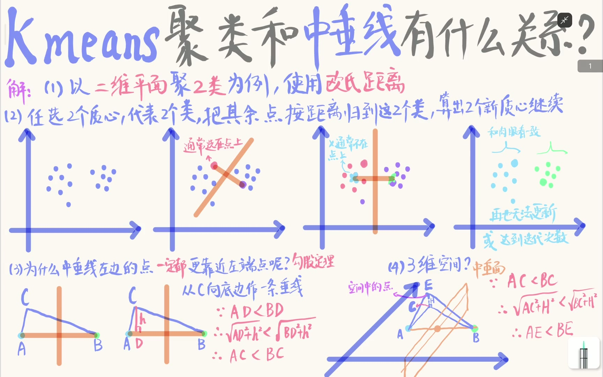](https://www.bilibili.com/video/BV1Kk9kBAEnC)
---

### 104. 为什么训练时是同时预测token的？【每天一个宝藏问题】
- 观看视频：[视频BV1jNoRBoE9b](https://www.bilibili.com/video/BV1jNoRBoE9b)
- 查看手稿：[图片BV1jNoRBoE9b](./assets/questions/BV1jNoRBoE9b.jpg)

[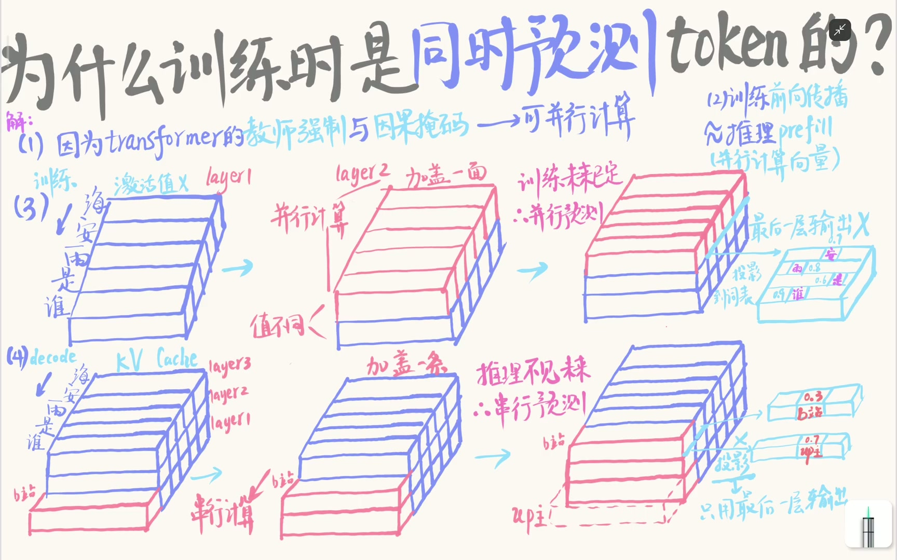](https://www.bilibili.com/video/BV1jNoRBoE9b)
---

### 103. 多个线程执行同一段算子代码时发生了什么？【每天一个宝藏问题】
- 观看视频：[视频BV1JcoRB8EGb](https://www.bilibili.com/video/BV1JcoRB8EGb)
- 查看手稿：[图片BV1JcoRB8EGb](./assets/questions/BV1JcoRB8EGb.jpg)

[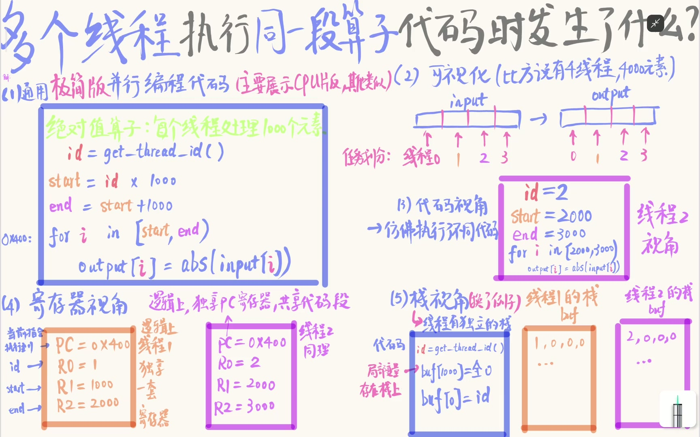](https://www.bilibili.com/video/BV1JcoRB8EGb)
---

### 102. PagedAttention是如何减少内存浪费的？【每天一个宝藏问题】
- 观看视频：[视频BV1EwoRBfExe](https://www.bilibili.com/video/BV1EwoRBfExe)
- 查看手稿：[图片BV1EwoRBfExe](./assets/questions/BV1EwoRBfExe.jpg)

[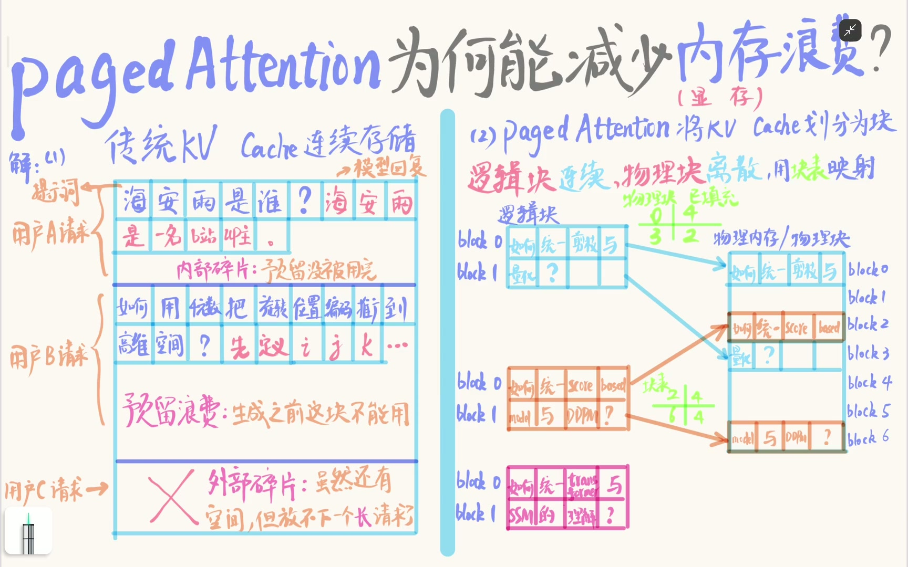](https://www.bilibili.com/video/BV1EwoRBfExe)
---

### 101. 如何用矩阵乘法链式法则速推Flash Attention梯度？【每天一个宝藏问题】
- 观看视频：[视频BV12CoMB5EDJ](https://www.bilibili.com/video/BV12CoMB5EDJ)
- 查看手稿：[图片BV12CoMB5EDJ](./assets/questions/BV12CoMB5EDJ.jpg)

[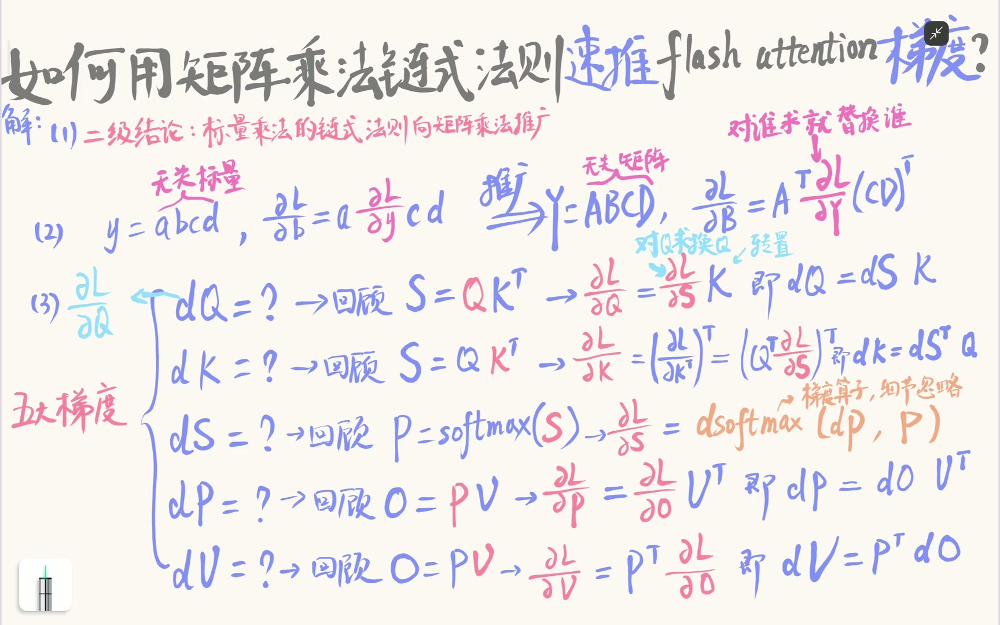](https://www.bilibili.com/video/BV12CoMB5EDJ)
---

### 100. 为什么神经网络连接可以用矩阵乘法实现？【每天一个宝藏问题】
- 观看视频：[视频BV1SBoMBmEVB](https://www.bilibili.com/video/BV1SBoMBmEVB)
- 查看手稿：[图片BV1SBoMBmEVB](./assets/questions/BV1SBoMBmEVB.jpg)

[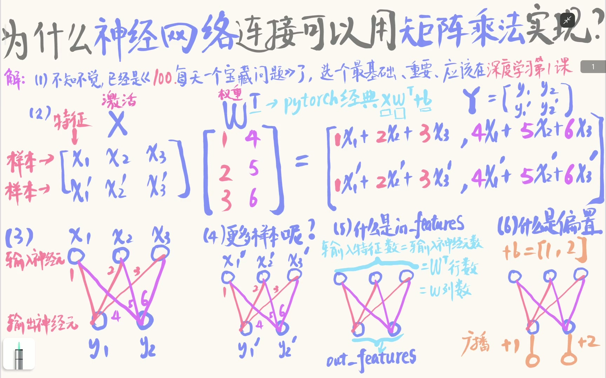](https://www.bilibili.com/video/BV1SBoMBmEVB)
---

### 99. MOE中先求Top K后Softmax，与先求Softmax后重归一化能一样？【每天一个宝藏问题】
- 观看视频：[视频BV1U6oMBjE1D](https://www.bilibili.com/video/BV1U6oMBjE1D)
- 查看手稿：[图片BV1U6oMBjE1D](./assets/questions/BV1U6oMBjE1D.jpg)

[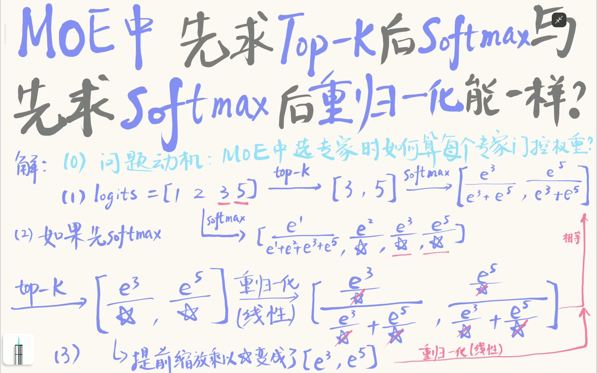](https://www.bilibili.com/video/BV1U6oMBjE1D)
---

### 98. 为什么训练时上个词的概率预测不直接影响下个词？【每天一个宝藏问题】
- 观看视频：[视频BV1CSoMBgEUA](https://www.bilibili.com/video/BV1CSoMBgEUA)
- 查看手稿：[图片BV1CSoMBgEUA](./assets/questions/BV1CSoMBgEUA.jpg)

[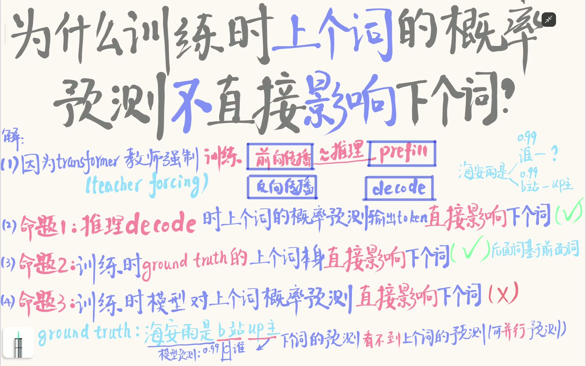](https://www.bilibili.com/video/BV1CSoMBgEUA)
---

### 97. 张量广播的线性索引是如何对应的？【每天一个宝藏问题】
- 观看视频：[视频BV1KyoMByEdR](https://www.bilibili.com/video/BV1KyoMByEdR)
- 查看手稿：[图片BV1KyoMByEdR](./assets/questions/BV1KyoMByEdR.jpg)

[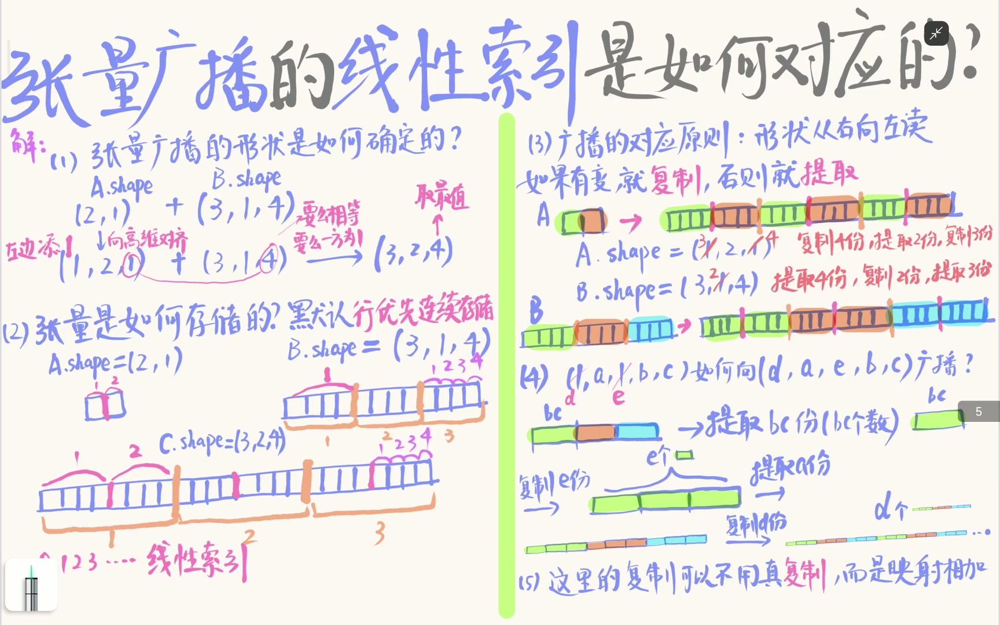](https://www.bilibili.com/video/BV1KyoMByEdR)
---

### 96. LoRA微调中A、B都随机初始化或全零初始化分别会带来什么问题？【每天一个宝藏问题】
- 观看视频：[视频BV15GdjByEpy](https://www.bilibili.com/video/BV15GdjByEpy)
- 查看手稿：[图片BV15GdjByEpy](./assets/questions/BV15GdjByEpy.jpg)

[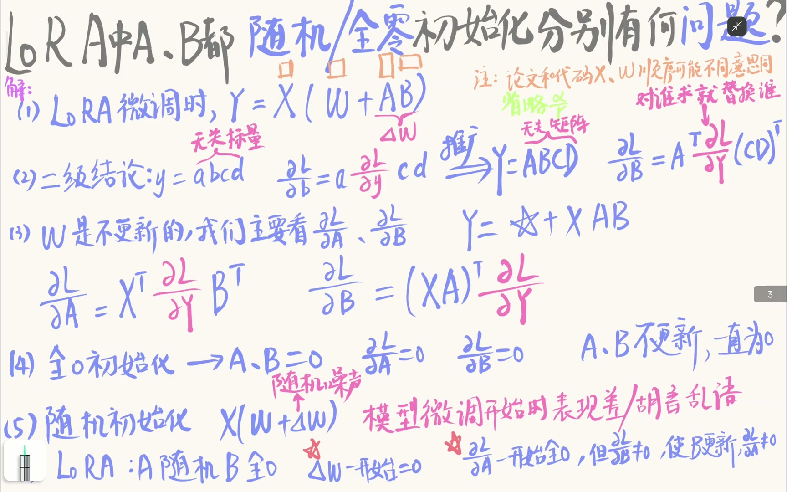](https://www.bilibili.com/video/BV15GdjByEpy)
---

### 95. 标量乘法的链式法则可以推广到矩阵吗？【每天一个宝藏问题】
- 观看视频：[视频BV1D8daB7En5](https://www.bilibili.com/video/BV1D8daB7En5)
- 查看手稿：[图片BV1D8daB7En5](./assets/questions/BV1D8daB7En5.jpg)

---

### 94. 量化感知训练中为什么要STE来处理round梯度？【每天一个宝藏问题】
- 观看视频：[视频BV12qdaBkERq](https://www.bilibili.com/video/BV12qdaBkERq)
- 查看手稿：[图片BV12qdaBkERq](./assets/questions/BV12qdaBkERq.jpg)

---

### 93. 为什么Transformer的核心公式是在做加权平均？【每天一个宝藏问题】
- 观看视频：[视频BV1CkQjBJE8K](https://www.bilibili.com/video/BV1CkQjBJE8K)
- 查看手稿：[图片BV1CkQjBJE8K](./assets/questions/BV1CkQjBJE8K.jpg)

---

### 92. 为什么量化会让损失“山谷”变成“台阶”？【每天一个宝藏问题】
- 观看视频：[视频BV1eoQvBQEMF](https://www.bilibili.com/video/BV1eoQvBQEMF)
- 查看手稿：[图片BV1eoQvBQEMF](./assets/questions/BV1eoQvBQEMF.jpg)

---

### 91. 游戏AI和LLM的πθ(a∣s)有何异同？【每天一个宝藏问题】
- 观看视频：[视频BV1TeD9B4EbF](https://www.bilibili.com/video/BV1TeD9B4EbF)
- 查看手稿：[图片BV1TeD9B4EbF](./assets/questions/BV1TeD9B4EbF.jpg)

---

### 90. OBQ如何将最小化剪枝损失推广到量化？【每天一个宝藏问题】
- 观看视频：[视频BV1kkDQBVE4y](https://www.bilibili.com/video/BV1kkDQBVE4y)
- 查看手稿：[图片BV1kkDQBVE4y](./assets/questions/BV1kkDQBVE4y.jpg)

---

### 89. 量化感知训练是如何感知到量化的？【每天一个宝藏问题】
- 观看视频：[视频BV1d9QABeEdC](https://www.bilibili.com/video/BV1d9QABeEdC)
- 查看手稿：[图片BV1d9QABeEdC](./assets/questions/BV1d9QABeEdC.jpg)

---

### 88. 量化后微调为什么要对聚类中心求和？【每天一个宝藏问题】
- 观看视频：[视频BV1fcD4BPEo7](https://www.bilibili.com/video/BV1fcD4BPEo7)
- 查看手稿：[图片BV1fcD4BPEo7](./assets/questions/BV1fcD4BPEo7.jpg)

---

### 87. 为什么前向广播对应着反向归约？【每天一个宝藏问题】
- 观看视频：[视频BV177DWBdEoV](https://www.bilibili.com/video/BV177DWBdEoV)
- 查看手稿：[图片BV177DWBdEoV](./assets/questions/BV177DWBdEoV.jpg)

---

### 86. 为什么矩阵乘法可以看作标量乘法的拓展？【每天一个宝藏问题】
- 观看视频：[视频BV1WxDeBcExC](https://www.bilibili.com/video/BV1WxDeBcExC)
- 查看手稿：[图片BV1WxDeBcExC](./assets/questions/BV1WxDeBcExC.jpg)

---

### 85. 为什么prefill和decode都可以跳过掩码上三角计算？【每天一个宝藏问题】
- 观看视频：[视频BV1ZEDvB9E6Y](https://www.bilibili.com/video/BV1ZEDvB9E6Y)
- 查看手稿：[图片BV1ZEDvB9E6Y](./assets/questions/BV1ZEDvB9E6Y.jpg)

---

### 84. LoRA要增加旁路，微调前后模型结构却可以不变，为什么？【每天一个宝藏问题】
- 观看视频：[视频BV1cQSSBvE8N](https://www.bilibili.com/video/BV1cQSSBvE8N)
- 查看手稿：[图片BV1cQSSBvE8N](./assets/questions/BV1cQSSBvE8N.jpg)

---

### 83. Flash Attention的线性显存比平方显存增长慢了多少？【每天一个宝藏问题】
- 观看视频：[视频BV1baNGzmEzn](https://www.bilibili.com/video/BV1baNGzmEzn)
- 查看手稿：[图片BV1baNGzmEzn](./assets/questions/BV1baNGzmEzn.jpg)

---

### 82. 在线Softmax和Flash Attention分别维护了多少个“动态规划量”？【每天一个宝藏问题】
- 观看视频：[视频BV1oA93BtETZ](https://www.bilibili.com/video/BV1oA93BtETZ)
- 查看手稿：[图片BV1oA93BtETZ](./assets/questions/BV1oA93BtETZ.jpg)

---

### 81. 量化后微调让聚在一起的权重分家了怎么办？【每天一个宝藏问题】
- 观看视频：[视频BV1zf9gBwEqd](https://www.bilibili.com/video/BV1zf9gBwEqd)
- 查看手稿：[图片BV1zf9gBwEqd](./assets/questions/BV1zf9gBwEqd.jpg)

---

### 80. 剪枝后微调让被置零的权重不再为零怎么办？【每天一个宝藏问题】
- 观看视频：[视频BV16E9cBqEK8](https://www.bilibili.com/video/BV16E9cBqEK8)
- 查看手稿：[图片BV16E9cBqEK8](./assets/questions/BV16E9cBqEK8.jpg)

---

### 79. 为什么基于权重大小剪枝是特殊的OBD、OBS、OBQ？【每天一个宝藏问题】
- 观看视频：[视频BV1fn9cBKEbt](https://www.bilibili.com/video/BV1fn9cBKEbt)
- 查看手稿：[图片BV1fn9cBKEbt](./assets/questions/BV1fn9cBKEbt.jpg)

---

### 78. GPTQ量化的最小化目标如何写成类似OBS形式的？【每天一个宝藏问题】
- 观看视频：[视频BV1679cBME93](https://www.bilibili.com/video/BV1679cBME93)
- 查看手稿：[图片BV1679cBME93](./assets/questions/BV1679cBME93.jpg)

---

### 77. 为什么训练时教师强制是只“感觉”不“生成”的？【每天一个宝藏问题】
- 观看视频：[视频BV14BXoBMEsk](https://www.bilibili.com/video/BV14BXoBMEsk)
- 查看手稿：[图片BV14BXoBMEsk](./assets/questions/BV14BXoBMEsk.jpg)

---

### 76. 为什么OBS剪枝可看作特殊的OBQ量化？【每天一个宝藏问题】
- 观看视频：[视频BV1cKX1BhED8](https://www.bilibili.com/video/BV1cKX1BhED8)
- 查看手稿：[图片BV1cKX1BhED8](./assets/questions/BV1cKX1BhED8.jpg)

---

### 75. OBS剪枝是如何选择被剪枝的权重的？【每天一个宝藏问题】
- 观看视频：[视频BV1AwX1BPE1g](https://www.bilibili.com/video/BV1AwX1BPE1g)
- 查看手稿：[图片BV1AwX1BPE1g](./assets/questions/BV1AwX1BPE1g.jpg)

---

### 74. 为什么OBD剪枝是特殊的OBS剪枝？【每天一个宝藏问题】
- 观看视频：[视频BV1xTXKB4Ecn](https://www.bilibili.com/video/BV1xTXKB4Ecn)
- 查看手稿：[图片BV1xTXKB4Ecn](./assets/questions/BV1xTXKB4Ecn.jpg)

---

### 73. OBS剪枝保留与修改了OBD剪枝的哪些假设？【每天一个宝藏问题】
- 观看视频：[视频BV1njXKBnEBg](https://www.bilibili.com/video/BV1njXKBnEBg)
- 查看手稿：[图片BV1njXKBnEBg](./assets/questions/BV1njXKBnEBg.jpg)

---

### 72. 如何从几何视角理解拉格朗日乘子法？【每天一个宝藏问题】
- 观看视频：[视频BV1C3XKB9EHm](https://www.bilibili.com/video/BV1C3XKB9EHm)
- 查看手稿：[图片BV1C3XKB9EHm](./assets/questions/BV1C3XKB9EHm.jpg)

---

### 71. OBD剪枝假设山谷是什么样的？【每天一个宝藏问题】
- 观看视频：[视频BV11RQfB3Eot](https://www.bilibili.com/video/BV11RQfB3Eot)
- 查看手稿：[图片BV11RQfB3Eot](./assets/questions/BV11RQfB3Eot.jpg)

---

### 70. 如何理解泰勒展开的多元函数扩展？【每天一个宝藏问题】
- 观看视频：[视频BV1HVXKBpE9p](https://www.bilibili.com/video/BV1HVXKBpE9p)
- 查看手稿：[图片BV1HVXKBpE9p](./assets/questions/BV1HVXKBpE9p.jpg)

---

### 69. 深度学习中两种常用的矩阵微积分是怎么来的？【每天一个宝藏问题】
- 观看视频：[视频BV1a9XNBTERT](https://www.bilibili.com/video/BV1a9XNBTERT)
- 查看手稿：[图片BV1a9XNBTERT](./assets/questions/BV1a9XNBTERT.jpg)

---

### 68. prefill和decode时KV Cache是如何"堆积"的？【每天一个宝藏问题】
- 观看视频：[视频BV1AYQdBfEDS](https://www.bilibili.com/video/BV1AYQdBfEDS)
- 查看手稿：[图片BV1AYQdBfEDS](./assets/questions/BV1AYQdBfEDS.jpg)

---

### 67. 为何圆形山谷会让OBD剪枝退化为基于大小剪枝？【每天一个宝藏问题】
- 观看视频：[视频BV1qAA5ztELy](https://www.bilibili.com/video/BV1qAA5ztELy)
- 查看手稿：[图片BV1qAA5ztELy](./assets/questions/BV1qAA5ztELy.jpg)

---

### 66. LLM.int8与SmoothQuant解决离群值的思路有何异同？【每天一个宝藏问题】
- 观看视频：[视频BV13rwCzwEKX](https://www.bilibili.com/video/BV13rwCzwEKX)
- 查看手稿：[图片BV13rwCzwEKX](./assets/questions/BV13rwCzwEKX.jpg)

---

### 65. 从校准集说明为何SmoothQuant中的S无需矩阵乘算子【每天一个宝藏问题】
- 观看视频：[视频BV12DwRz9E4j](https://www.bilibili.com/video/BV12DwRz9E4j)
- 查看手稿：[图片BV12DwRz9E4j](./assets/questions/BV12DwRz9E4j.jpg)

---

### 64. SmoothQuant量化中有没有用到外积思想？【每天一个宝藏问题】
- 观看视频：[视频BV1DMwmzgEyV](https://www.bilibili.com/video/BV1DMwmzgEyV)
- 查看手稿：[图片BV1DMwmzgEyV](./assets/questions/BV1DMwmzgEyV.jpg)

---

### 63. 举例说明SmoothQuant量化对角矩阵乘法的正确性？【每天一个宝藏问题】
- 观看视频：[视频BV1VTw7zbEzq](https://www.bilibili.com/video/BV1VTw7zbEzq)
- 查看手稿：[图片BV1VTw7zbEzq](./assets/questions/BV1VTw7zbEzq.jpg)

---

### 62．LLM.int8是如何利用向量外积进行量化的？【每天一个宝藏问题】
- 观看视频：[视频BV17pwEzMETL](https://www.bilibili.com/video/BV17pwEzMETL)
- 查看手稿：[图片BV17pwEzMETL](./assets/questions/BV17pwEzMETL.jpg)

---

### 61. 含广播的偏置b的梯度如何计算？【每天一个宝藏问题】
- 观看视频：[视频BV1WWXWBzELJ](https://www.bilibili.com/video/BV1WWXWBzELJ)
- 查看手稿：[图片BV1WWXWBzELJ](./assets/questions/BV1WWXWBzELJ.jpg)

---

### 60. LoRA微调和向量外积为何长得很像？【每天一个宝藏问题】
- 观看视频：[视频BV1pKwjz3E1P](https://www.bilibili.com/video/BV1pKwjz3E1P)
- 查看手稿：[图片BV1pKwjz3E1P](./assets/questions/BV1pKwjz3E1P.jpg)

---

### 59. DeepSeek OCR比较人性化的可视化可能是什么样的？【每天一个宝藏问题】
- 观看视频：[视频BV13gcCzbE7y](https://www.bilibili.com/video/BV13gcCzbE7y)
- 查看手稿：[图片BV13gcCzbE7y](./assets/questions/BV13gcCzbE7y.jpg)

---

### 58. 如何根据答案倒推合成思维链做SFT？以AscendKernelGen为例【每天一个宝藏问题】
- 观看视频：[视频BV1DvcyzcEa4](https://www.bilibili.com/video/BV1DvcyzcEa4)
- 查看手稿：[图片BV1DvcyzcEa4](./assets/questions/BV1DvcyzcEa4.jpg)

---

### 57. 网格步进是如何加速张量计算的？【每天一个宝藏问题】
- 观看视频：[视频BV1SSNFz2EDK](https://www.bilibili.com/video/BV1SSNFz2EDK)
- 查看手稿：[图片BV1SSNFz2EDK](./assets/questions/BV1SSNFz2EDK.jpg)

---

### 56. 为什么多个Sub-Agent也可以共享前缀KV Cache？【每天一个宝藏问题】
- 观看视频：[视频BV1cPAuzpE6e](https://www.bilibili.com/video/BV1cPAuzpE6e)
- 查看手稿：[图片BV1cPAuzpE6e](./assets/questions/BV1cPAuzpE6e.jpg)

---

### 55. 为什么KV Cache也有LRU等缓存替换策略?【每天一个宝藏问题】
- 观看视频：[视频BV1YdANzcESN](https://www.bilibili.com/video/BV1YdANzcESN)
- 查看手稿：[图片BV1YdANzcESN](./assets/questions/BV1YdANzcESN.jpg)

---

### 53. 如何加速两个张量之和？【每天一个宝藏问题】
- 观看视频：[视频BV1SqPhzAErH](https://www.bilibili.com/video/BV1SqPhzAErH)
- 查看手稿：[图片BV1SqPhzAErH](./assets/questions/BV1SqPhzAErH.jpg)

---

### 52 简单的梯度算子是如何定义的【每天一个宝藏问题】
- 观看视频：[视频BV1TUPWzkEgW](https://www.bilibili.com/video/BV1TUPWzkEgW)
- 查看手稿：[图片BV1TUPWzkEgW](./assets/questions/BV1TUPWzkEgW.jpg)

---

### 51 矩阵乘法对权重的梯度是怎么来的？【每天一个宝藏问题】
- 观看视频：[视频BV1TUPWzkE6U](https://www.bilibili.com/video/BV1TUPWzkE6U)
- 查看手稿：[图片BV1TUPWzkE6U](./assets/questions/BV1TUPWzkE6U.jpg)

---

### 49. 双缓冲是如何加速张量计算的？【每天一个宝藏问题】
- 观看视频：[视频BV1bUP5zDER5](https://www.bilibili.com/video/BV1bUP5zDER5)
- 查看手稿：[图片BV1bUP5zDER5](./assets/questions/BV1bUP5zDER5.jpg)

---

### 47 CLIP比较人性化的可视化可能长什么样？【每天一个宝藏问题】
- 观看视频：[视频BV1k4PDzrE9X](https://www.bilibili.com/video/BV1k4PDzrE9X)
- 查看手稿：[图片BV1k4PDzrE9X](./assets/questions/BV1k4PDzrE9X.jpg)

---

### 46. 矩阵乘法对激活的梯度是怎么来的？【每天一个宝藏问题】
- 观看视频：[视频BV1ioArzKEMB](https://www.bilibili.com/video/BV1ioArzKEMB)
- 查看手稿：[图片BV1ioArzKEMB](./assets/questions/BV1ioArzKEMB.jpg)

---

### 45. SIMD是如何加速张量计算的(简单理解)【每天一个宝藏问题】
- 观看视频：[视频BV1doArzKExB](https://www.bilibili.com/video/BV1doArzKExB)
- 查看手稿：[图片BV1doArzKExB](./assets/questions/BV1doArzKExB.jpg)

---

### 44. 为什么把权重置0就是在剪枝？【每天一个宝藏问题】
- 观看视频：[视频BV1B9ArzuEP3](https://www.bilibili.com/video/BV1B9ArzuEP3)
- 查看手稿：[图片BV1B9ArzuEP3](./assets/questions/BV1B9ArzuEP3.jpg)

---

### 42. 聚类量化和线性量化有何不同？【每天一个宝藏问题】
- 观看视频：[视频BV1yBArzEEeE](https://www.bilibili.com/video/BV1yBArzEEeE)
- 查看手稿：[图片BV1yBArzEEeE](./assets/questions/BV1yBArzEEeE.jpg)

---

### 41 Flash Attention之前的那种N^2注意力不好在哪里？【每天一个宝藏问题】
- 观看视频：[视频BV1WzArzUEdr](https://www.bilibili.com/video/BV1WzArzUEdr)
- 查看手稿：[图片BV1WzArzUEdr](./assets/questions/BV1WzArzUEdr.jpg)

---

### 40. Temperature、TopK/P退化为贪婪解码的三种条件是？【每天一个宝藏问题】
- 观看视频：[视频BV1AzArzUEh1](https://www.bilibili.com/video/BV1AzArzUEh1)
- 查看手稿：[图片BV1AzArzUEh1](./assets/questions/BV1AzArzUEh1.jpg)

---

### 39. FlashAttention V2中为何要先循环Q后循环K？【每天一个宝藏问题】
- 观看视频：[视频BV1yiArzSEs1](https://www.bilibili.com/video/BV1yiArzSEs1)
- 查看手稿：[图片BV1yiArzSEs1](./assets/questions/BV1yiArzSEs1.jpg)

---

### 37. GQA中讲的共享指的是Token还是Head？【每天一个宝藏问题】
- 观看视频：[视频BV1cTZyBzEjv](https://www.bilibili.com/video/BV1cTZyBzEjv)
- 查看手稿：[图片BV1cTZyBzEjv](./assets/questions/BV1cTZyBzEjv.jpg)

---

### 36. 为什么推理时prefill是GEMM，而decode是（Batched）GEMV？【每天一个宝藏问题】
- 观看视频：[视频BV1UtZkBjEZP](https://www.bilibili.com/video/BV1UtZkBjEZP)
- 查看手稿：[图片BV1UtZkBjEZP](./assets/questions/BV1UtZkBjEZP.jpg)

---

### 35. Transformer暗含多少种分块矩阵乘法的理解方式？【每天一个宝藏问题】
- 观看视频：[视频BV1pRZtBaEYv](https://www.bilibili.com/video/BV1pRZtBaEYv)
- 查看手稿：[图片BV1pRZtBaEYv](./assets/questions/BV1pRZtBaEYv.jpg)

---

### 34. BERT为什么没有KV Cache/KV Cache何以存在？【每天一个宝藏问题】
- 观看视频：[视频BV1qKZ7BsEs5](https://www.bilibili.com/video/BV1qKZ7BsEs5)
- 查看手稿：[图片BV1qKZ7BsEs5](./assets/questions/BV1qKZ7BsEs5.jpg)

---

### 33. 用户改提示词为什么不会影响前面的KV Cache？【每天一个宝藏问题】
- 观看视频：[视频BV1dgZ7BQEHL](https://www.bilibili.com/video/BV1dgZ7BQEHL)
- 查看手稿：[图片BV1dgZ7BQEHL](./assets/questions/BV1dgZ7BQEHL.jpg)

---

### 32. 一种人性化的Transformer可视化可能是什么样的？【每天一个宝藏问题】
- 观看视频：[视频BV13FZEBEE6y](https://www.bilibili.com/video/BV13FZEBEE6y)
- 查看手稿：[图片BV13FZEBEE6y](./assets/questions/BV13FZEBEE6y.jpg)

---

### 31. FlashAttention v2版本如何省略掩码上三角矩阵计算？【每天一个宝藏问题】
- 观看视频：[视频BV16qZLBxEZt](https://www.bilibili.com/video/BV16qZLBxEZt)
- 查看手稿：[图片BV16qZLBxEZt](./assets/questions/BV16qZLBxEZt.jpg)

---

### 30. 举例说明SlimAttention的分块矩阵乘法的正确性？【每天一个宝藏问题】
- 观看视频：[视频BV11KcWz8EZm](https://www.bilibili.com/video/BV11KcWz8EZm)
- 查看手稿：[图片BV11KcWz8EZm](./assets/questions/BV11KcWz8EZm.jpg)

---

### 29. 以逐元素乘加为例，算子融合为什么能提高计算效率？【每天一个宝藏问题】
- 观看视频：[视频BV19PcnzPEQp](https://www.bilibili.com/video/BV19PcnzPEQp)
- 查看手稿：[图片BV19PcnzPEQp](./assets/questions/BV19PcnzPEQp.jpg)

---

### 28. 为什么在线Softmax比安全Softmax可以少一次循环？【每天一个宝藏问题】
- 观看视频：[视频BV1i6cnzzE2x](https://www.bilibili.com/video/BV1i6cnzzE2x)
- 查看手稿：[图片BV1i6cnzzE2x](./assets/questions/BV1i6cnzzE2x.jpg)

---

### 23. Llama的旋转位置编码实现和RoPE原论文有何不同？【每天一个宝藏问题】
- 观看视频：[视频BV15EcbzoEY7](https://www.bilibili.com/video/BV15EcbzoEY7)
- 查看手稿：[图片BV15EcbzoEY7](./assets/questions/BV15EcbzoEY7.jpg)

---

### 22. 为什么transformers.Llama的实现和RoPE原论文不一致？【每天一个宝藏问题】
- 观看视频：[视频BV1nUcbzTEGi](https://www.bilibili.com/video/BV1nUcbzTEGi)
- 查看手稿：[图片BV1nUcbzTEGi](./assets/questions/BV1nUcbzTEGi.jpg)

---

### 21. 为什么增大旋转位置编码中10000可提高模型外推能力【每天一个宝藏问题】
- 观看视频：[视频BV1o5FozuEz2](https://www.bilibili.com/video/BV1o5FozuEz2)
- 查看手稿：[图片BV1o5FozuEz2](./assets/questions/BV1o5FozuEz2.jpg)

---

### 20. RoPE注意力的绝对位置无关性和欧拉公式有什么关系？【每天一个宝藏问题】
- 观看视频：[视频BV1fFFDzsEt6](https://www.bilibili.com/video/BV1fFFDzsEt6)
- 查看手稿：[图片BV1fFFDzsEt6](./assets/questions/BV1fFFDzsEt6.jpg)

---

### 19. 为什么RoPE中旋转矩阵R实际上不需要矩阵乘算子？【每天一个宝藏问题】
- 观看视频：[视频BV1XyFyzcEN6](https://www.bilibili.com/video/BV1XyFyzcEN6)
- 查看手稿：[图片BV1XyFyzcEN6](./assets/questions/BV1XyFyzcEN6.jpg)

---

### 17. 为什么正余弦位置编码的注意力是和绝对位置相关的？【每天一个宝藏问题】
- 观看视频：[视频BV1mZcuztEw2](https://www.bilibili.com/video/BV1mZcuztEw2)
- 查看手稿：[图片BV1mZcuztEw2](./assets/questions/BV1mZcuztEw2.jpg)

---

### 16. RoPE如何从2维推广到任意偶数维，奇数维咋办？【每天一个宝藏问题】
- 观看视频：[视频BV1FgcMzkE5h](https://www.bilibili.com/video/BV1FgcMzkE5h)
- 查看手稿：[图片BV1FgcMzkE5h](./assets/questions/BV1FgcMzkE5h.jpg)

---

### 14. 旋转位置编码和高中三角函数和差角公式有什么关系？【每天一个宝藏问题】
- 观看视频：[视频BV1uoFxzgEWz](https://www.bilibili.com/video/BV1uoFxzgEWz)
- 查看手稿：[图片BV1uoFxzgEWz](./assets/questions/BV1uoFxzgEWz.jpg)

---

### 13. 旋转位置编码和复数欧拉公式有什么关系？【每天一个宝藏问题】
- 观看视频：[视频BV1qzFxzQES2](https://www.bilibili.com/video/BV1qzFxzQES2)
- 查看手稿：[图片BV1qzFxzQES2](./assets/questions/BV1qzFxzQES2.jpg)

---

## 每天一个宝藏名词

### 54. bf16：与FP32有相同的8位指数位，所以更适合模型训练【每天一个宝藏名词】
- 观看视频：[视频BV1DvPhzeE3R](https://www.bilibili.com/video/BV1DvPhzeE3R)
- 查看手稿：[图片BV1DvPhzeE3R](./assets/terms/BV1DvPhzeE3R.jpg)

---

### 50. 环境变量的工作原理：控制台启动时自动执行命令，让简写命令找到在哪执行【每天一个宝藏名词】
- 观看视频：[视频BV1zXP7zyEbD](https://www.bilibili.com/video/BV1zXP7zyEbD)
- 查看手稿：[图片BV1zXP7zyEbD](./assets/terms/BV1zXP7zyEbD.jpg)

---

### 48. NoteBookLM：Google的PPT制作神器，还有思维导图等一系列功能【每天一个宝藏名词】
- 观看视频：[视频BV1MUP5zDEmj](https://www.bilibili.com/video/BV1MUP5zDEmj)
- 查看手稿：[图片BV1MUP5zDEmj](./assets/terms/BV1MUP5zDEmj.jpg)

---

### 43. everything：比Windows默认文件搜索工具快很多，2MB的免费小工具【每天一个宝藏名词】
- 观看视频：[视频BV1iRArzqEvU](https://www.bilibili.com/video/BV1iRArzqEvU)
- 查看手稿：[图片BV1iRArzqEvU](./assets/terms/BV1iRArzqEvU.jpg)

---

### 38. miniSGLang：一个简化版SGLang，仅5000行python【每天一个宝藏名词】
- 观看视频：[视频BV1obA6zeEtE](https://www.bilibili.com/video/BV1obA6zeEtE)
- 查看手稿：[图片BV1obA6zeEtE](./assets/terms/BV1obA6zeEtE.jpg)

---

### 27. 在线Softmax：通过修正比安全Softmax减少了一次循环【每天一个宝藏名词】
- 观看视频：[视频BV1c1c7zzEb4](https://www.bilibili.com/video/BV1c1c7zzEb4)
- 查看手稿：[图片BV1c1c7zzEb4](./assets/terms/BV1c1c7zzEb4.jpg)

---

### 26. TinyML：MIT推出的大模型轻量化课，亲手量化一个本地llama模型【每天一个宝藏名词】
- 观看视频：[视频BV1CPcJzLELq](https://www.bilibili.com/video/BV1CPcJzLELq)
- 查看手稿：[图片BV1CPcJzLELq](./assets/terms/BV1CPcJzLELq.jpg)

---

### 25. 举例说明FlashAttention的分块矩阵乘法的正确性？【每天一个宝藏名词】
- 观看视频：[视频BV18pcLz2E3P](https://www.bilibili.com/video/BV18pcLz2E3P)
- 查看手稿：[图片BV18pcLz2E3P](./assets/terms/BV18pcLz2E3P.jpg)

---

### 24. 思维树：大模型+DFS玩24点游戏成功率大增【每天一个宝藏名词】
- 观看视频：[视频BV1gtcbzDENr](https://www.bilibili.com/video/BV1gtcbzDENr)
- 查看手稿：[图片BV1gtcbzDENr](./assets/terms/BV1gtcbzDENr.jpg)

---

### 18. CCF-DDL：一个统计CCF分类和倒计时的宝藏网站【每天一个宝藏名词】
- 观看视频：[视频BV1Jif9BeEYE](https://www.bilibili.com/video/BV1Jif9BeEYE)
- 查看手稿：[图片BV1Jif9BeEYE](./assets/terms/BV1Jif9BeEYE.jpg)

---

### 15. 投机解码：小模型草拟，大模型验证【每天一个宝藏名词】
- 观看视频：[视频BV1yS6zBXEVu](https://www.bilibili.com/video/BV1yS6zBXEVu)
- 查看手稿：[图片BV1yS6zBXEVu](./assets/terms/BV1yS6zBXEVu.jpg)

---

### 12. RoPE：通过旋转矩阵让注意力只取决于相对位置【每天一个宝藏名词】
- 观看视频：[视频BV1gQ6iBREZw](https://www.bilibili.com/video/BV1gQ6iBREZw)
- 查看手稿：[图片BV1gQ6iBREZw](./assets/terms/BV1gQ6iBREZw.jpg)

---

### 11. GQA：介于MHA和MQA之间，键值共享查询分组【每天一个宝藏名词】
- 观看视频：[视频BV19u6BBwEQ8](https://www.bilibili.com/video/BV19u6BBwEQ8)
- 查看手稿：[图片BV19u6BBwEQ8](./assets/terms/BV19u6BBwEQ8.jpg)

---

### 10. NF4：QLoRA中的非均匀量化数据类型【每天一个宝藏名词】
- 观看视频：[视频BV1qA6BBKEck](https://www.bilibili.com/video/BV1qA6BBKEck)
- 查看手稿：[图片BV1qA6BBKEck](./assets/terms/BV1qA6BBKEck.jpg)

---

### 9. FlashAttention：将Attention的显存占用从平方级降到了线性级【每天一个宝藏名词】
- 观看视频：[视频BV1C66YBvECv](https://www.bilibili.com/video/BV1C66YBvECv)
- 查看手稿：[图片BV1C66YBvECv](./assets/terms/BV1C66YBvECv.jpg)

---

### 8. PagedAttention：借鉴操作系统分页机制，内置于vLLM【每天一个宝藏名词】
- 观看视频：[视频BV1Ht6wBVEUX](https://www.bilibili.com/video/BV1Ht6wBVEUX)
- 查看手稿：[图片BV1Ht6wBVEUX](./assets/terms/BV1Ht6wBVEUX.jpg)

---

### 7. SlimAttention：一种比FlashAttention更适合CPU的推理方案【每天一个宝藏名词】
- 观看视频：[视频BV1MUzZBVEtV](https://www.bilibili.com/video/BV1MUzZBVEtV)
- 查看手稿：[图片BV1MUzZBVEtV](./assets/terms/BV1MUzZBVEtV.jpg)

---

### 6. nano-vLLM：纯python实现的堪比vLLM的推理框架【每天一个宝藏名词】
- 观看视频：[视频BV1FTzfBcE3h](https://www.bilibili.com/video/BV1FTzfBcE3h)
- 查看手稿：[图片BV1FTzfBcE3h](./assets/terms/BV1FTzfBcE3h.jpg)

---

### 5. CS336：斯坦福LLM神课，甚至包含洗数据和SFT【每天一个宝藏名词】
- 观看视频：[视频BV12pzXBREPY](https://www.bilibili.com/video/BV12pzXBREPY)
- 查看手稿：[图片BV12pzXBREPY](./assets/terms/BV12pzXBREPY.jpg)

---

### 4. SmoothQuant：一种转嫁压力的LLM量化方法【每天一个宝藏名词】
- 观看视频：[视频BV1RyzXB6Eyz](https://www.bilibili.com/video/BV1RyzXB6Eyz)
- 查看手稿：[图片BV1RyzXB6Eyz](./assets/terms/BV1RyzXB6Eyz.jpg)

---

### 3. GPTQ：一种纯数学的LLM量化方法【每天一个宝藏名词】
- 观看视频：[视频BV1aXzXBNE4A](https://www.bilibili.com/video/BV1aXzXBNE4A)
- 查看手稿：[图片BV1aXzXBNE4A](./assets/terms/BV1aXzXBNE4A.jpg)

---

### 2. AWQ：一种保护关键权重的LLM量化算法【每天一个宝藏名词】
- 观看视频：[视频BV16H6EBHEP5](https://www.bilibili.com/video/BV16H6EBHEP5)
- 查看手稿：[图片BV16H6EBHEP5](./assets/terms/BV16H6EBHEP5.jpg)

---

### 1. BitNet 1.58b：微软开源的3值量化模型【每天一个宝藏名词】
- 观看视频：[视频BV1kG6jBSE3u](https://www.bilibili.com/video/BV1kG6jBSE3u)
- 查看手稿：[图片BV1kG6jBSE3u](./assets/terms/BV1kG6jBSE3u.jpg)

---

## 每天一个宝藏论文

### [102]. ReAct：Agent经典论文精读【每天一个宝藏论文】
- 观看视频：[视频BV1FRTi6oEz2](https://www.bilibili.com/video/BV1FRTi6oEz2)
- 查看手稿：[图片BV1FRTi6oEz2](./assets/papers/BV1FRTi6oEz2.jpg)

[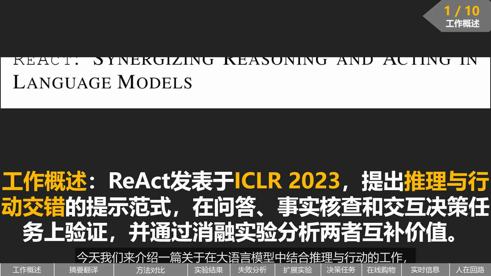](https://www.bilibili.com/video/BV1FRTi6oEz2)
---

### [101]. H2O：KV缓存压缩论文精读【每天一个宝藏论文】
- 观看视频：[视频BV1ktTc6tEce](https://www.bilibili.com/video/BV1ktTc6tEce)
- 查看手稿：[图片BV1ktTc6tEce](./assets/papers/BV1ktTc6tEce.jpg)

[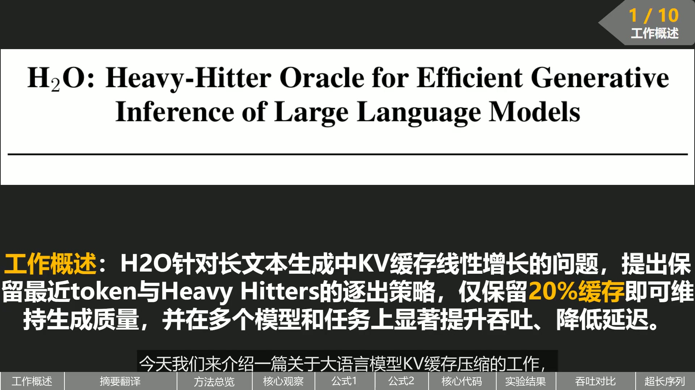](https://www.bilibili.com/video/BV1ktTc6tEce)
---

### [100]. FlashDecoding的改进：FlashDecoding++论文精读【每天一个宝藏论文】
- 观看视频：[视频BV1rtTc6tEen](https://www.bilibili.com/video/BV1rtTc6tEen)
- 查看手稿：[图片BV1rtTc6tEen](./assets/papers/BV1rtTc6tEen.jpg)

[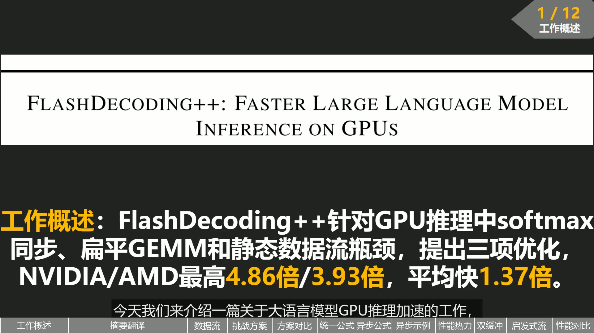](https://www.bilibili.com/video/BV1rtTc6tEen)
---

### [99]. Medusa：投机解码和树形注意力论文精读【每天一个宝藏论文】
- 观看视频：[视频BV1NsKQ6zENp](https://www.bilibili.com/video/BV1NsKQ6zENp)
- 查看手稿：[图片BV1NsKQ6zENp](./assets/papers/BV1NsKQ6zENp.jpg)

[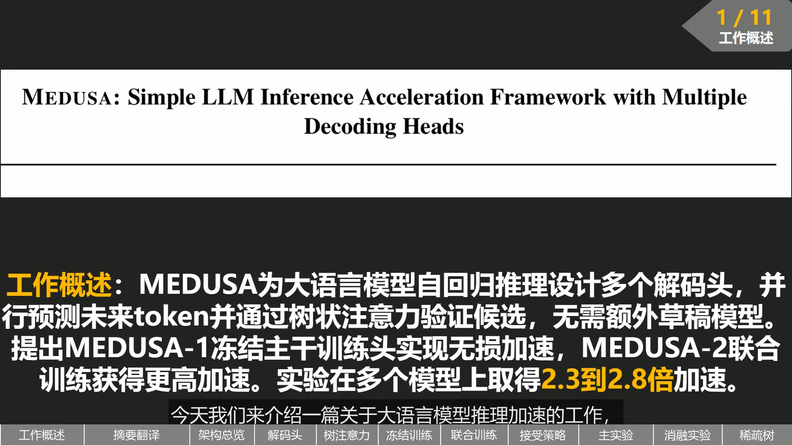](https://www.bilibili.com/video/BV1NsKQ6zENp)
---

### [98]. TurboQuant：KV Cache量化论文精读【每天一个宝藏论文】
- 观看视频：[视频BV11sKQ6zEFj](https://www.bilibili.com/video/BV11sKQ6zEFj)
- 查看手稿：[图片BV11sKQ6zEFj](./assets/papers/BV11sKQ6zEFj.jpg)

[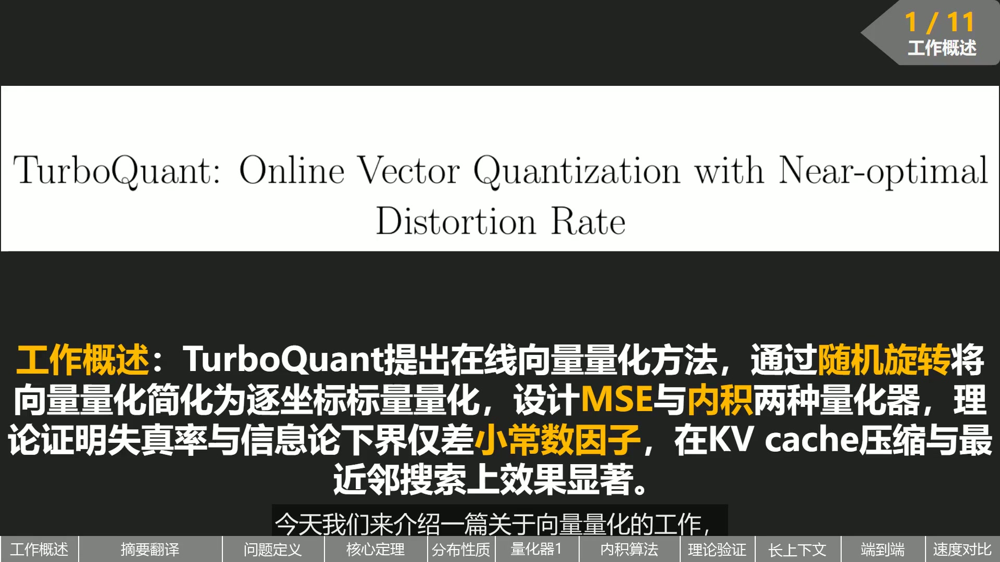](https://www.bilibili.com/video/BV11sKQ6zEFj)
---

### [97]. RaBitQ的改进工作：论文精读【每天一个宝藏论文】
- 观看视频：[视频BV18e7p6FEU6](https://www.bilibili.com/video/BV18e7p6FEU6)
- 查看手稿：[图片BV18e7p6FEU6](./assets/papers/BV18e7p6FEU6.jpg)

[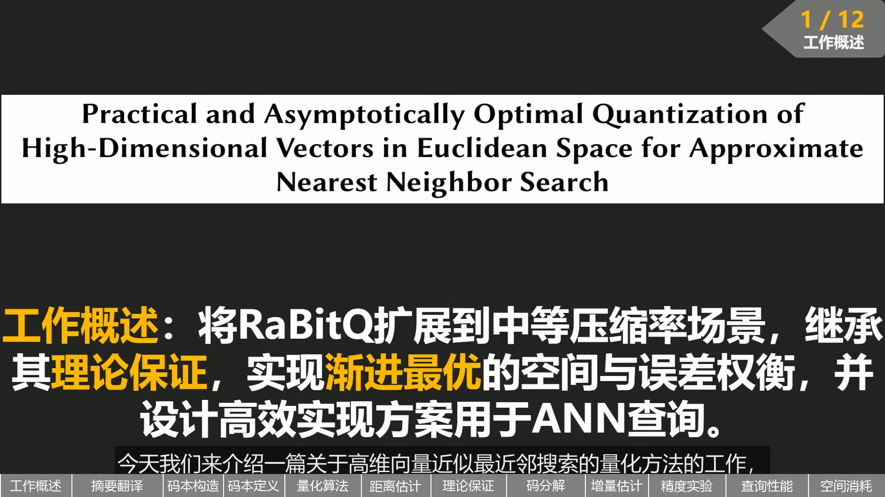](https://www.bilibili.com/video/BV18e7p6FEU6)
---

### [96]. Mamba_2：论文精读【每天一个宝藏论文】
- 观看视频：[视频BV1Av7q6dEpF](https://www.bilibili.com/video/BV1Av7q6dEpF)
- 查看手稿：[图片BV1Av7q6dEpF](./assets/papers/BV1Av7q6dEpF.jpg)

[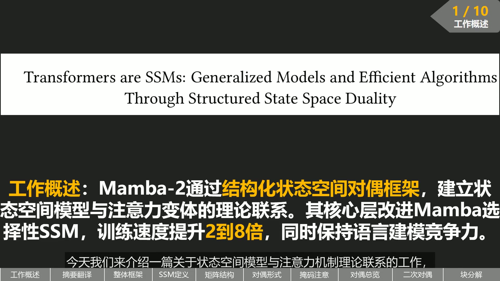](https://www.bilibili.com/video/BV1Av7q6dEpF)
---

### [95]. SAM_2：论文精读【每天一个宝藏论文】
- 观看视频：[视频BV1kv7q6RELS](https://www.bilibili.com/video/BV1kv7q6RELS)
- 查看手稿：[图片BV1kv7q6RELS](./assets/papers/BV1kv7q6RELS.jpg)

---

### [94]. BPE：论文精读【每天一个宝藏论文】
- 观看视频：[视频BV1kv7q6REeS](https://www.bilibili.com/video/BV1kv7q6REeS)
- 查看手稿：[图片BV1kv7q6REeS](./assets/papers/BV1kv7q6REeS.jpg)

[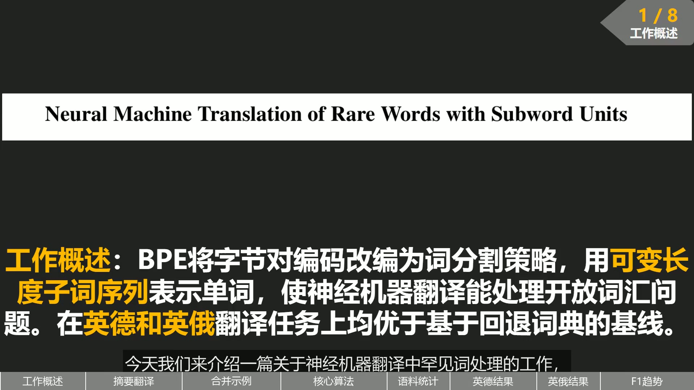](https://www.bilibili.com/video/BV1kv7q6REeS)
---

### [93]. PyTorch_2：论文精读【每天一个宝藏论文】
- 观看视频：[视频BV1kv7q6RE7a](https://www.bilibili.com/video/BV1kv7q6RE7a)
- 查看手稿：[图片BV1kv7q6RE7a](./assets/papers/BV1kv7q6RE7a.jpg)

[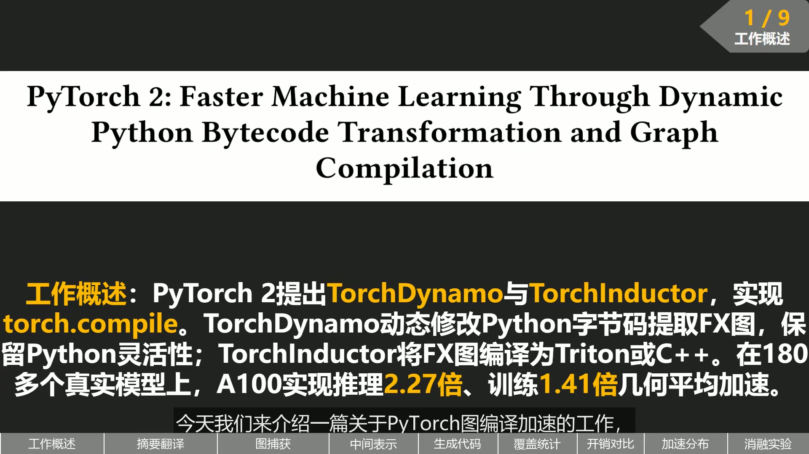](https://www.bilibili.com/video/BV1kv7q6RE7a)
---

### [92]. TVM：论文精读【每天一个宝藏论文】
- 观看视频：[视频BV1kv7q6REVg](https://www.bilibili.com/video/BV1kv7q6REVg)
- 查看手稿：[图片BV1kv7q6REVg](./assets/papers/BV1kv7q6REVg.jpg)

[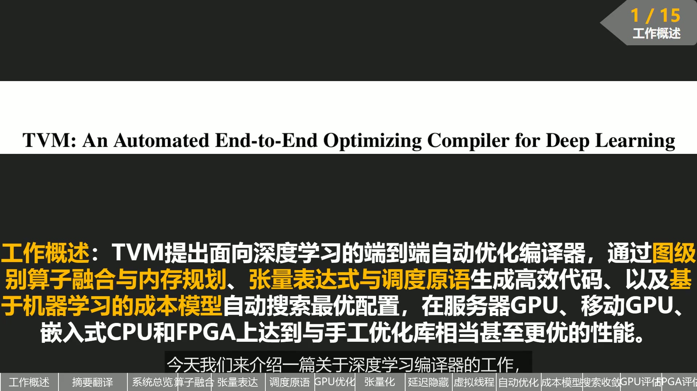](https://www.bilibili.com/video/BV1kv7q6REVg)
---

### [91]. ConsistencyModels：论文精读【每天一个宝藏论文】
- 观看视频：[视频BV1wv7q6dEtL](https://www.bilibili.com/video/BV1wv7q6dEtL)
- 查看手稿：[图片BV1wv7q6dEtL](./assets/papers/BV1wv7q6dEtL.jpg)

[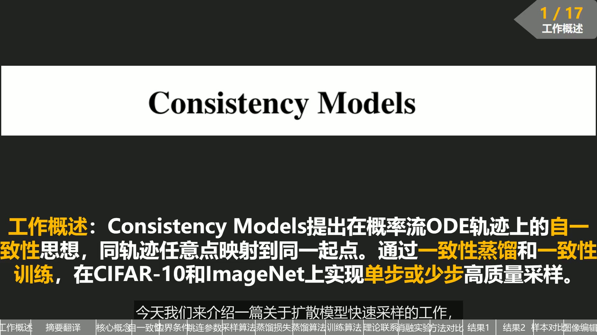](https://www.bilibili.com/video/BV1wv7q6dEtL)
---

### [90]. EDM：论文精读【每天一个宝藏论文】
- 观看视频：[视频BV1kv7q6REvQ](https://www.bilibili.com/video/BV1kv7q6REvQ)
- 查看手稿：[图片BV1kv7q6REvQ](./assets/papers/BV1kv7q6REvQ.jpg)

[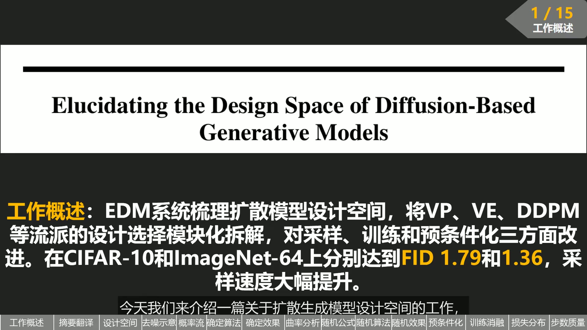](https://www.bilibili.com/video/BV1kv7q6REvQ)
---

### [89]. LDM：论文精读【每天一个宝藏论文】
- 观看视频：[视频BV1Av7q6dEKW](https://www.bilibili.com/video/BV1Av7q6dEKW)
- 查看手稿：[图片BV1Av7q6dEKW](./assets/papers/BV1Av7q6dEKW.jpg)

[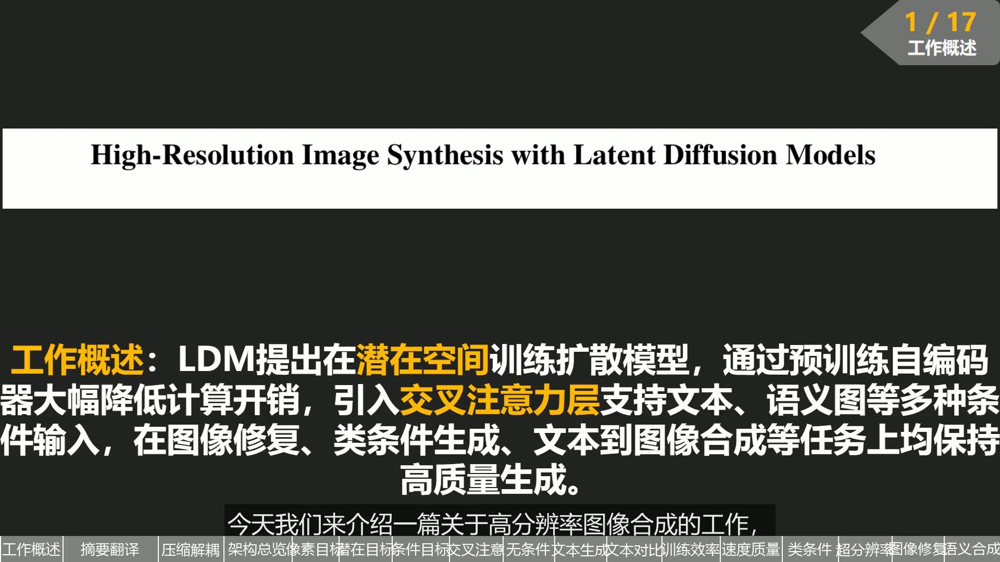](https://www.bilibili.com/video/BV1Av7q6dEKW)
---

### [88]. DiffusionBeatGANs：论文精读【每天一个宝藏论文】
- 观看视频：[视频BV1kv7q6REEK](https://www.bilibili.com/video/BV1kv7q6REEK)
- 查看手稿：[图片BV1kv7q6REEK](./assets/papers/BV1kv7q6REEK.jpg)

[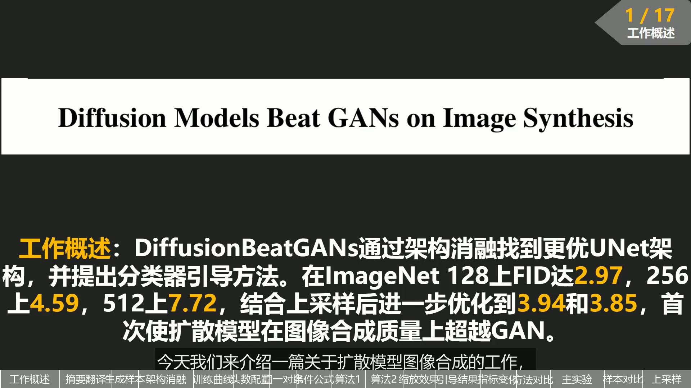](https://www.bilibili.com/video/BV1kv7q6REEK)
---

### [87]. ScoreSDE：论文精读【每天一个宝藏论文】
- 观看视频：[视频BV1kv7q6REtL](https://www.bilibili.com/video/BV1kv7q6REtL)
- 查看手稿：[图片BV1kv7q6REtL](./assets/papers/BV1kv7q6REtL.jpg)

[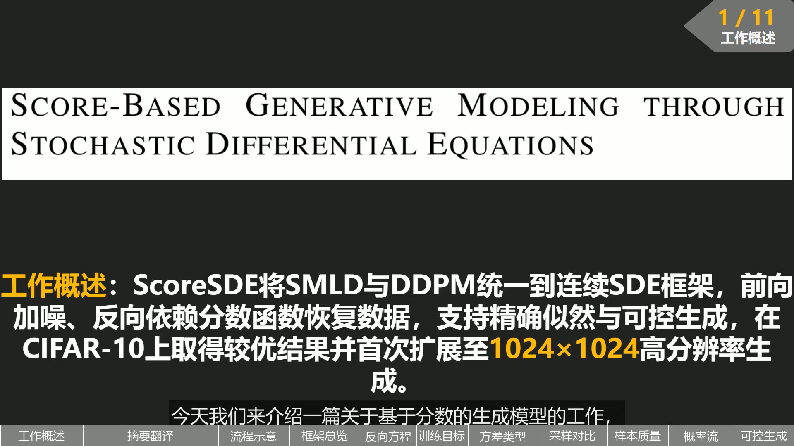](https://www.bilibili.com/video/BV1kv7q6REtL)
---

### [86]. DDIM：论文精读【每天一个宝藏论文】
- 观看视频：[视频BV1LXjg6vEPM](https://www.bilibili.com/video/BV1LXjg6vEPM)
- 查看手稿：[图片BV1LXjg6vEPM](./assets/papers/BV1LXjg6vEPM.jpg)

[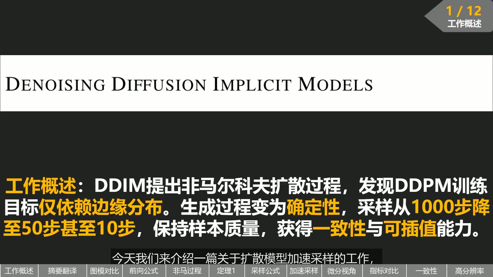](https://www.bilibili.com/video/BV1LXjg6vEPM)
---

### [85]. NCSN：论文精读【每天一个宝藏论文】
- 观看视频：[视频BV1LXjg6vEhk](https://www.bilibili.com/video/BV1LXjg6vEhk)
- 查看手稿：[图片BV1LXjg6vEhk](./assets/papers/BV1LXjg6vEhk.jpg)

[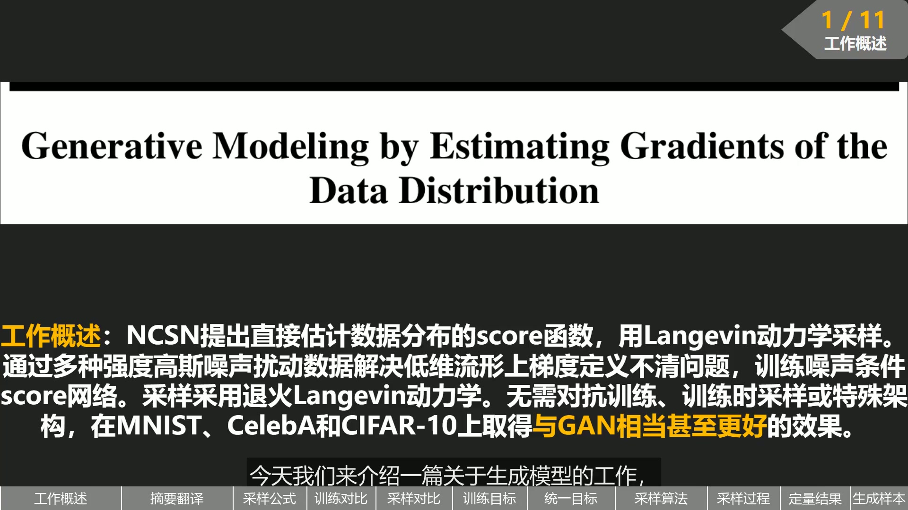](https://www.bilibili.com/video/BV1LXjg6vEhk)
---

### [84]. WGAN：论文精读【每天一个宝藏论文】
- 观看视频：[视频BV176Js6DELe](https://www.bilibili.com/video/BV176Js6DELe)
- 查看手稿：[图片BV176Js6DELe](./assets/papers/BV176Js6DELe.jpg)

---

### [83]. 思维树：论文精读【每天一个宝藏论文】
- 观看视频：[视频BV176Js6DEsq](https://www.bilibili.com/video/BV176Js6DEsq)
- 查看手稿：[图片BV176Js6DEsq](./assets/papers/BV176Js6DEsq.jpg)

---

### [82]. 思维链：论文精读【每天一个宝藏论文】
- 观看视频：[视频BV1q6Js6DEaQ](https://www.bilibili.com/video/BV1q6Js6DEaQ)
- 查看手稿：[图片BV1q6Js6DEaQ](./assets/papers/BV1q6Js6DEaQ.jpg)

[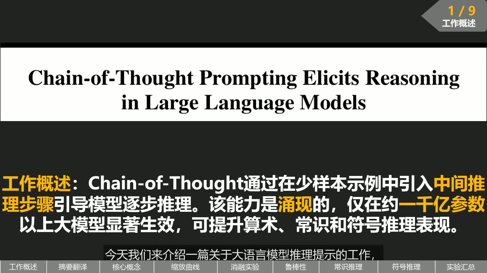](https://www.bilibili.com/video/BV1q6Js6DEaQ)
---

### [81]. ProgressiveDistillation：论文精读【每天一个宝藏论文】
- 观看视频：[视频BV1q6Js6DE2b](https://www.bilibili.com/video/BV1q6Js6DE2b)
- 查看手稿：[图片BV1q6Js6DE2b](./assets/papers/BV1q6Js6DE2b.jpg)

[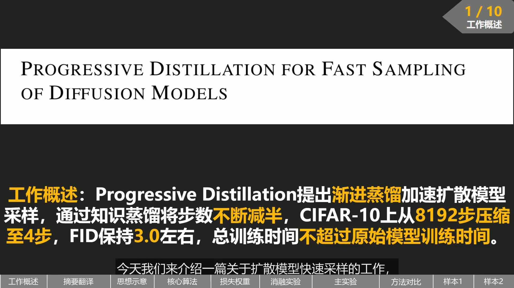](https://www.bilibili.com/video/BV1q6Js6DE2b)
---

### [80]. GAN：论文精读【每天一个宝藏论文】
- 观看视频：[视频BV176Js6DEPp](https://www.bilibili.com/video/BV176Js6DEPp)
- 查看手稿：[图片BV176Js6DEPp](./assets/papers/BV176Js6DEPp.jpg)

---

### [79]. FlashAttention-4：论文精读【每天一个宝藏论文】
- 观看视频：[视频BV1q6Js6DEwE](https://www.bilibili.com/video/BV1q6Js6DEwE)
- 查看手稿：[图片BV1q6Js6DEwE](./assets/papers/BV1q6Js6DEwE.jpg)

[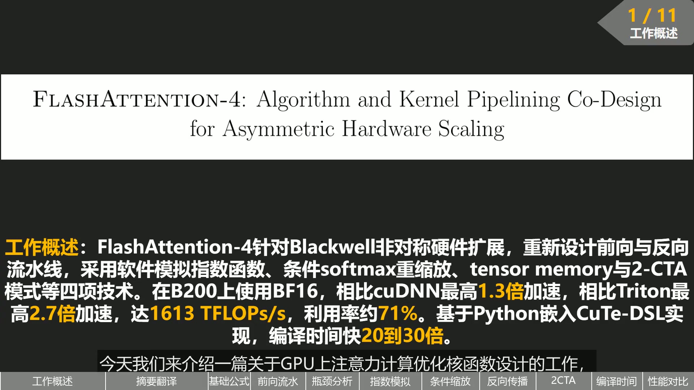](https://www.bilibili.com/video/BV1q6Js6DEwE)
---

### [78]. CFG：论文精读【每天一个宝藏论文】
- 观看视频：[视频BV176Js6DE5W](https://www.bilibili.com/video/BV176Js6DE5W)
- 查看手稿：[图片BV176Js6DE5W](./assets/papers/BV176Js6DE5W.jpg)

[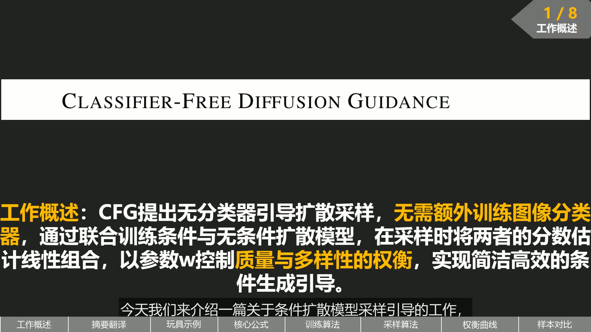](https://www.bilibili.com/video/BV176Js6DE5W)
---

### [77]. DDPM：论文精读【每天一个宝藏论文】
- 观看视频：[视频BV176Js6DEaM](https://www.bilibili.com/video/BV176Js6DEaM)
- 查看手稿：[图片BV176Js6DEaM](./assets/papers/BV176Js6DEaM.jpg)

[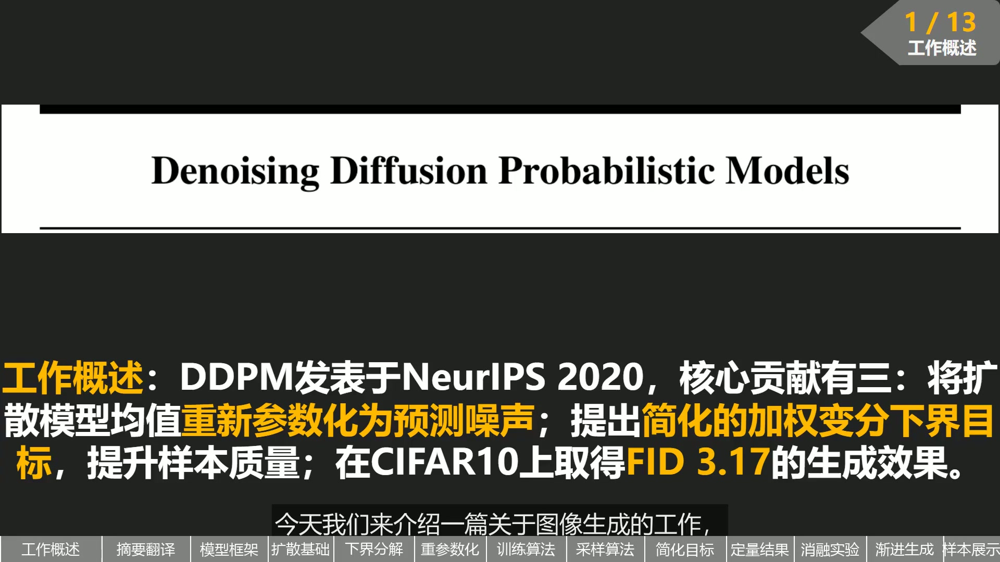](https://www.bilibili.com/video/BV176Js6DEaM)
---

### [76]. VAE：论文精读【每天一个宝藏论文】
- 观看视频：[视频BV1Ag7m6XEyN](https://www.bilibili.com/video/BV1Ag7m6XEyN)
- 查看手稿：[图片BV1Ag7m6XEyN](./assets/papers/BV1Ag7m6XEyN.jpg)

---

### [75]. GoogLeNet：论文精读【每天一个宝藏论文】
- 观看视频：[视频BV1Pg7m6XEnq](https://www.bilibili.com/video/BV1Pg7m6XEnq)
- 查看手稿：[图片BV1Pg7m6XEnq](./assets/papers/BV1Pg7m6XEnq.jpg)

---

### [74]. VGG：论文精读【每天一个宝藏论文】
- 观看视频：[视频BV1Ag7m6XEy4](https://www.bilibili.com/video/BV1Ag7m6XEy4)
- 查看手稿：[图片BV1Ag7m6XEy4](./assets/papers/BV1Ag7m6XEy4.jpg)

[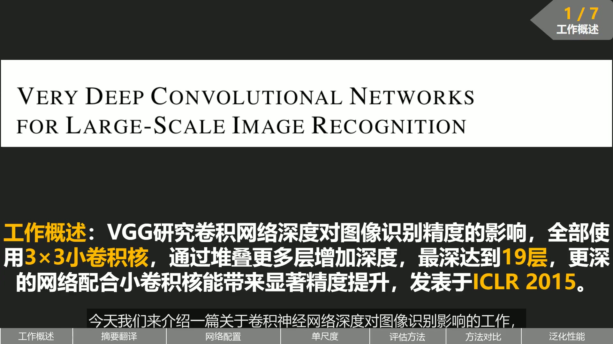](https://www.bilibili.com/video/BV1Ag7m6XEy4)
---

### [73]. FasterRCNN：论文精读【每天一个宝藏论文】
- 观看视频：[视频BV1Wg7m6XEgG](https://www.bilibili.com/video/BV1Wg7m6XEgG)
- 查看手稿：[图片BV1Wg7m6XEgG](./assets/papers/BV1Wg7m6XEgG.jpg)

---

### [72]. Word2Vec：论文精读【每天一个宝藏论文】
- 观看视频：[视频BV1Ag7m6XERk](https://www.bilibili.com/video/BV1Ag7m6XERk)
- 查看手稿：[图片BV1Ag7m6XERk](./assets/papers/BV1Ag7m6XERk.jpg)

[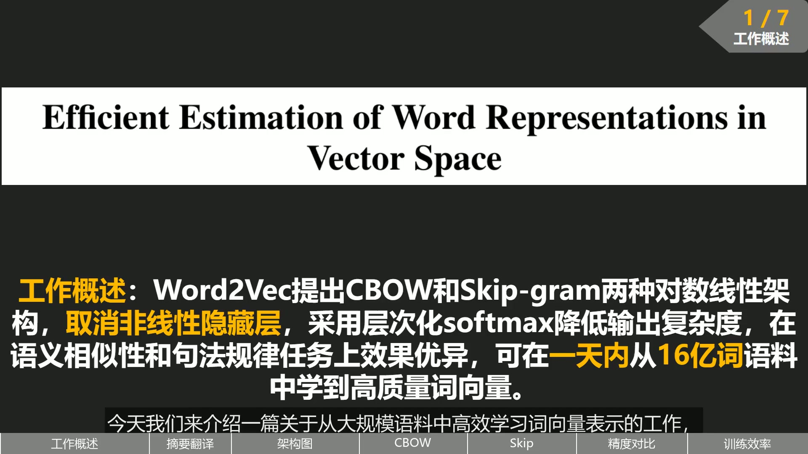](https://www.bilibili.com/video/BV1Ag7m6XERk)
---

### [71]. Whisper：论文精读【每天一个宝藏论文】
- 观看视频：[视频BV1Ag7m6XErq](https://www.bilibili.com/video/BV1Ag7m6XErq)
- 查看手稿：[图片BV1Ag7m6XErq](./assets/papers/BV1Ag7m6XErq.jpg)

[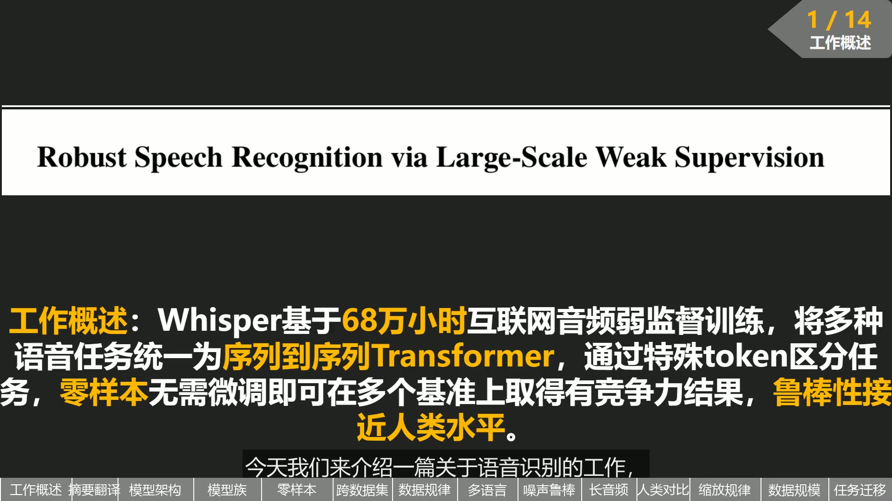](https://www.bilibili.com/video/BV1Ag7m6XErq)
---

### [70]. UNet：论文精读【每天一个宝藏论文】
- 观看视频：[视频BV1zRVE6sEz1](https://www.bilibili.com/video/BV1zRVE6sEz1)
- 查看手稿：[图片BV1zRVE6sEz1](./assets/papers/BV1zRVE6sEz1.jpg)

[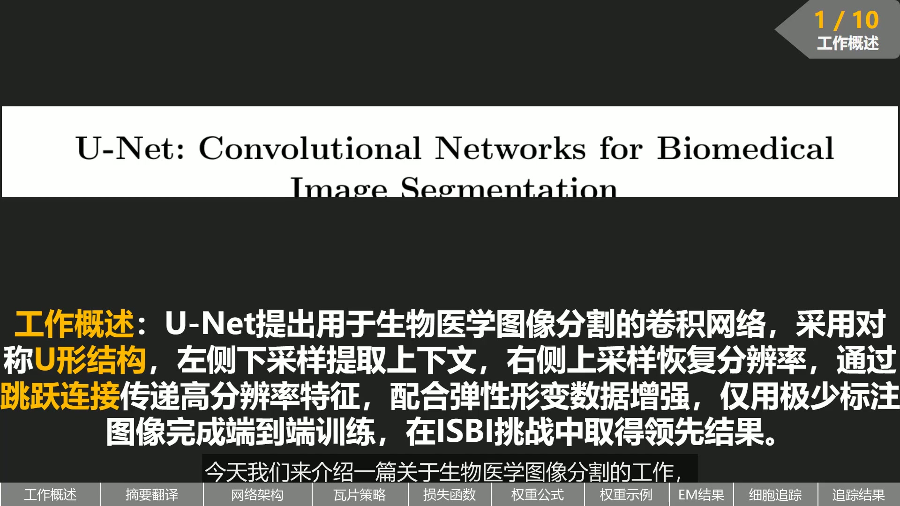](https://www.bilibili.com/video/BV1zRVE6sEz1)
---

### [69]. SwinTransformer：论文解读【每天一个宝藏论文】
- 观看视频：[视频BV1zRVE6sEU2](https://www.bilibili.com/video/BV1zRVE6sEU2)
- 查看手稿：[图片BV1zRVE6sEU2](./assets/papers/BV1zRVE6sEU2.jpg)

[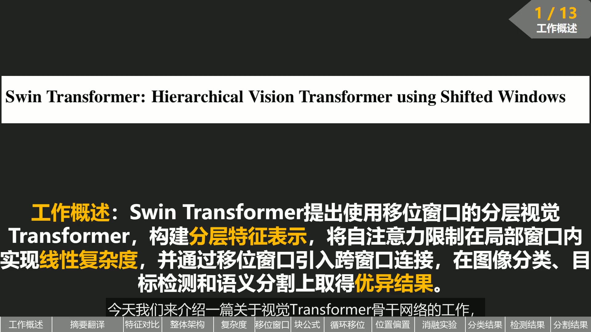](https://www.bilibili.com/video/BV1zRVE6sEU2)
---

### [68]. EfficientNet：论文解读【每天一个宝藏论文】
- 观看视频：[视频BV1zRVE6sEmR](https://www.bilibili.com/video/BV1zRVE6sEmR)
- 查看手稿：[图片BV1zRVE6sEmR](./assets/papers/BV1zRVE6sEmR.jpg)

[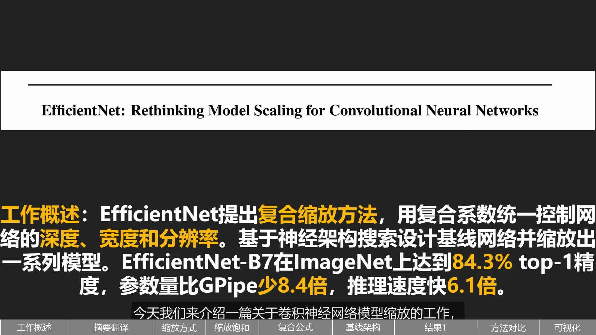](https://www.bilibili.com/video/BV1zRVE6sEmR)
---

### [67]. Dropout：论文解读【每天一个宝藏论文】
- 观看视频：[视频BV1dsG26dETn](https://www.bilibili.com/video/BV1dsG26dETn)
- 查看手稿：[图片BV1dsG26dETn](./assets/papers/BV1dsG26dETn.jpg)

[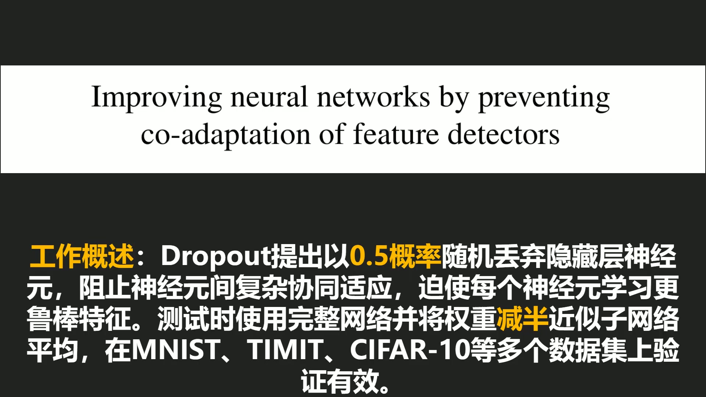](https://www.bilibili.com/video/BV1dsG26dETn)
---

### [66]. DINO：论文解读【每天一个宝藏论文】
- 观看视频：[视频BV1bGVK6iEq7](https://www.bilibili.com/video/BV1bGVK6iEq7)
- 查看手稿：[图片BV1bGVK6iEq7](./assets/papers/BV1bGVK6iEq7.jpg)

---

### [65]. Mamba：论文解读【每天一个宝藏论文】
- 观看视频：[视频BV1uGVK6iEh2](https://www.bilibili.com/video/BV1uGVK6iEh2)
- 查看手稿：[图片BV1uGVK6iEh2](./assets/papers/BV1uGVK6iEh2.jpg)

[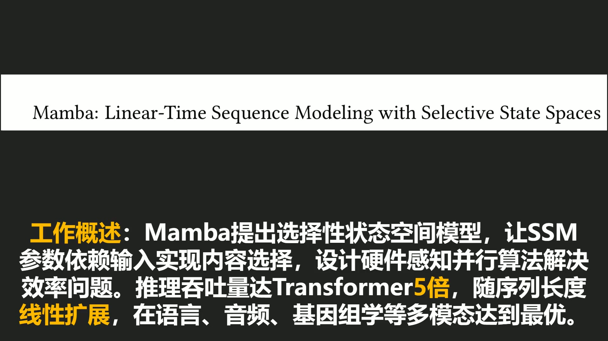](https://www.bilibili.com/video/BV1uGVK6iEh2)
---

### [64]. YOLO：论文解读【每天一个宝藏论文】
- 观看视频：[视频BV18iGx6oEo1](https://www.bilibili.com/video/BV18iGx6oEo1)
- 查看手稿：[图片BV18iGx6oEo1](./assets/papers/BV18iGx6oEo1.jpg)

[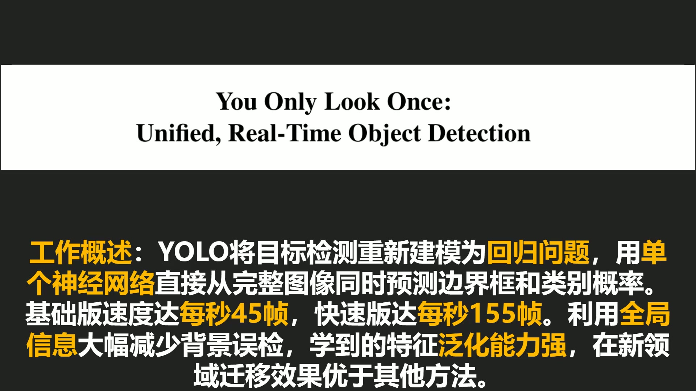](https://www.bilibili.com/video/BV18iGx6oEo1)
---

### [63]. DETR：论文解读【每天一个宝藏论文】
- 观看视频：[视频BV1DiGx6oE4S](https://www.bilibili.com/video/BV1DiGx6oE4S)
- 查看手稿：[图片BV1DiGx6oE4S](./assets/papers/BV1DiGx6oE4S.jpg)

---

### [62]. FlowMatching：论文解读【每天一个宝藏论文】
- 观看视频：[视频BV1hiGx6oExa](https://www.bilibili.com/video/BV1hiGx6oExa)
- 查看手稿：[图片BV1hiGx6oExa](./assets/papers/BV1hiGx6oExa.jpg)

---

### [61]. RaBitQ：向量检索论文解读【每天一个宝藏论文】
- 观看视频：[视频BV1AtGe6KEuV](https://www.bilibili.com/video/BV1AtGe6KEuV)
- 查看手稿：[图片BV1AtGe6KEuV](./assets/papers/BV1AtGe6KEuV.jpg)

[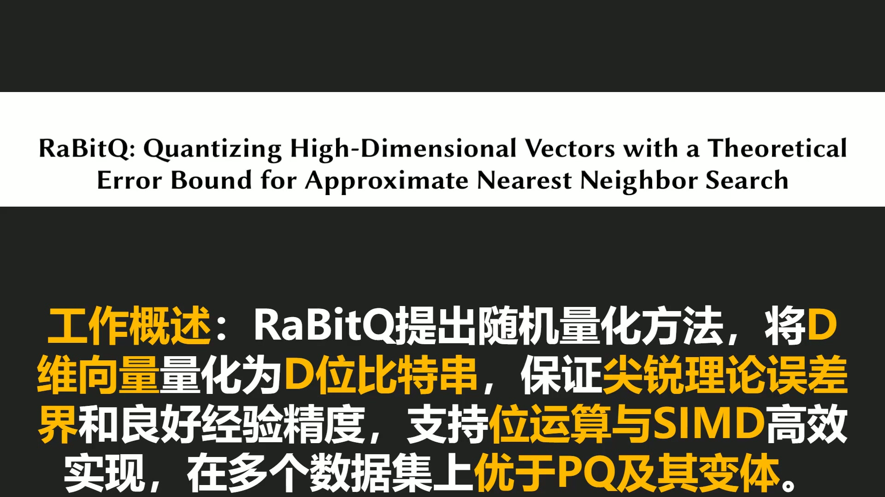](https://www.bilibili.com/video/BV1AtGe6KEuV)
---

### [60]. SAM：论文解读【每天一个宝藏论文】
- 观看视频：[视频BV1ktGe6NE1c](https://www.bilibili.com/video/BV1ktGe6NE1c)
- 查看手稿：[图片BV1ktGe6NE1c](./assets/papers/BV1ktGe6NE1c.jpg)

[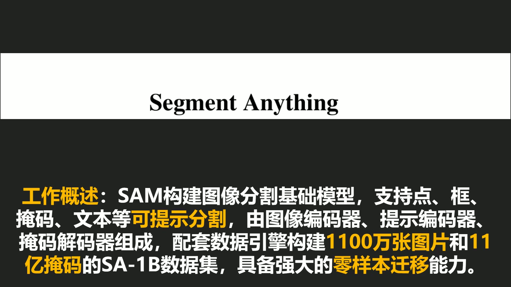](https://www.bilibili.com/video/BV1ktGe6NE1c)
---

### [59]. MoE：论文解读【每天一个宝藏论文】
- 观看视频：[视频BV17zLC68Emq](https://www.bilibili.com/video/BV17zLC68Emq)
- 查看手稿：[图片BV17zLC68Emq](./assets/papers/BV17zLC68Emq.jpg)

[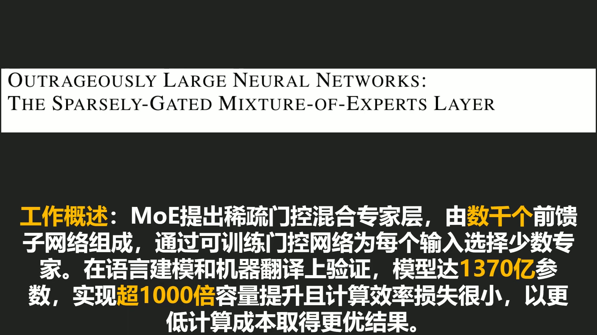](https://www.bilibili.com/video/BV17zLC68Emq)
---

### [58]. MAE：论文解读【每天一个宝藏论文】
- 观看视频：[视频BV1zGLM6cEYG](https://www.bilibili.com/video/BV1zGLM6cEYG)
- 查看手稿：[图片BV1zGLM6cEYG](./assets/papers/BV1zGLM6cEYG.jpg)

[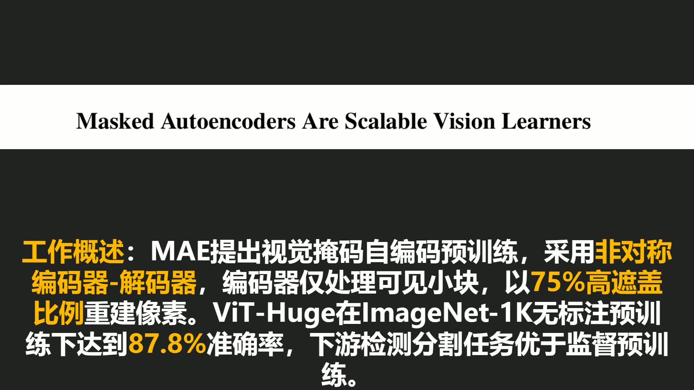](https://www.bilibili.com/video/BV1zGLM6cEYG)
---

### [57]. CLIP：论文解读【每天一个宝藏论文】
- 观看视频：[视频BV1cQLJ6PE78](https://www.bilibili.com/video/BV1cQLJ6PE78)
- 查看手稿：[图片BV1cQLJ6PE78](./assets/papers/BV1cQLJ6PE78.jpg)

[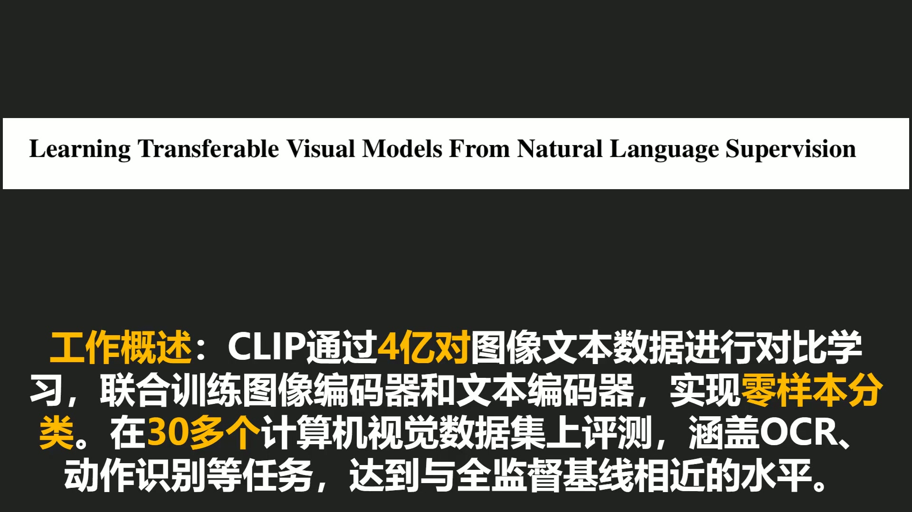](https://www.bilibili.com/video/BV1cQLJ6PE78)
---

### [56]. 旋转位置编码RoPE：论文解读【每天一个宝藏论文】
- 观看视频：[视频BV1cQLJ6PEAs](https://www.bilibili.com/video/BV1cQLJ6PEAs)
- 查看手稿：[图片BV1cQLJ6PEAs](./assets/papers/BV1cQLJ6PEAs.jpg)

[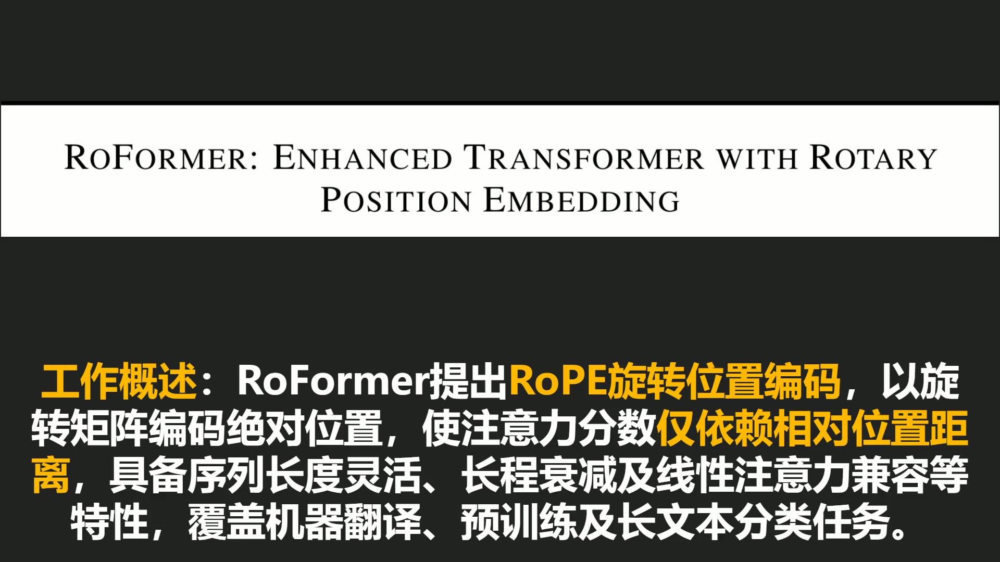](https://www.bilibili.com/video/BV1cQLJ6PEAs)
---

### [55]. ScaNN：向量检索论文解读【每天一个宝藏论文】
- 观看视频：[视频BV1FQLJ6PESa](https://www.bilibili.com/video/BV1FQLJ6PESa)
- 查看手稿：[图片BV1FQLJ6PESa](./assets/papers/BV1FQLJ6PESa.jpg)

[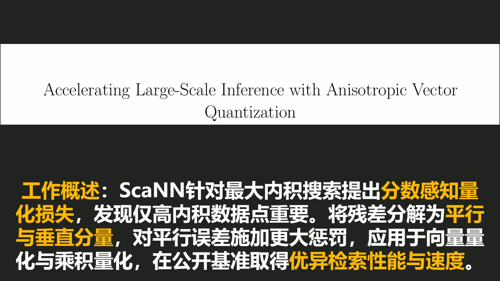](https://www.bilibili.com/video/BV1FQLJ6PESa)
---

### [54]. ViT：论文解读【每天一个宝藏论文】
- 观看视频：[视频BV1JXLJ6YE1X](https://www.bilibili.com/video/BV1JXLJ6YE1X)
- 查看手稿：[图片BV1JXLJ6YE1X](./assets/papers/BV1JXLJ6YE1X.jpg)

[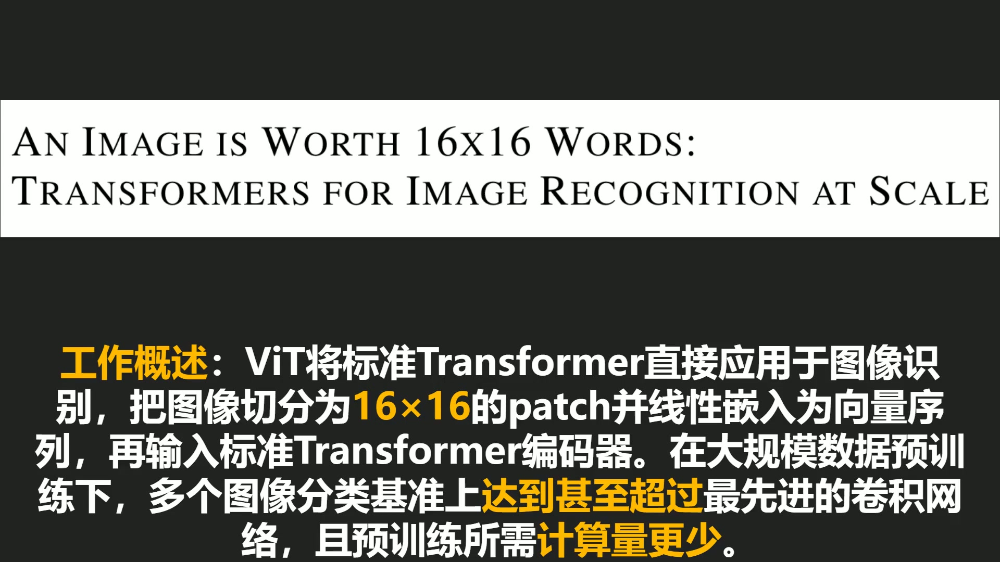](https://www.bilibili.com/video/BV1JXLJ6YE1X)
---

### [53]. GPT3：论文解读【每天一个宝藏论文】
- 观看视频：[视频BV1FXLJ6YEh4](https://www.bilibili.com/video/BV1FXLJ6YEh4)
- 查看手稿：[图片BV1FXLJ6YEh4](./assets/papers/BV1FXLJ6YEh4.jpg)

[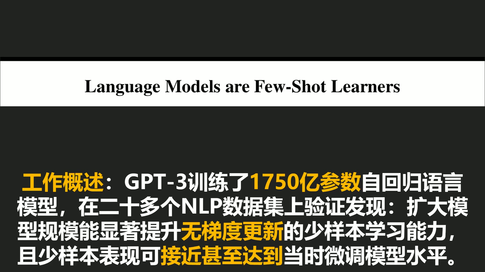](https://www.bilibili.com/video/BV1FXLJ6YEh4)
---

### [52]. GPT2：论文解读【每天一个宝藏论文】
- 观看视频：[视频BV1FXLJ6YECS](https://www.bilibili.com/video/BV1FXLJ6YECS)
- 查看手稿：[图片BV1FXLJ6YECS](./assets/papers/BV1FXLJ6YECS.jpg)

[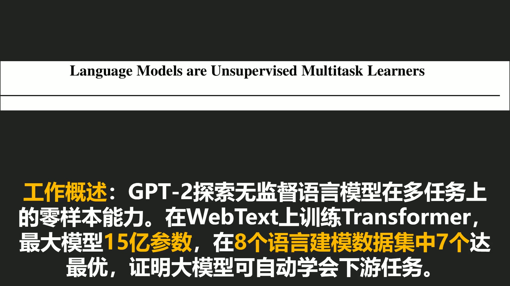](https://www.bilibili.com/video/BV1FXLJ6YECS)
---

### [51]. BERT：论文解读【每天一个宝藏论文】
- 观看视频：[视频BV1fXLJ6aEZ1](https://www.bilibili.com/video/BV1fXLJ6aEZ1)
- 查看手稿：[图片BV1fXLJ6aEZ1](./assets/papers/BV1fXLJ6aEZ1.jpg)

---

### [50]. MobileNet：论文解读【每天一个宝藏论文】
- 观看视频：[视频BV1FXLJ6YExi](https://www.bilibili.com/video/BV1FXLJ6YExi)
- 查看手稿：[图片BV1FXLJ6YExi](./assets/papers/BV1FXLJ6YExi.jpg)

[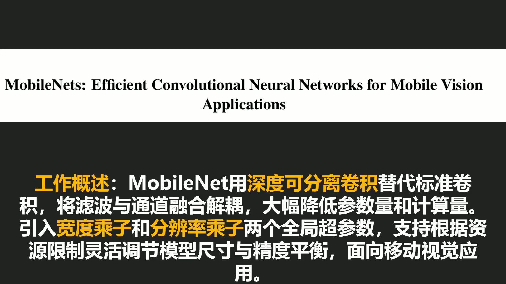](https://www.bilibili.com/video/BV1FXLJ6YExi)
---

### [49]. ResNet：论文解读【每天一个宝藏论文】
- 观看视频：[视频BV1FXLJ6YE4U](https://www.bilibili.com/video/BV1FXLJ6YE4U)
- 查看手稿：[图片BV1FXLJ6YE4U](./assets/papers/BV1FXLJ6YE4U.jpg)

[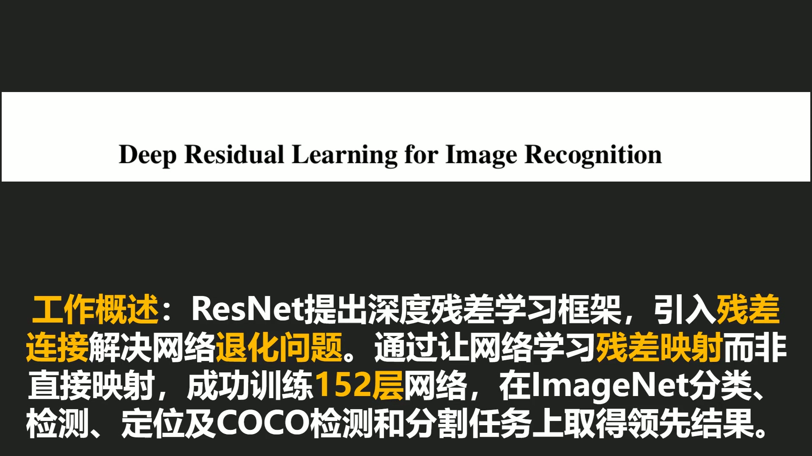](https://www.bilibili.com/video/BV1FXLJ6YE4U)
---

### [48]. DAPO：论文解读【每天一个宝藏论文】
- 观看视频：[视频BV1tN5b6YEjF](https://www.bilibili.com/video/BV1tN5b6YEjF)
- 查看手稿：[图片BV1tN5b6YEjF](./assets/papers/BV1tN5b6YEjF.jpg)

[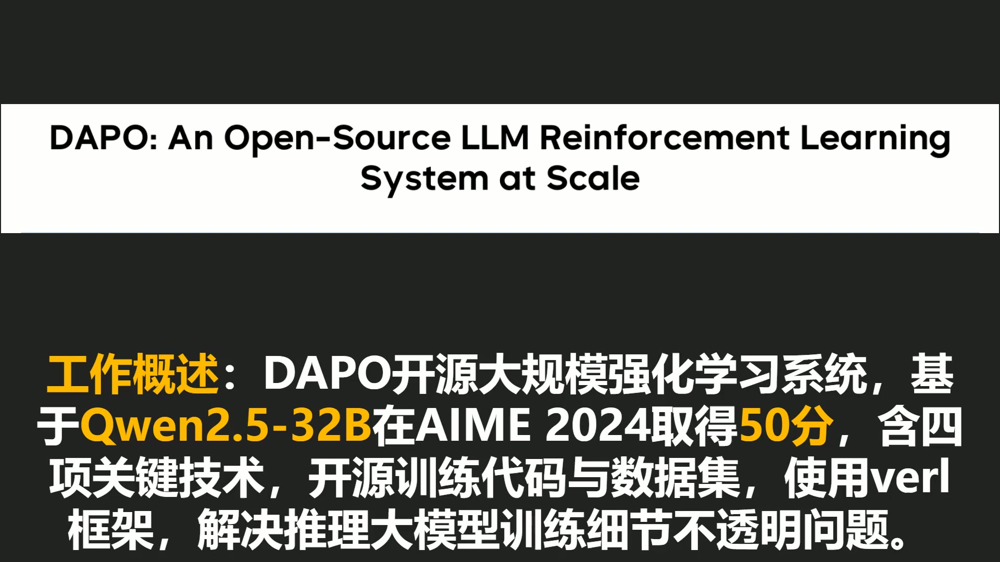](https://www.bilibili.com/video/BV1tN5b6YEjF)
---

### [47]. QLearning：论文解读【每天一个宝藏论文】
- 观看视频：[视频BV14N5b6YEbS](https://www.bilibili.com/video/BV14N5b6YEbS)
- 查看手稿：[图片BV14N5b6YEbS](./assets/papers/BV14N5b6YEbS.jpg)

---

### [46]. Muon is Scalable：Muon优化器论文解读【每天一个宝藏论文】
- 观看视频：[视频BV14N5b6YEbf](https://www.bilibili.com/video/BV14N5b6YEbf)
- 查看手稿：[图片BV14N5b6YEbf](./assets/papers/BV14N5b6YEbf.jpg)

---

### [45]. AlphaZero：论文解读【每天一个宝藏论文】
- 观看视频：[视频BV1nERrB9E7d](https://www.bilibili.com/video/BV1nERrB9E7d)
- 查看手稿：[图片BV1nERrB9E7d](./assets/papers/BV1nERrB9E7d.jpg)

---

### [44]. AutoRound：大模型量化论文解读【每天一个宝藏论文】
- 观看视频：[视频BV1t1RrBNEEt](https://www.bilibili.com/video/BV1t1RrBNEEt)
- 查看手稿：[图片BV1t1RrBNEEt](./assets/papers/BV1t1RrBNEEt.jpg)

---

### [43]. MQA：论文解读【每天一个宝藏论文】
- 观看视频：[视频BV1m1RrBNEmy](https://www.bilibili.com/video/BV1m1RrBNEmy)
- 查看手稿：[图片BV1m1RrBNEmy](./assets/papers/BV1m1RrBNEmy.jpg)

---

### [42]. DQN：论文解读【每天一个宝藏论文】
- 观看视频：[视频BV141RrBNEd1](https://www.bilibili.com/video/BV141RrBNEd1)
- 查看手稿：[图片BV141RrBNEd1](./assets/papers/BV141RrBNEd1.jpg)

[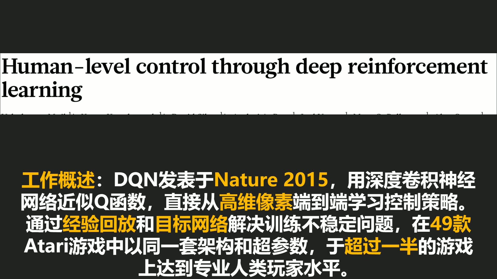](https://www.bilibili.com/video/BV141RrBNEd1)
---

### [41]. DeepSeek_GRPO：论文解读【每天一个宝藏论文】
- 观看视频：[视频BV1m1RrBNEhp](https://www.bilibili.com/video/BV1m1RrBNEhp)
- 查看手稿：[图片BV1m1RrBNEhp](./assets/papers/BV1m1RrBNEhp.jpg)

[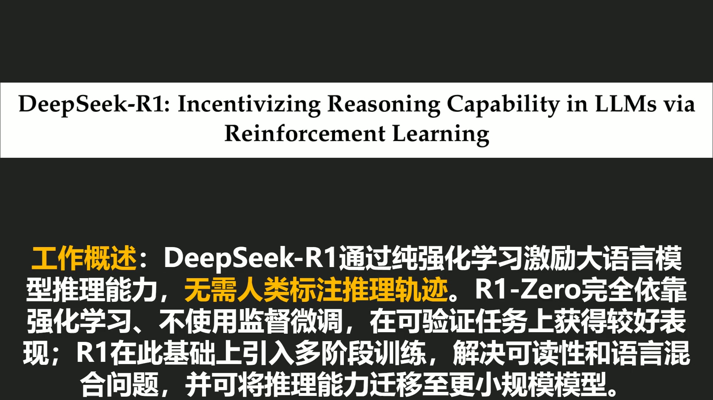](https://www.bilibili.com/video/BV1m1RrBNEhp)
---

### [40]. Transformer：论文解读【每天一个宝藏论文】
- 观看视频：[视频BV1t1RrBNEwi](https://www.bilibili.com/video/BV1t1RrBNEwi)
- 查看手稿：[图片BV1t1RrBNEwi](./assets/papers/BV1t1RrBNEwi.jpg)

[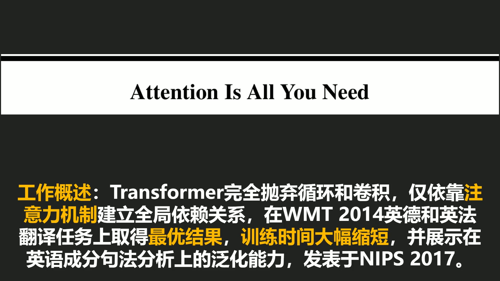](https://www.bilibili.com/video/BV1t1RrBNEwi)
---

### [39]. 智能体强化学习论文串讲：WebRL、DigiRL、WebAgent-R1、AgentQ【每天一个宝藏论文】
- 观看视频：[视频BV1f9RxBCEyN](https://www.bilibili.com/video/BV1f9RxBCEyN)
- 查看手稿：[图片BV1f9RxBCEyN](./assets/papers/BV1f9RxBCEyN.jpg)

[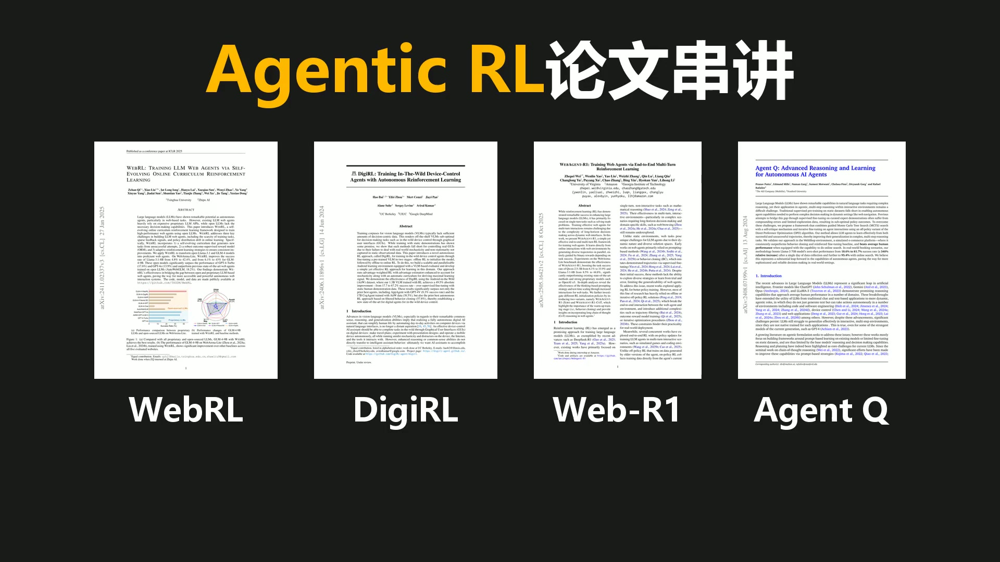](https://www.bilibili.com/video/BV1f9RxBCEyN)
---

### [38]. AlphaGo：论文解读【每天一个宝藏论文】
- 观看视频：[视频BV1t1RrBNELs](https://www.bilibili.com/video/BV1t1RrBNELs)
- 查看手稿：[图片BV1t1RrBNELs](./assets/papers/BV1t1RrBNELs.jpg)

---

### [37]. Adam：论文解读【每天一个宝藏论文】
- 观看视频：[视频BV142RrBeEjQ](https://www.bilibili.com/video/BV142RrBeEjQ)
- 查看手稿：[图片BV142RrBeEjQ](./assets/papers/BV142RrBeEjQ.jpg)

[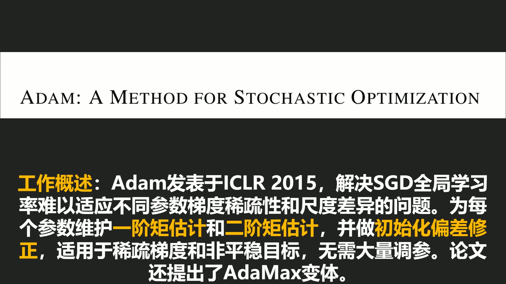](https://www.bilibili.com/video/BV142RrBeEjQ)
---

### [36]. DPO：论文解读【每天一个宝藏论文】
- 观看视频：[视频BV142RrBeE8E](https://www.bilibili.com/video/BV142RrBeE8E)
- 查看手稿：[图片BV142RrBeE8E](./assets/papers/BV142RrBeE8E.jpg)

---

### [35]. Deepseek-Engram：论文解读【每天一个宝藏论文】
- 观看视频：[视频BV122RrBeEfs](https://www.bilibili.com/video/BV122RrBeEfs)
- 查看手稿：[图片BV122RrBeEfs](./assets/papers/BV122RrBeEfs.jpg)

[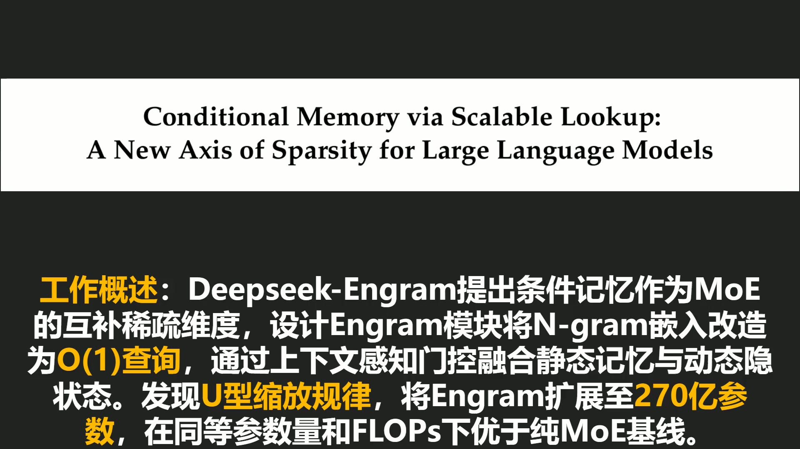](https://www.bilibili.com/video/BV122RrBeEfs)
---

### [34]. PPO：论文解读【每天一个宝藏论文】
- 观看视频：[视频BV1T2RrBvE25](https://www.bilibili.com/video/BV1T2RrBvE25)
- 查看手稿：[图片BV1T2RrBvE25](./assets/papers/BV1T2RrBvE25.jpg)

[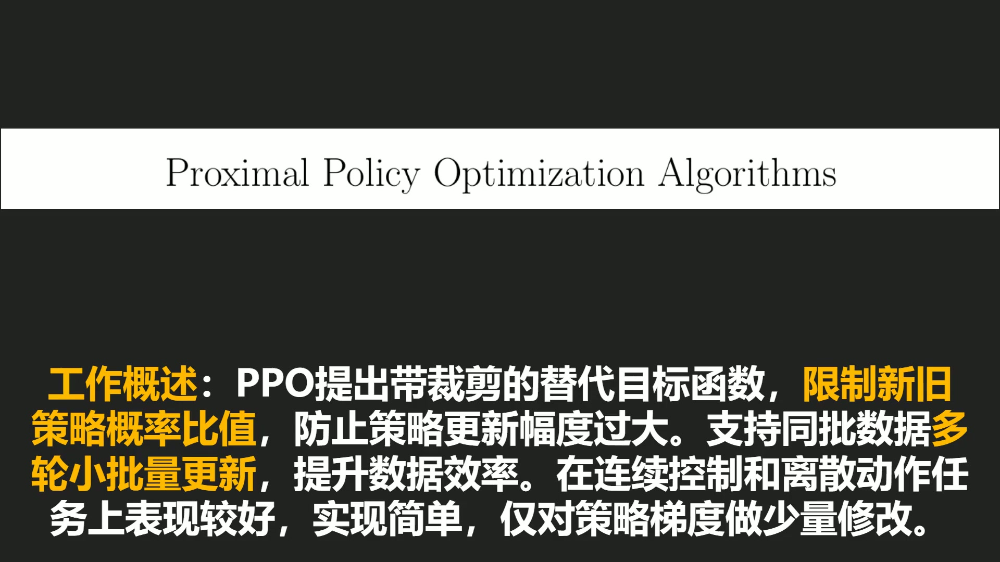](https://www.bilibili.com/video/BV1T2RrBvE25)
---

### [33]. mHC：流形约束超连接【每天一个宝藏论文】
- 观看视频：[视频BV1m2RrBeEFS](https://www.bilibili.com/video/BV1m2RrBeEFS)
- 查看手稿：[图片BV1m2RrBeEFS](./assets/papers/BV1m2RrBeEFS.jpg)

[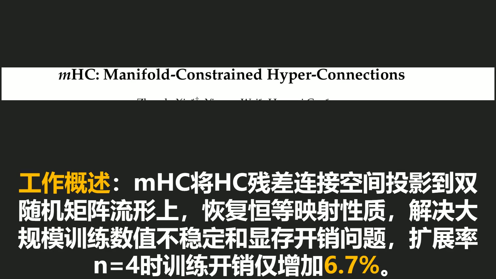](https://www.bilibili.com/video/BV1m2RrBeEFS)
---

### [32]. Hyper Connections：残差连接的改进【每天一个宝藏论文】
- 观看视频：[视频BV142RrBeEa3](https://www.bilibili.com/video/BV142RrBeEa3)
- 查看手稿：[图片BV142RrBeEa3](./assets/papers/BV142RrBeEa3.jpg)

---

### [31]. OSDI 2025 LLM方向论文串讲：DecDEC、WLB_LLM、Straggler【每天一个宝藏论文】
- 观看视频：[视频BV129ReB1EiW](https://www.bilibili.com/video/BV129ReB1EiW)
- 查看手稿：[图片BV129ReB1EiW](./assets/papers/BV129ReB1EiW.jpg)

---

### [30] Deepseek-MLA、MTP解读 【每天一个宝藏论文】
- 观看视频：[视频BV1Vgd2BtEKe](https://www.bilibili.com/video/BV1Vgd2BtEKe)
- 查看手稿：[图片BV1Vgd2BtEKe](./assets/papers/BV1Vgd2BtEKe.jpg)

[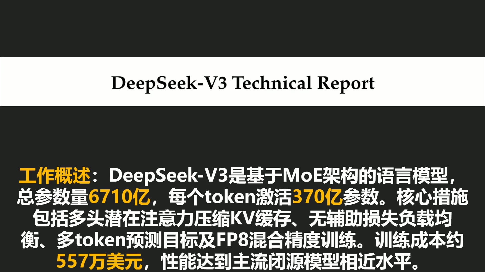](https://www.bilibili.com/video/BV1Vgd2BtEKe)
---

### [29] GPTQ：大模型量化论文解读【每天一个宝藏论文】
- 观看视频：[视频BV1Y3d2BoELh](https://www.bilibili.com/video/BV1Y3d2BoELh)
- 查看手稿：[图片BV1Y3d2BoELh](./assets/papers/BV1Y3d2BoELh.jpg)

[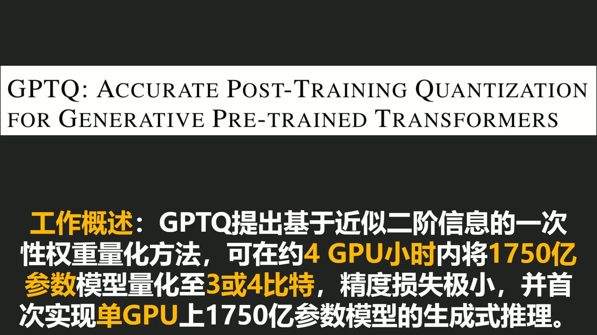](https://www.bilibili.com/video/BV1Y3d2BoELh)
---

### [28] 模型剪枝OB家族论文一口气看完：OBD、OBS、OBC【每天一个宝藏论文】
- 观看视频：[视频BV1bJd2BHEeb](https://www.bilibili.com/video/BV1bJd2BHEeb)
- 查看手稿：[图片BV1bJd2BHEeb](./assets/papers/BV1bJd2BHEeb.jpg)

[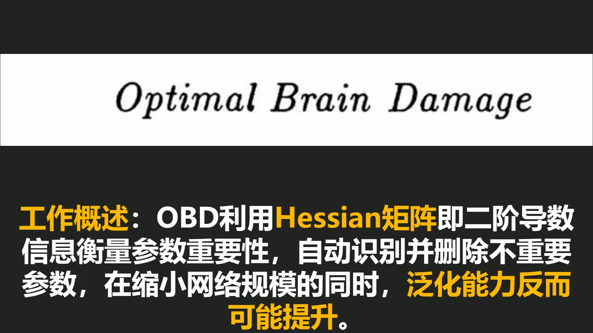](https://www.bilibili.com/video/BV1bJd2BHEeb)
---

### [27] SlimAttention：一种和FlashAttention分块策略不同的注意力【每天一个宝藏论文】
- 观看视频：[视频BV1hjd2BWEGS](https://www.bilibili.com/video/BV1hjd2BWEGS)
- 查看手稿：[图片BV1hjd2BWEGS](./assets/papers/BV1hjd2BWEGS.jpg)

[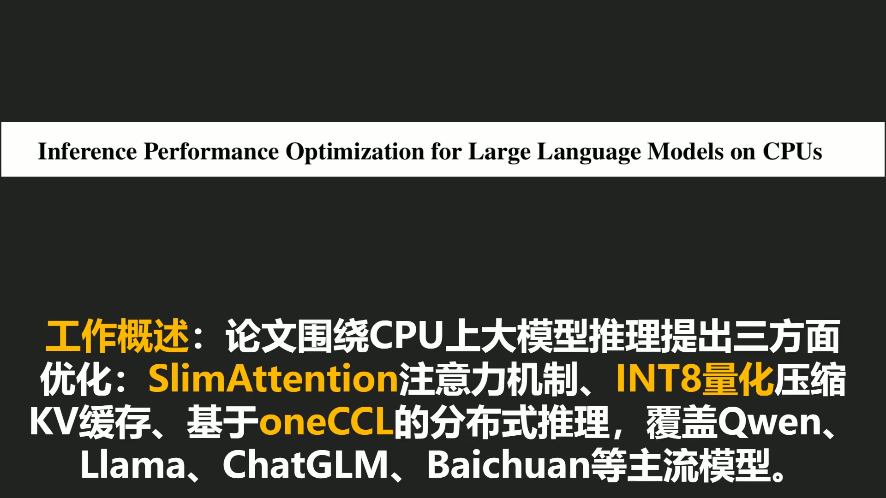](https://www.bilibili.com/video/BV1hjd2BWEGS)
---

### [26] GQA：分组查询注意力论文解读【每天一个宝藏论文】
- 观看视频：[视频BV1Bcd2BeEVv](https://www.bilibili.com/video/BV1Bcd2BeEVv)
- 查看手稿：[图片BV1Bcd2BeEVv](./assets/papers/BV1Bcd2BeEVv.jpg)

---

### [25] QLora：大模型量化微调论文解读【每天一个宝藏论文】
- 观看视频：[视频BV1CFdrBfE2D](https://www.bilibili.com/video/BV1CFdrBfE2D)
- 查看手稿：[图片BV1CFdrBfE2D](./assets/papers/BV1CFdrBfE2D.jpg)

---

### [24] SGLang：大模型推理引擎论文解读【每天一个宝藏论文】
- 观看视频：[视频BV18Ud6BME78](https://www.bilibili.com/video/BV18Ud6BME78)
- 查看手稿：[图片BV18Ud6BME78](./assets/papers/BV18Ud6BME78.jpg)

---

### [23] flash-attention-v3：论文解读【每天一个宝藏论文】
- 观看视频：[视频BV1yZd6BcE3b](https://www.bilibili.com/video/BV1yZd6BcE3b)
- 查看手稿：[图片BV1yZd6BcE3b](./assets/papers/BV1yZd6BcE3b.jpg)

---

### [22] FlashAttention-V2：论文解读【每天一个宝藏论文】
- 观看视频：[视频BV1yfd6B8E37](https://www.bilibili.com/video/BV1yfd6B8E37)
- 查看手稿：[图片BV1yfd6B8E37](./assets/papers/BV1yfd6B8E37.jpg)

---

### [21] 在线softmax：论文解读【每天一个宝藏论文】
- 观看视频：[视频BV1Qkd6B3EUe](https://www.bilibili.com/video/BV1Qkd6B3EUe)
- 查看手稿：[图片BV1Qkd6B3EUe](./assets/papers/BV1Qkd6B3EUe.jpg)

---

### [20] 投机采样：大模型推理加速论文解读【每天一个宝藏论文】
- 观看视频：[视频BV1V6d6BCEzJ](https://www.bilibili.com/video/BV1V6d6BCEzJ)
- 查看手稿：[图片BV1V6d6BCEzJ](./assets/papers/BV1V6d6BCEzJ.jpg)

---

### [19] DeepSeek-V4逐图、逐公式解读【每天一个宝藏论文】
- 观看视频：[视频BV1Mgo5BwEST](https://www.bilibili.com/video/BV1Mgo5BwEST)
- 查看手稿：[图片BV1Mgo5BwEST](./assets/papers/BV1Mgo5BwEST.jpg)

---

### [18] SmoothQuant：大模型量化论文解读【每天一个宝藏论文】
- 观看视频：[视频BV1CkoPBbEyB](https://www.bilibili.com/video/BV1CkoPBbEyB)
- 查看手稿：[图片BV1CkoPBbEyB](./assets/papers/BV1CkoPBbEyB.jpg)

---

### [17] FlashAttention-1论文解读 【每天一个宝藏论文】
- 观看视频：[视频BV1XPoNB5EQy](https://www.bilibili.com/video/BV1XPoNB5EQy)
- 查看手稿：[图片BV1XPoNB5EQy](./assets/papers/BV1XPoNB5EQy.jpg)

---

### [16] LLM.int8()：大模型量化论文解读【每天一个宝藏论文】
- 观看视频：[视频BV1BeoNB9EQP](https://www.bilibili.com/video/BV1BeoNB9EQP)
- 查看手稿：[图片BV1BeoNB9EQP](./assets/papers/BV1BeoNB9EQP.jpg)

---

### [15] PagedAttention：vLLM论文解读【每天一个宝藏论文】
- 观看视频：[视频BV1xJoNBPEqe](https://www.bilibili.com/video/BV1xJoNBPEqe)
- 查看手稿：[图片BV1xJoNBPEqe](./assets/papers/BV1xJoNBPEqe.jpg)

---

### [14] AWQ：大语言模型量化论文解读 【每天一个宝藏论文】
- 观看视频：[视频BV1RuoFBvEm8](https://www.bilibili.com/video/BV1RuoFBvEm8)
- 查看手稿：[图片BV1RuoFBvEm8](./assets/papers/BV1RuoFBvEm8.jpg)

---

### ［12］读2个多Agent共享KV Cache的论文【每周一个宝藏论文】
- 观看视频：[视频BV1B997BmEGr](https://www.bilibili.com/video/BV1B997BmEGr)
- 查看手稿：[图片BV1B997BmEGr](./assets/papers/BV1B997BmEGr.jpg)

---

### ［10］大模型写算子：读两个KernelBench的改进工作【每周一个宝藏论文】
- 观看视频：[视频BV1M8QUBUESz](https://www.bilibili.com/video/BV1M8QUBUESz)
- 查看手稿：[图片BV1M8QUBUESz](./assets/papers/BV1M8QUBUESz.jpg)

---

### [8] 读三个强化学习写算子的论文【每周一个宝藏论文】
- 观看视频：[视频BV1fVckzqE1S](https://www.bilibili.com/video/BV1fVckzqE1S)
- 查看手稿：[图片BV1fVckzqE1S](./assets/papers/BV1fVckzqE1S.jpg)

---

### [6] Agent写算子：读三个Agent写算子的论文【每周一个宝藏论文】
- 观看视频：[视频BV1HVPkzEEx9](https://www.bilibili.com/video/BV1HVPkzEEx9)
- 查看手稿：[图片BV1HVPkzEEx9](./assets/papers/BV1HVPkzEEx9.jpg)

---

### [4] 大模型写算子：一篇综述+2个数据集【每周一个宝藏论文】
- 观看视频：[视频BV1pJA6zkEH4](https://www.bilibili.com/video/BV1pJA6zkEH4)
- 查看手稿：[图片BV1pJA6zkEH4](./assets/papers/BV1pJA6zkEH4.jpg)

---

### [2] 读上月新鲜出炉的综述：大模型写算子【每周一个宝藏论文】
- 观看视频：[视频BV1XcfBBGEUw](https://www.bilibili.com/video/BV1XcfBBGEUw)
- 查看手稿：[图片BV1XcfBBGEUw](./assets/papers/BV1XcfBBGEUw.jpg)

---

## 每天一个宝藏实验

### [13] AutoDL上部署龙虾，它能帮忙测试算子性能吗？【每周一个宝藏实验】
- 观看视频：[视频BV1XMX5BZEGF](https://www.bilibili.com/video/BV1XMX5BZEGF)
- 查看手稿：[图片BV1XMX5BZEGF](./assets/experiments/BV1XMX5BZEGF.jpg)

---

### [11] 跑robust-kbench测试LLM写算子，附Agent提示词【每周一个宝藏实验】
- 观看视频：[视频BV1vxAszpE3P](https://www.bilibili.com/video/BV1vxAszpE3P)
- 查看手稿：[图片BV1vxAszpE3P](./assets/experiments/BV1vxAszpE3P.jpg)

---

### [9] 跑CUDA-L2测试和cuBLAS相比效果如何？【每周一个宝藏实验】
- 观看视频：[视频BV1QPwszCE39](https://www.bilibili.com/video/BV1QPwszCE39)
- 查看手稿：[图片BV1QPwszCE39](./assets/experiments/BV1QPwszCE39.jpg)

---

### [7] 跑KernelBench测试LLM将PyTorch转译为CUDA代码的能力（ICML2025）【每周一个宝藏实验】
- 观看视频：[视频BV1gzPyzuERu](https://www.bilibili.com/video/BV1gzPyzuERu)
- 查看手稿：[图片BV1gzPyzuERu](./assets/experiments/BV1gzPyzuERu.jpg)

---

### [5] 快速上手FuctionCall和React：极简易百词斩Agent【每周一个宝藏实验】
- 观看视频：[视频BV1nUAazDEma](https://www.bilibili.com/video/BV1nUAazDEma)
- 查看手稿：[图片BV1nUAazDEma](./assets/experiments/BV1nUAazDEma.jpg)

---

### [3] 从采摘200片三叶草开始训练一个简易无条件DDPM 【每周一个宝藏实验】
- 观看视频：[视频BV1PcfEBrEBs](https://www.bilibili.com/video/BV1PcfEBrEBs)
- 查看手稿：[图片BV1PcfEBrEBs](./assets/experiments/BV1PcfEBrEBs.jpg)

---

### [1]. 跑通TritonBench测试LLM的算子生成能力(ACL2025)【每周一个宝藏实验】
- 观看视频：[视频BV12xZBBwEKf](https://www.bilibili.com/video/BV12xZBBwEKf)
- 查看手稿：[图片BV12xZBBwEKf](./assets/experiments/BV12xZBBwEKf.jpg)

---

## 其他

*暂无视频*
