# 宝藏问题

- **作者**：b站**海安雨**。
- **下载方式**：点击右上角的`<>code`按钮，选择`Download Zip`。或直接`git clone`。

## 每天一个宝藏问题

### 95. 标量乘法的链式法则可以推广到矩阵吗？【每天一个宝藏问题】
- 观看视频：[BV1D8daB7En5](https://www.bilibili.com/video/BV1D8daB7En5)
[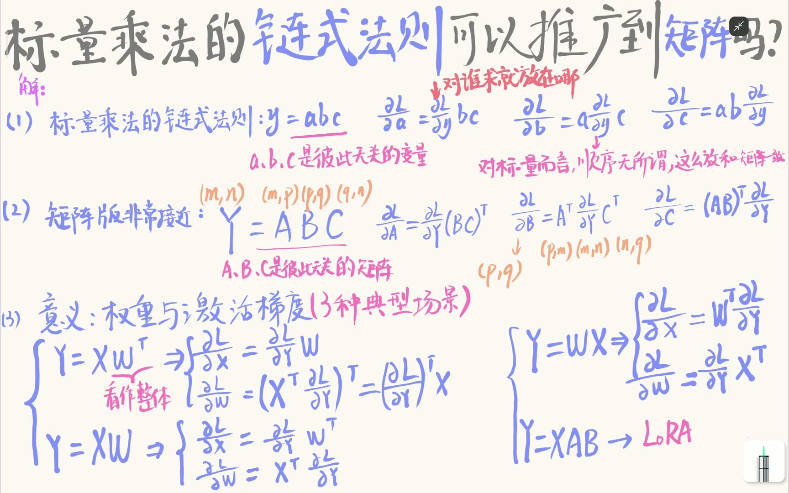](https://www.bilibili.com/video/BV1D8daB7En5)
---

### 94. 量化感知训练中为什么要STE来处理round梯度？【每天一个宝藏问题】
- 观看视频：[BV12qdaBkERq](https://www.bilibili.com/video/BV12qdaBkERq)
[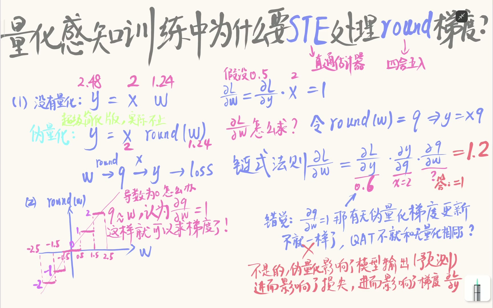](https://www.bilibili.com/video/BV12qdaBkERq)
---

### 93. 为什么Transformer的核心公式是在做加权平均？【每天一个宝藏问题】
- 观看视频：[BV1CkQjBJE8K](https://www.bilibili.com/video/BV1CkQjBJE8K)
[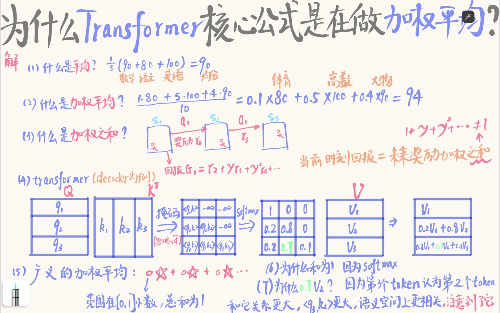](https://www.bilibili.com/video/BV1CkQjBJE8K)
---

### 92. 为什么量化会让损失“山谷”变成“台阶”？【每天一个宝藏问题】
- 观看视频：[BV1eoQvBQEMF](https://www.bilibili.com/video/BV1eoQvBQEMF)
[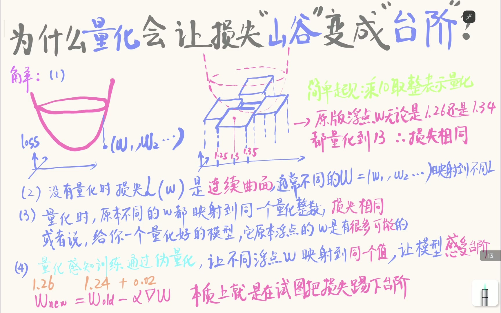](https://www.bilibili.com/video/BV1eoQvBQEMF)
---

### 91. 游戏AI和LLM的πθ(a∣s)有何异同？【每天一个宝藏问题】
- 观看视频：[BV1TeD9B4EbF](https://www.bilibili.com/video/BV1TeD9B4EbF)
[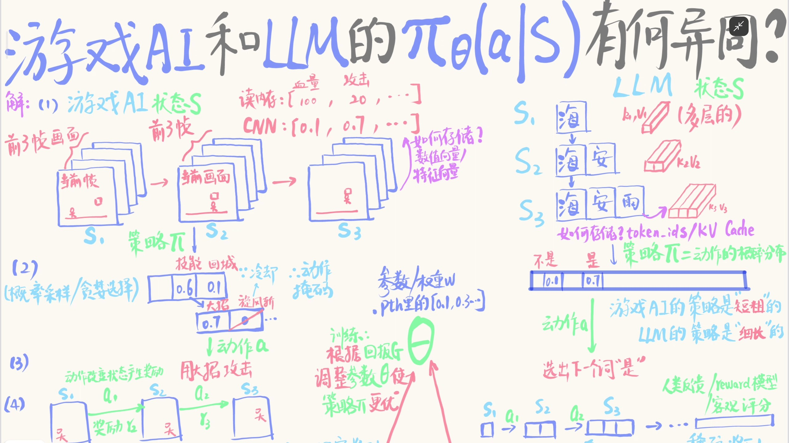](https://www.bilibili.com/video/BV1TeD9B4EbF)
---

### 90. OBQ如何将最小化剪枝损失推广到量化？【每天一个宝藏问题】
- 观看视频：[BV1kkDQBVE4y](https://www.bilibili.com/video/BV1kkDQBVE4y)
[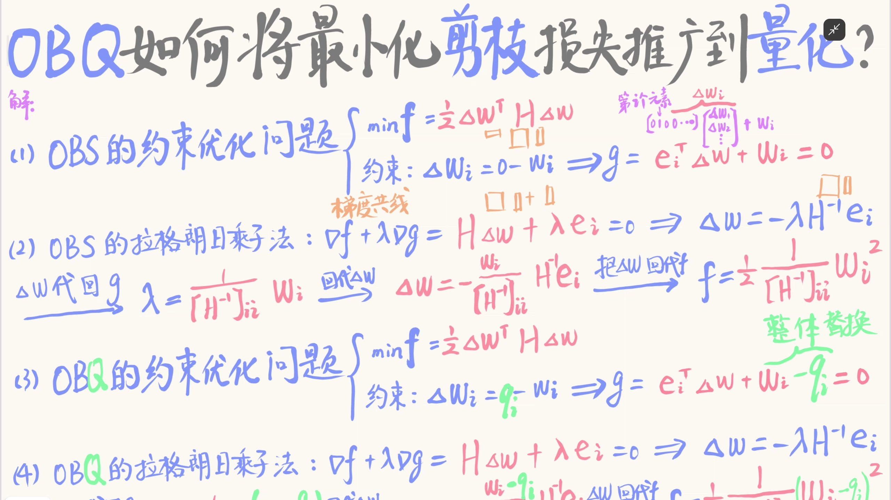](https://www.bilibili.com/video/BV1kkDQBVE4y)
---

### 89. 量化感知训练是如何感知到量化的？【每天一个宝藏问题】
- 观看视频：[BV1d9QABeEdC](https://www.bilibili.com/video/BV1d9QABeEdC)
[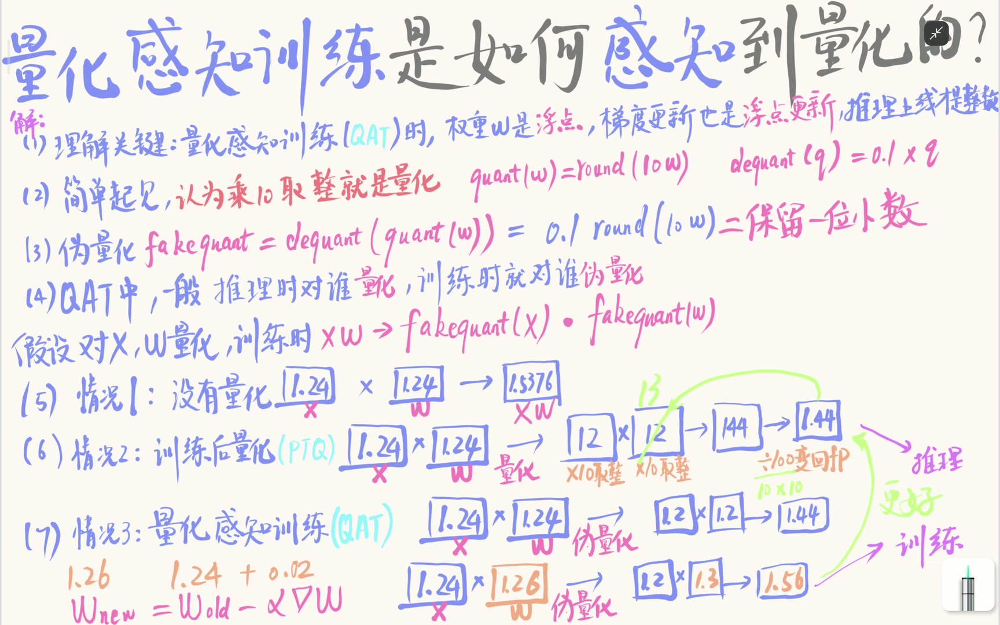](https://www.bilibili.com/video/BV1d9QABeEdC)
---

### 88. 量化后微调为什么要对聚类中心求和？【每天一个宝藏问题】
- 观看视频：[BV1fcD4BPEo7](https://www.bilibili.com/video/BV1fcD4BPEo7)
[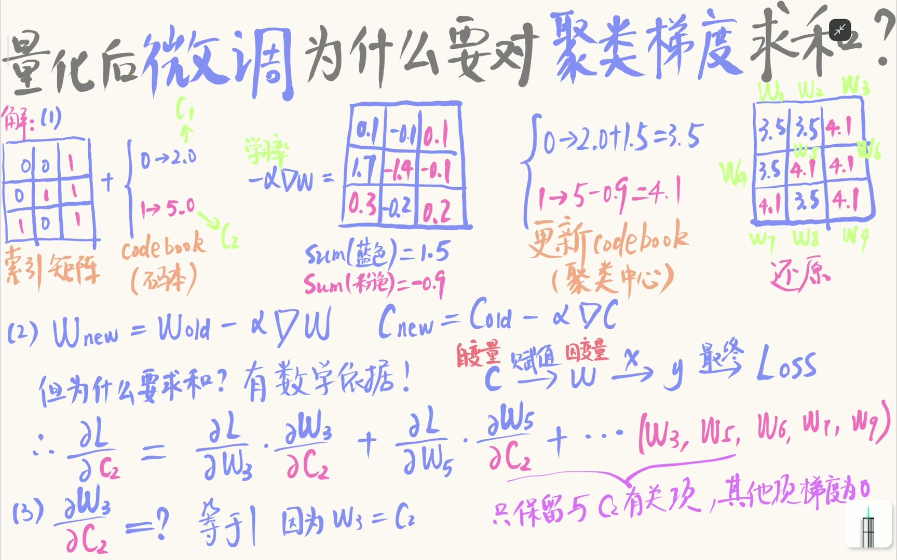](https://www.bilibili.com/video/BV1fcD4BPEo7)
---

### 87. 为什么前向广播对应着反向归约？【每天一个宝藏问题】
- 观看视频：[BV177DWBdEoV](https://www.bilibili.com/video/BV177DWBdEoV)
[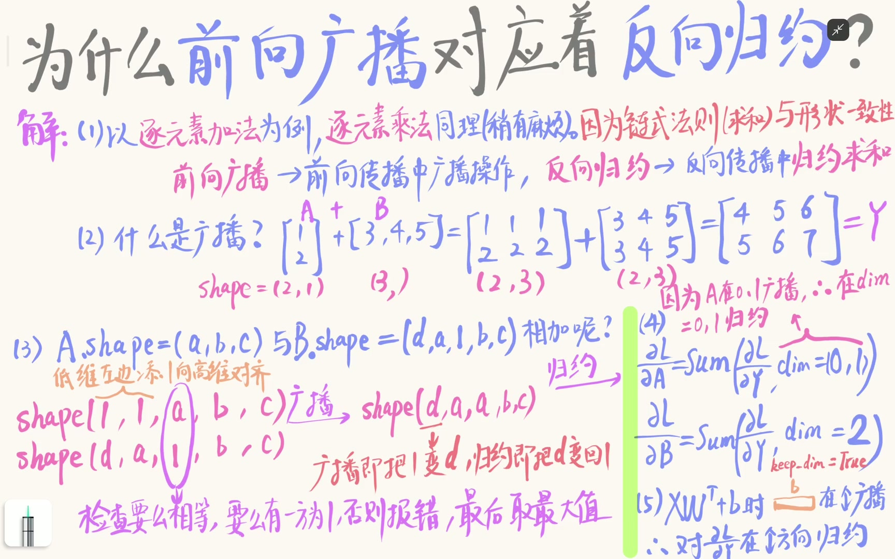](https://www.bilibili.com/video/BV177DWBdEoV)
---

### 86. 为什么矩阵乘法可以看作标量乘法的拓展？【每天一个宝藏问题】
- 观看视频：[BV1WxDeBcExC](https://www.bilibili.com/video/BV1WxDeBcExC)
[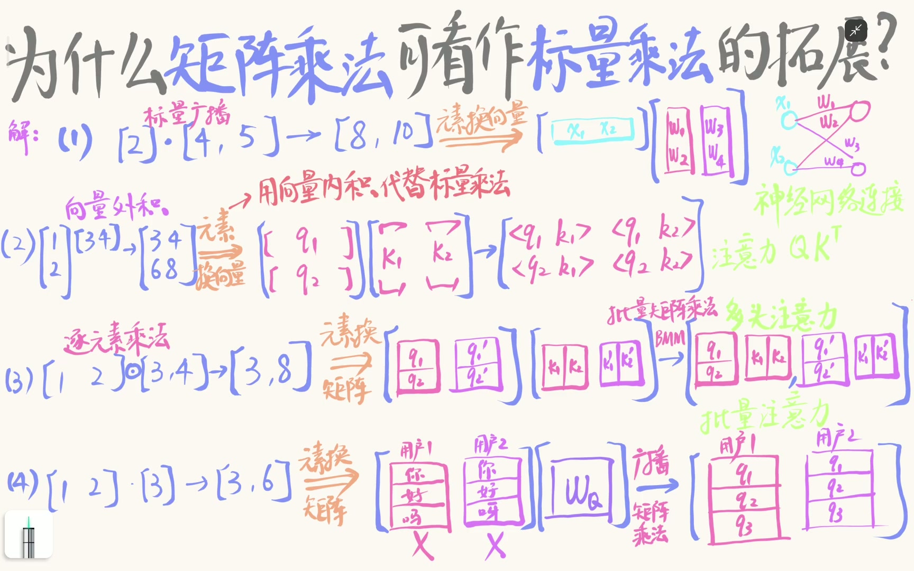](https://www.bilibili.com/video/BV1WxDeBcExC)
---

### 85. 为什么prefill和decode都可以跳过掩码上三角计算？【每天一个宝藏问题】
- 观看视频：[BV1ZEDvB9E6Y](https://www.bilibili.com/video/BV1ZEDvB9E6Y)
[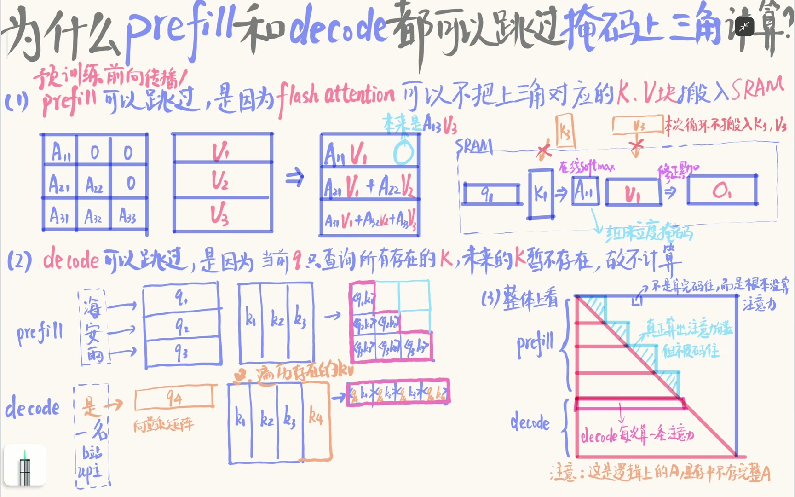](https://www.bilibili.com/video/BV1ZEDvB9E6Y)
---

### 84. LoRA要增加旁路，微调前后模型结构却可以不变，为什么？【每天一个宝藏问题】
- 观看视频：[BV1cQSSBvE8N](https://www.bilibili.com/video/BV1cQSSBvE8N)
[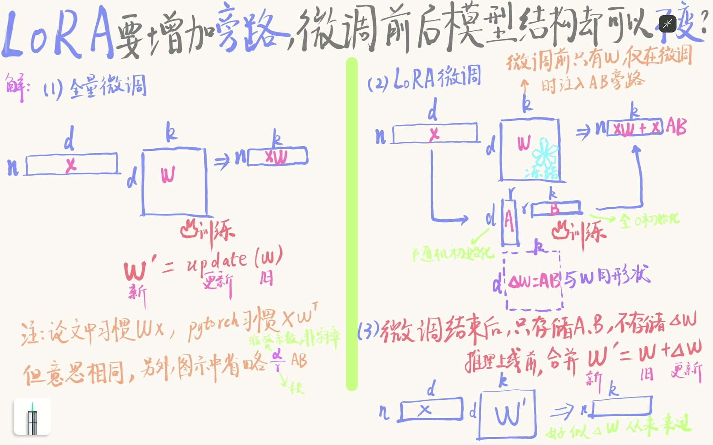](https://www.bilibili.com/video/BV1cQSSBvE8N)
---

### 83. Flash Attention的线性显存比平方显存增长慢了多少？【每天一个宝藏问题】
- 观看视频：[BV1baNGzmEzn](https://www.bilibili.com/video/BV1baNGzmEzn)
[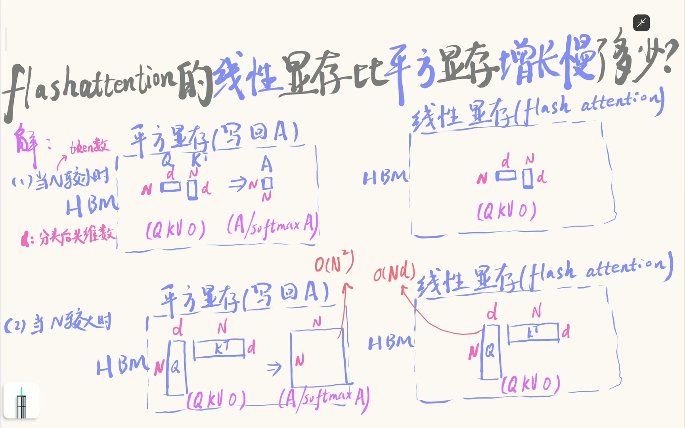](https://www.bilibili.com/video/BV1baNGzmEzn)
---

### 82. 在线Softmax和Flash Attention分别维护了多少个“动态规划量”？【每天一个宝藏问题】
- 观看视频：[BV1oA93BtETZ](https://www.bilibili.com/video/BV1oA93BtETZ)
[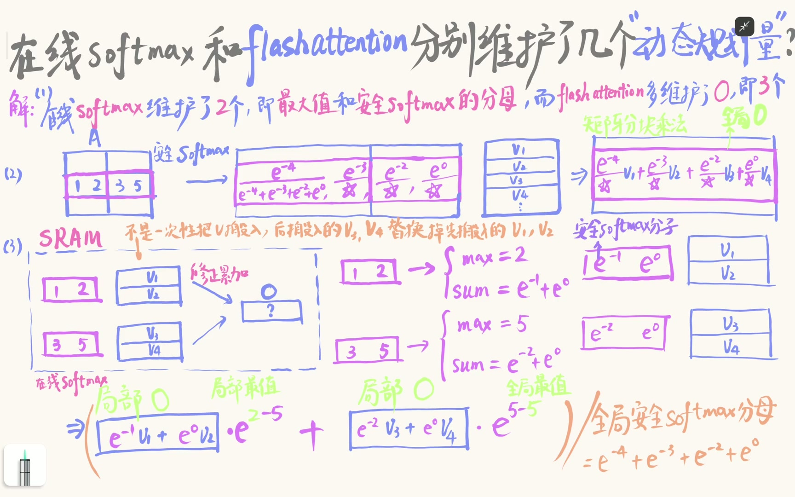](https://www.bilibili.com/video/BV1oA93BtETZ)
---

### 81. 量化后微调让聚在一起的权重分家了怎么办？【每天一个宝藏问题】
- 观看视频：[BV1zf9gBwEqd](https://www.bilibili.com/video/BV1zf9gBwEqd)
[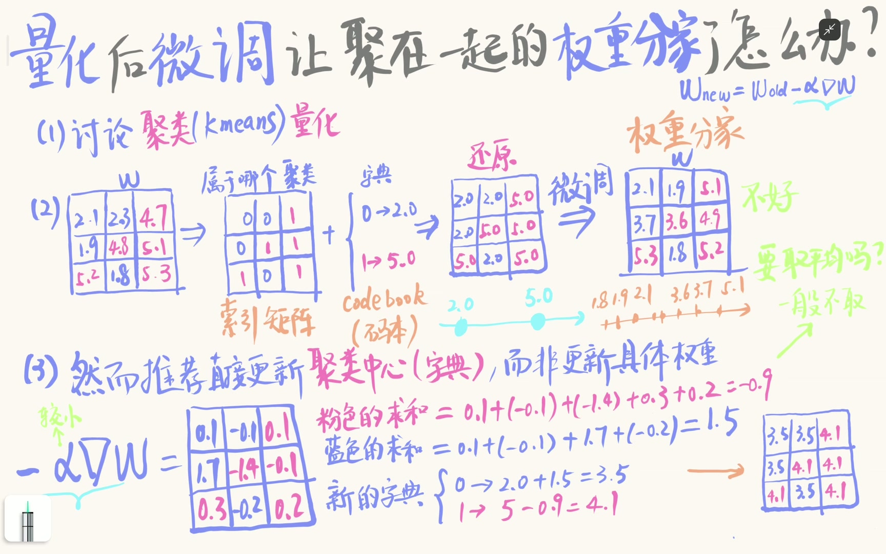](https://www.bilibili.com/video/BV1zf9gBwEqd)
---

### 80. 剪枝后微调让被置零的权重不再为零怎么办？【每天一个宝藏问题】
- 观看视频：[BV16E9cBqEK8](https://www.bilibili.com/video/BV16E9cBqEK8)
[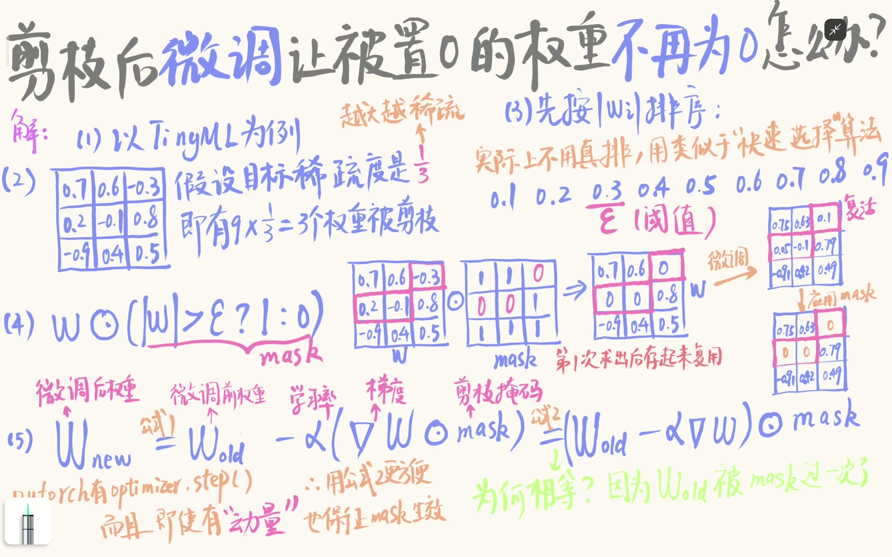](https://www.bilibili.com/video/BV16E9cBqEK8)
---

### 79. 为什么基于权重大小剪枝是特殊的OBD、OBS、OBQ？【每天一个宝藏问题】
- 观看视频：[BV1fn9cBKEbt](https://www.bilibili.com/video/BV1fn9cBKEbt)

---

### 78. GPTQ量化的最小化目标如何写成类似OBS形式的？【每天一个宝藏问题】
- 观看视频：[BV1679cBME93](https://www.bilibili.com/video/BV1679cBME93)
[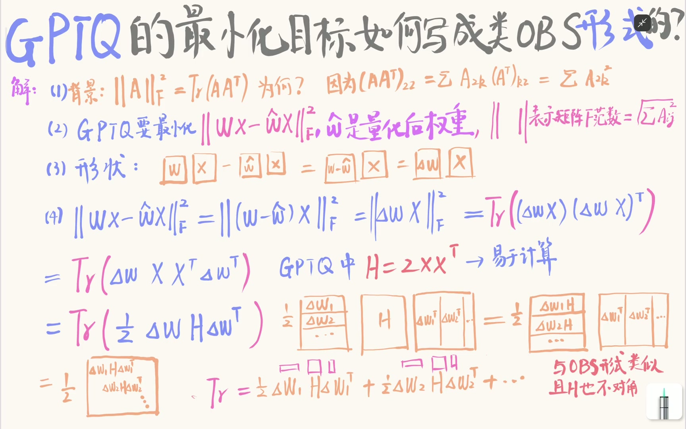](https://www.bilibili.com/video/BV1679cBME93)
---

### 77. 为什么训练时教师强制是只“感觉”不“生成”的？【每天一个宝藏问题】
- 观看视频：[BV14BXoBMEsk](https://www.bilibili.com/video/BV14BXoBMEsk)
[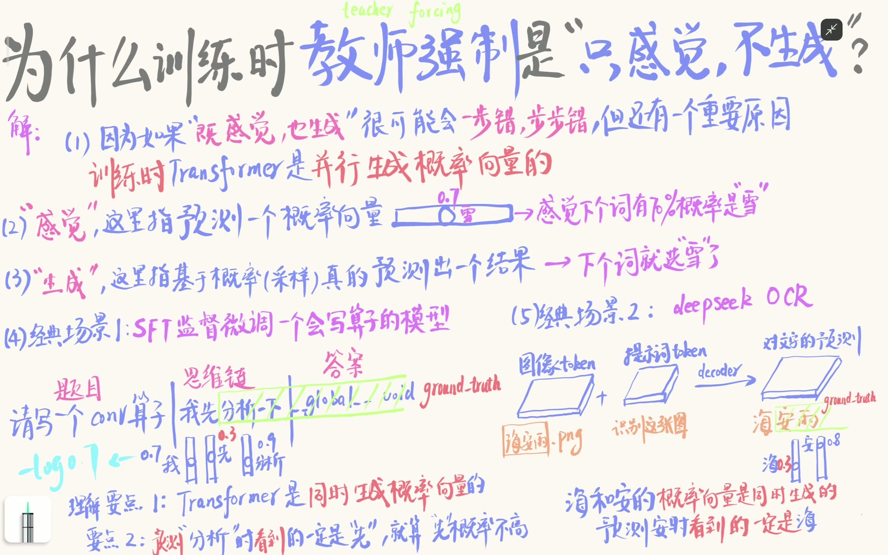](https://www.bilibili.com/video/BV14BXoBMEsk)
---

### 76. 为什么OBS剪枝可看作特殊的OBQ量化？【每天一个宝藏问题】
- 观看视频：[BV1cKX1BhED8](https://www.bilibili.com/video/BV1cKX1BhED8)
[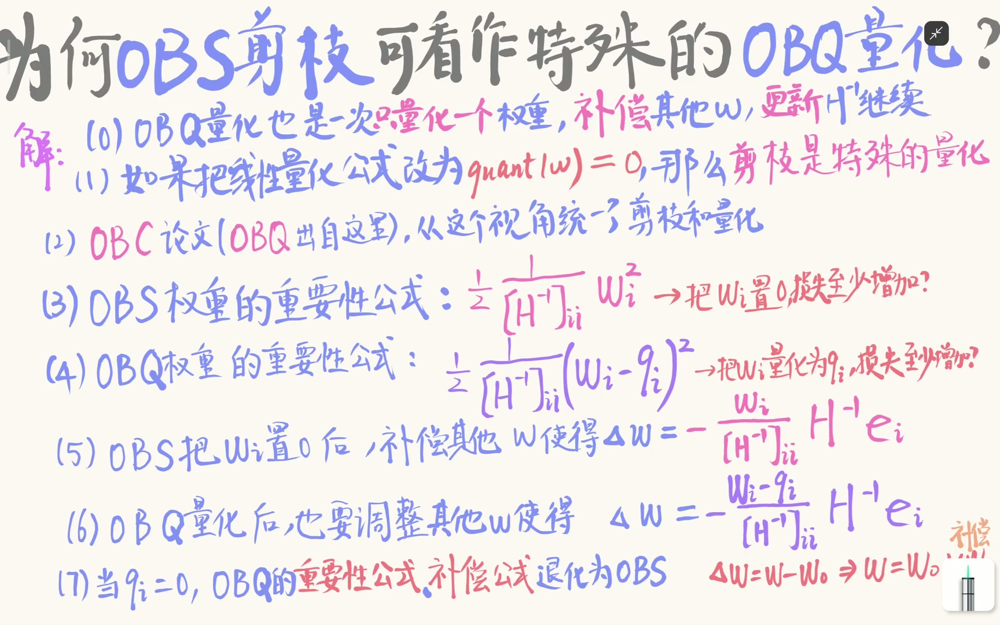](https://www.bilibili.com/video/BV1cKX1BhED8)
---

### 75. OBS剪枝是如何选择被剪枝的权重的？【每天一个宝藏问题】
- 观看视频：[BV1AwX1BPE1g](https://www.bilibili.com/video/BV1AwX1BPE1g)
[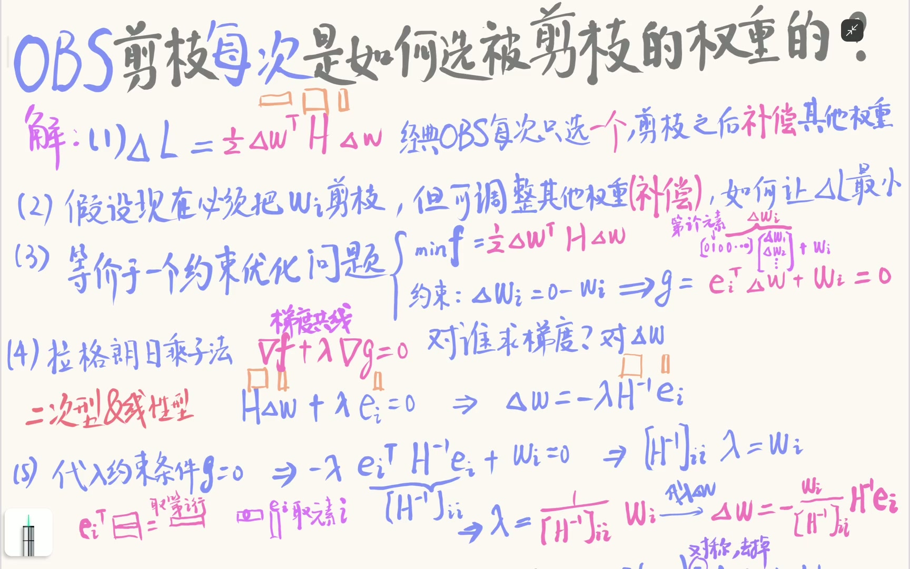](https://www.bilibili.com/video/BV1AwX1BPE1g)
---

### 74. 为什么OBD剪枝是特殊的OBS剪枝？【每天一个宝藏问题】
- 观看视频：[BV1xTXKB4Ecn](https://www.bilibili.com/video/BV1xTXKB4Ecn)
[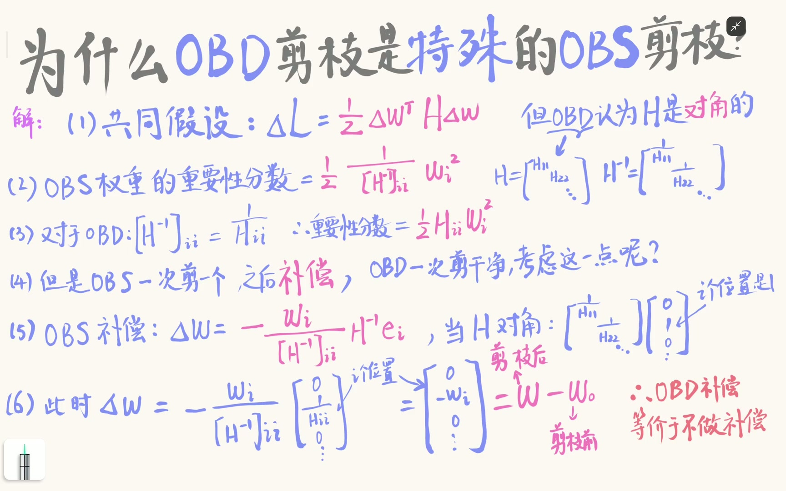](https://www.bilibili.com/video/BV1xTXKB4Ecn)
---

### 73. OBS剪枝保留与修改了OBD剪枝的哪些假设？【每天一个宝藏问题】
- 观看视频：[BV1njXKBnEBg](https://www.bilibili.com/video/BV1njXKBnEBg)
[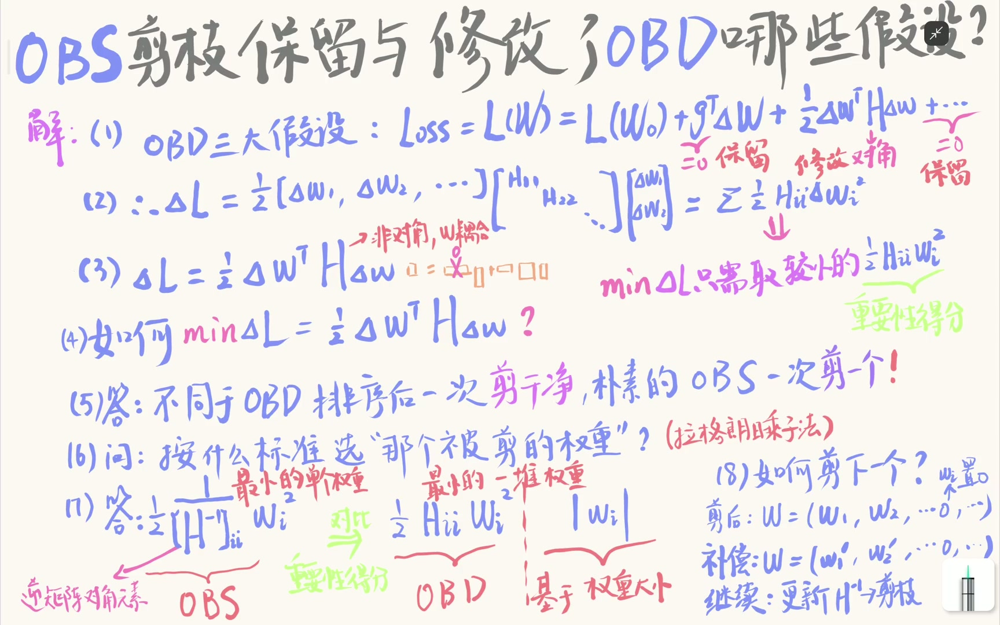](https://www.bilibili.com/video/BV1njXKBnEBg)
---

### 72. 如何从几何视角理解拉格朗日乘子法？【每天一个宝藏问题】
- 观看视频：[BV1C3XKB9EHm](https://www.bilibili.com/video/BV1C3XKB9EHm)
[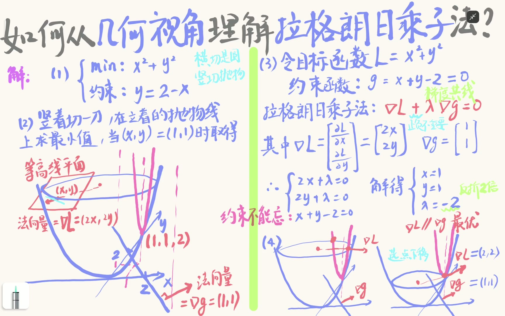](https://www.bilibili.com/video/BV1C3XKB9EHm)
---

### 71. OBD剪枝假设山谷是什么样的？【每天一个宝藏问题】
- 观看视频：[BV11RQfB3Eot](https://www.bilibili.com/video/BV11RQfB3Eot)
[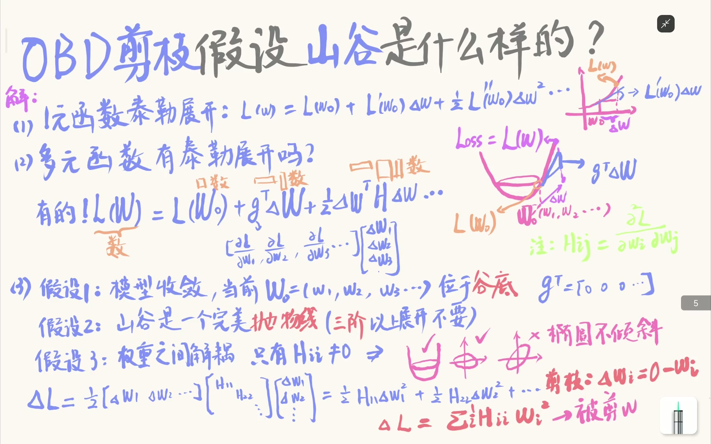](https://www.bilibili.com/video/BV11RQfB3Eot)
---

### 70. 如何理解泰勒展开的多元函数扩展？【每天一个宝藏问题】
- 观看视频：[BV1HVXKBpE9p](https://www.bilibili.com/video/BV1HVXKBpE9p)

---

### 69. 深度学习中两种常用的矩阵微积分是怎么来的？【每天一个宝藏问题】
- 观看视频：[BV1a9XNBTERT](https://www.bilibili.com/video/BV1a9XNBTERT)

---

### 68. prefill和decode时KV Cache是如何"堆积"的？【每天一个宝藏问题】
- 观看视频：[BV1AYQdBfEDS](https://www.bilibili.com/video/BV1AYQdBfEDS)

---

### 67. 为何圆形山谷会让OBD剪枝退化为基于大小剪枝？【每天一个宝藏问题】
- 观看视频：[BV1qAA5ztELy](https://www.bilibili.com/video/BV1qAA5ztELy)

---

### 66. LLM.int8与SmoothQuant解决离群值的思路有何异同？【每天一个宝藏问题】
- 观看视频：[BV13rwCzwEKX](https://www.bilibili.com/video/BV13rwCzwEKX)

---

### 65. 从校准集说明为何SmoothQuant中的S无需矩阵乘算子【每天一个宝藏问题】
- 观看视频：[BV12DwRz9E4j](https://www.bilibili.com/video/BV12DwRz9E4j)

---

### 64. SmoothQuant量化中有没有用到外积思想？【每天一个宝藏问题】
- 观看视频：[BV1DMwmzgEyV](https://www.bilibili.com/video/BV1DMwmzgEyV)

---

### 63. 举例说明SmoothQuant量化对角矩阵乘法的正确性？【每天一个宝藏问题】
- 观看视频：[BV1VTw7zbEzq](https://www.bilibili.com/video/BV1VTw7zbEzq)

---

### 62．LLM.int8是如何利用向量外积进行量化的？【每天一个宝藏问题】
- 观看视频：[BV17pwEzMETL](https://www.bilibili.com/video/BV17pwEzMETL)

---

### 61. 含广播的偏置b的梯度如何计算？【每天一个宝藏问题】
- 观看视频：[BV1WWXWBzELJ](https://www.bilibili.com/video/BV1WWXWBzELJ)

---

### 60. LoRA微调和向量外积为何长得很像？【每天一个宝藏问题】
- 观看视频：[BV1pKwjz3E1P](https://www.bilibili.com/video/BV1pKwjz3E1P)

---

### 59. DeepSeek OCR比较人性化的可视化可能是什么样的？【每天一个宝藏问题】
- 观看视频：[BV13gcCzbE7y](https://www.bilibili.com/video/BV13gcCzbE7y)

---

### 58. 如何根据答案倒推合成思维链做SFT？以AscendKernelGen为例【每天一个宝藏问题】
- 观看视频：[BV1DvcyzcEa4](https://www.bilibili.com/video/BV1DvcyzcEa4)

---

### 57. 网格步进是如何加速张量计算的？【每天一个宝藏问题】
- 观看视频：[BV1SSNFz2EDK](https://www.bilibili.com/video/BV1SSNFz2EDK)

---

### 56. 为什么多个Sub-Agent也可以共享前缀KV Cache？【每天一个宝藏问题】
- 观看视频：[BV1cPAuzpE6e](https://www.bilibili.com/video/BV1cPAuzpE6e)

---

### 55. 为什么KV Cache也有LRU等缓存替换策略?【每天一个宝藏问题】
- 观看视频：[BV1YdANzcESN](https://www.bilibili.com/video/BV1YdANzcESN)

---

### 53. 如何加速两个张量之和？【每天一个宝藏问题】
- 观看视频：[BV1SqPhzAErH](https://www.bilibili.com/video/BV1SqPhzAErH)

---

### 52 简单的梯度算子是如何定义的【每天一个宝藏问题】
- 观看视频：[BV1TUPWzkEgW](https://www.bilibili.com/video/BV1TUPWzkEgW)

---

### 51 矩阵乘法对权重的梯度是怎么来的？【每天一个宝藏问题】
- 观看视频：[BV1TUPWzkE6U](https://www.bilibili.com/video/BV1TUPWzkE6U)

---

### 49. 双缓冲是如何加速张量计算的？【每天一个宝藏问题】
- 观看视频：[BV1bUP5zDER5](https://www.bilibili.com/video/BV1bUP5zDER5)

---

### 47 CLIP比较人性化的可视化可能长什么样？【每天一个宝藏问题】
- 观看视频：[BV1k4PDzrE9X](https://www.bilibili.com/video/BV1k4PDzrE9X)

---

### 46. 矩阵乘法对激活的梯度是怎么来的？【每天一个宝藏问题】
- 观看视频：[BV1ioArzKEMB](https://www.bilibili.com/video/BV1ioArzKEMB)

---

### 45. SIMD是如何加速张量计算的(简单理解)【每天一个宝藏问题】
- 观看视频：[BV1doArzKExB](https://www.bilibili.com/video/BV1doArzKExB)

---

### 44. 为什么把权重置0就是在剪枝？【每天一个宝藏问题】
- 观看视频：[BV1B9ArzuEP3](https://www.bilibili.com/video/BV1B9ArzuEP3)

---

### 42. 聚类量化和线性量化有何不同？【每天一个宝藏问题】
- 观看视频：[BV1yBArzEEeE](https://www.bilibili.com/video/BV1yBArzEEeE)

---

### 41 Flash Attention之前的那种N^2注意力不好在哪里？【每天一个宝藏问题】
- 观看视频：[BV1WzArzUEdr](https://www.bilibili.com/video/BV1WzArzUEdr)

---

### 40. Temperature、TopK/P退化为贪婪解码的三种条件是？【每天一个宝藏问题】
- 观看视频：[BV1AzArzUEh1](https://www.bilibili.com/video/BV1AzArzUEh1)

---

### 39. FlashAttention V2中为何要先循环Q后循环K？【每天一个宝藏问题】
- 观看视频：[BV1yiArzSEs1](https://www.bilibili.com/video/BV1yiArzSEs1)

---

### 37. GQA中讲的共享指的是Token还是Head？【每天一个宝藏问题】
- 观看视频：[BV1cTZyBzEjv](https://www.bilibili.com/video/BV1cTZyBzEjv)

---

### 36. 为什么推理时prefill是GEMM，而decode是（Batched）GEMV？【每天一个宝藏问题】
- 观看视频：[BV1UtZkBjEZP](https://www.bilibili.com/video/BV1UtZkBjEZP)

---

### 35. Transformer暗含多少种分块矩阵乘法的理解方式？【每天一个宝藏问题】
- 观看视频：[BV1pRZtBaEYv](https://www.bilibili.com/video/BV1pRZtBaEYv)

---

### 34. BERT为什么没有KV Cache/KV Cache何以存在？【每天一个宝藏问题】
- 观看视频：[BV1qKZ7BsEs5](https://www.bilibili.com/video/BV1qKZ7BsEs5)

---

### 33. 用户改提示词为什么不会影响前面的KV Cache？【每天一个宝藏问题】
- 观看视频：[BV1dgZ7BQEHL](https://www.bilibili.com/video/BV1dgZ7BQEHL)

---

### 32. 一种人性化的Transformer可视化可能是什么样的？【每天一个宝藏问题】
- 观看视频：[BV13FZEBEE6y](https://www.bilibili.com/video/BV13FZEBEE6y)

---

### 31. FlashAttention v2版本如何省略掩码上三角矩阵计算？【每天一个宝藏问题】
- 观看视频：[BV16qZLBxEZt](https://www.bilibili.com/video/BV16qZLBxEZt)

---

### 30. 举例说明SlimAttention的分块矩阵乘法的正确性？【每天一个宝藏问题】
- 观看视频：[BV11KcWz8EZm](https://www.bilibili.com/video/BV11KcWz8EZm)

---

### 29. 以逐元素乘加为例，算子融合为什么能提高计算效率？【每天一个宝藏问题】
- 观看视频：[BV19PcnzPEQp](https://www.bilibili.com/video/BV19PcnzPEQp)

---

### 28. 为什么在线Softmax比安全Softmax可以少一次循环？【每天一个宝藏问题】
- 观看视频：[BV1i6cnzzE2x](https://www.bilibili.com/video/BV1i6cnzzE2x)

---

### 23. Llama的旋转位置编码实现和RoPE原论文有何不同？【每天一个宝藏问题】
- 观看视频：[BV15EcbzoEY7](https://www.bilibili.com/video/BV15EcbzoEY7)

---

### 22. 为什么transformers.Llama的实现和RoPE原论文不一致？【每天一个宝藏问题】
- 观看视频：[BV1nUcbzTEGi](https://www.bilibili.com/video/BV1nUcbzTEGi)

---

### 21. 为什么增大旋转位置编码中10000可提高模型外推能力【每天一个宝藏问题】
- 观看视频：[BV1o5FozuEz2](https://www.bilibili.com/video/BV1o5FozuEz2)

---

### 20. RoPE注意力的绝对位置无关性和欧拉公式有什么关系？【每天一个宝藏问题】
- 观看视频：[BV1fFFDzsEt6](https://www.bilibili.com/video/BV1fFFDzsEt6)

---

### 19. 为什么RoPE中旋转矩阵R实际上不需要矩阵乘算子？【每天一个宝藏问题】
- 观看视频：[BV1XyFyzcEN6](https://www.bilibili.com/video/BV1XyFyzcEN6)

---

### 17. 为什么正余弦位置编码的注意力是和绝对位置相关的？【每天一个宝藏问题】
- 观看视频：[BV1mZcuztEw2](https://www.bilibili.com/video/BV1mZcuztEw2)

---

### 16. RoPE如何从2维推广到任意偶数维，奇数维咋办？【每天一个宝藏问题】
- 观看视频：[BV1FgcMzkE5h](https://www.bilibili.com/video/BV1FgcMzkE5h)

---

### 14. 旋转位置编码和高中三角函数和差角公式有什么关系？【每天一个宝藏问题】
- 观看视频：[BV1uoFxzgEWz](https://www.bilibili.com/video/BV1uoFxzgEWz)

---

### 13. 旋转位置编码和复数欧拉公式有什么关系？【每天一个宝藏问题】
- 观看视频：[BV1qzFxzQES2](https://www.bilibili.com/video/BV1qzFxzQES2)

---

## 每天一个宝藏名词

### 54. bf16：与FP32有相同的8位指数位，所以更适合模型训练【每天一个宝藏名词】
- 观看视频：[BV1DvPhzeE3R](https://www.bilibili.com/video/BV1DvPhzeE3R)

---

### 50. 环境变量的工作原理：控制台启动时自动执行命令，让简写命令找到在哪执行【每天一个宝藏名词】
- 观看视频：[BV1zXP7zyEbD](https://www.bilibili.com/video/BV1zXP7zyEbD)

---

### 48. NoteBookLM：Google的PPT制作神器，还有思维导图等一系列功能【每天一个宝藏名词】
- 观看视频：[BV1MUP5zDEmj](https://www.bilibili.com/video/BV1MUP5zDEmj)

---

### 43. everything：比Windows默认文件搜索工具快很多，2MB的免费小工具【每天一个宝藏名词】
- 观看视频：[BV1iRArzqEvU](https://www.bilibili.com/video/BV1iRArzqEvU)

---

### 38. miniSGLang：一个简化版SGLang，仅5000行python【每天一个宝藏名词】
- 观看视频：[BV1obA6zeEtE](https://www.bilibili.com/video/BV1obA6zeEtE)

---

### 27. 在线Softmax：通过修正比安全Softmax减少了一次循环【每天一个宝藏名词】
- 观看视频：[BV1c1c7zzEb4](https://www.bilibili.com/video/BV1c1c7zzEb4)

---

### 26. TinyML：MIT推出的大模型轻量化课，亲手量化一个本地llama模型【每天一个宝藏名词】
- 观看视频：[BV1CPcJzLELq](https://www.bilibili.com/video/BV1CPcJzLELq)

---

### 25. 举例说明FlashAttention的分块矩阵乘法的正确性？【每天一个宝藏名词】
- 观看视频：[BV18pcLz2E3P](https://www.bilibili.com/video/BV18pcLz2E3P)

---

### 24. 思维树：大模型+DFS玩24点游戏成功率大增【每天一个宝藏名词】
- 观看视频：[BV1gtcbzDENr](https://www.bilibili.com/video/BV1gtcbzDENr)

---

### 18. CCF-DDL：一个统计CCF分类和倒计时的宝藏网站【每天一个宝藏名词】
- 观看视频：[BV1Jif9BeEYE](https://www.bilibili.com/video/BV1Jif9BeEYE)

---

### 15. 投机解码：小模型草拟，大模型验证【每天一个宝藏名词】
- 观看视频：[BV1yS6zBXEVu](https://www.bilibili.com/video/BV1yS6zBXEVu)

---

### 12. RoPE：通过旋转矩阵让注意力只取决于相对位置【每天一个宝藏名词】
- 观看视频：[BV1gQ6iBREZw](https://www.bilibili.com/video/BV1gQ6iBREZw)

---

### 11. GQA：介于MHA和MQA之间，键值共享查询分组【每天一个宝藏名词】
- 观看视频：[BV19u6BBwEQ8](https://www.bilibili.com/video/BV19u6BBwEQ8)

---

### 10. NF4：QLoRA中的非均匀量化数据类型【每天一个宝藏名词】
- 观看视频：[BV1qA6BBKEck](https://www.bilibili.com/video/BV1qA6BBKEck)

---

### 9. FlashAttention：将Attention的显存占用从平方级降到了线性级【每天一个宝藏名词】
- 观看视频：[BV1C66YBvECv](https://www.bilibili.com/video/BV1C66YBvECv)

---

### 8. PagedAttention：借鉴操作系统分页机制，内置于vLLM【每天一个宝藏名词】
- 观看视频：[BV1Ht6wBVEUX](https://www.bilibili.com/video/BV1Ht6wBVEUX)

---

### 7. SlimAttention：一种比FlashAttention更适合CPU的推理方案【每天一个宝藏名词】
- 观看视频：[BV1MUzZBVEtV](https://www.bilibili.com/video/BV1MUzZBVEtV)

---

### 6. nano-vLLM：纯python实现的堪比vLLM的推理框架【每天一个宝藏名词】
- 观看视频：[BV1FTzfBcE3h](https://www.bilibili.com/video/BV1FTzfBcE3h)

---

### 5. CS336：斯坦福LLM神课，甚至包含洗数据和SFT【每天一个宝藏名词】
- 观看视频：[BV12pzXBREPY](https://www.bilibili.com/video/BV12pzXBREPY)

---

### 4. SmoothQuant：一种转嫁压力的LLM量化方法【每天一个宝藏名词】
- 观看视频：[BV1RyzXB6Eyz](https://www.bilibili.com/video/BV1RyzXB6Eyz)

---

### 3. GPTQ：一种纯数学的LLM量化方法【每天一个宝藏名词】
- 观看视频：[BV1aXzXBNE4A](https://www.bilibili.com/video/BV1aXzXBNE4A)

---

### 2. AWQ：一种保护关键权重的LLM量化算法【每天一个宝藏名词】
- 观看视频：[BV16H6EBHEP5](https://www.bilibili.com/video/BV16H6EBHEP5)

---

### 1. BitNet 1.58b：微软开源的3值量化模型【每天一个宝藏名词】
- 观看视频：[BV1kG6jBSE3u](https://www.bilibili.com/video/BV1kG6jBSE3u)

---

## 每周一个宝藏论文

### [26] GQA：分组查询注意力论文解读【每天一个宝藏论文】
- 观看视频：[BV1Bcd2BeEVv](https://www.bilibili.com/video/BV1Bcd2BeEVv)

---

### [25] QLora：大模型量化微调论文解读【每天一个宝藏论文】
- 观看视频：[BV1CFdrBfE2D](https://www.bilibili.com/video/BV1CFdrBfE2D)

---

### [24] SGLang：大模型推理引擎论文解读【每天一个宝藏论文】
- 观看视频：[BV18Ud6BME78](https://www.bilibili.com/video/BV18Ud6BME78)
[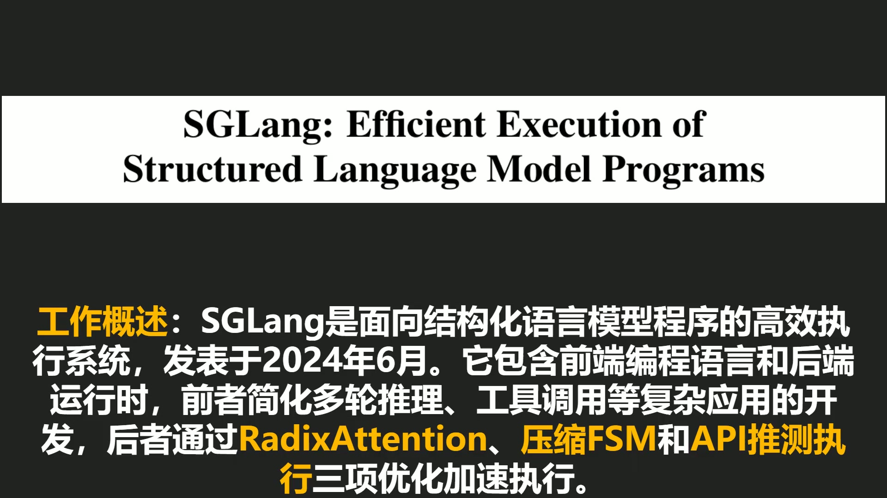](https://www.bilibili.com/video/BV18Ud6BME78)
---

### [23] flash-attention-v3：论文解读【每天一个宝藏论文】
- 观看视频：[BV1yZd6BcE3b](https://www.bilibili.com/video/BV1yZd6BcE3b)
[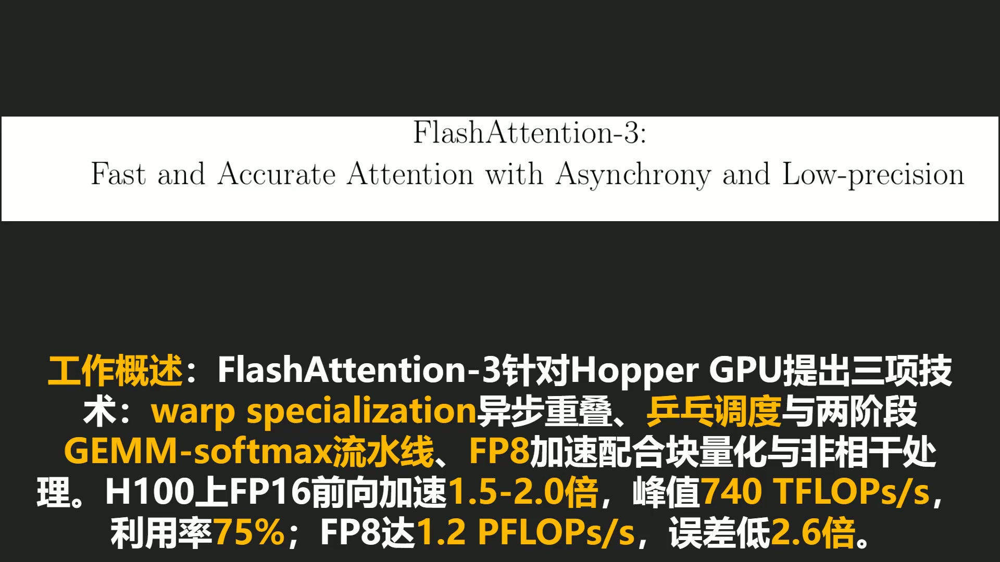](https://www.bilibili.com/video/BV1yZd6BcE3b)
---

### [22] FlashAttention-V2：论文解读【每天一个宝藏论文】
- 观看视频：[BV1yfd6B8E37](https://www.bilibili.com/video/BV1yfd6B8E37)
[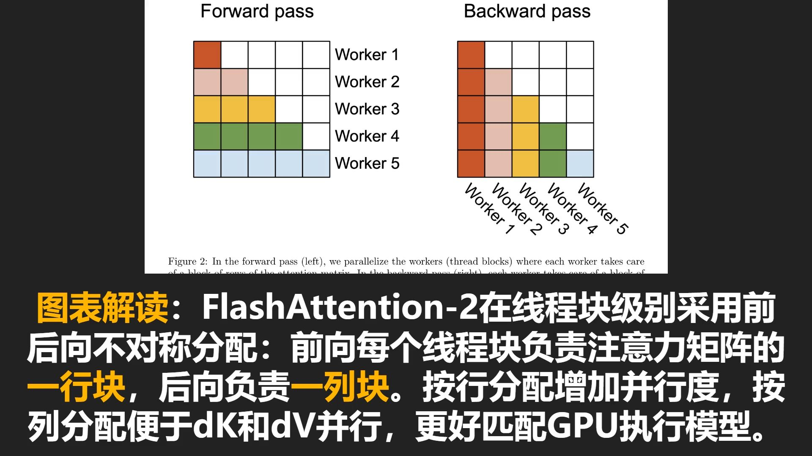](https://www.bilibili.com/video/BV1yfd6B8E37)
---

### [21] 在线softmax：论文解读【每天一个宝藏论文】
- 观看视频：[BV1Qkd6B3EUe](https://www.bilibili.com/video/BV1Qkd6B3EUe)
[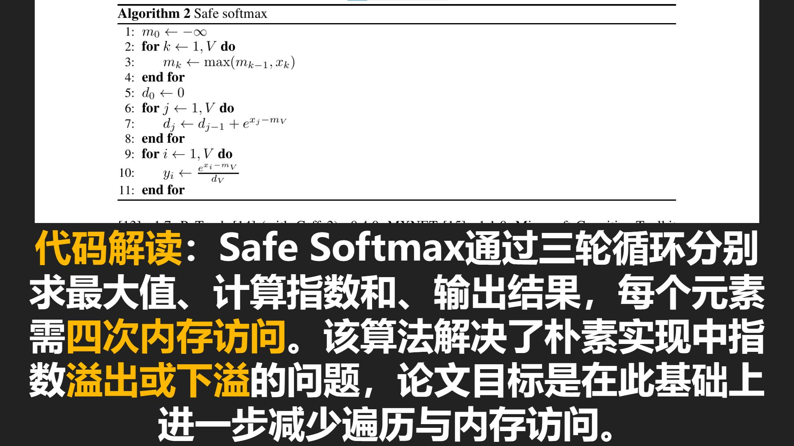](https://www.bilibili.com/video/BV1Qkd6B3EUe)
---

### [20] 投机采样：大模型推理加速论文解读【每天一个宝藏论文】
- 观看视频：[BV1V6d6BCEzJ](https://www.bilibili.com/video/BV1V6d6BCEzJ)
[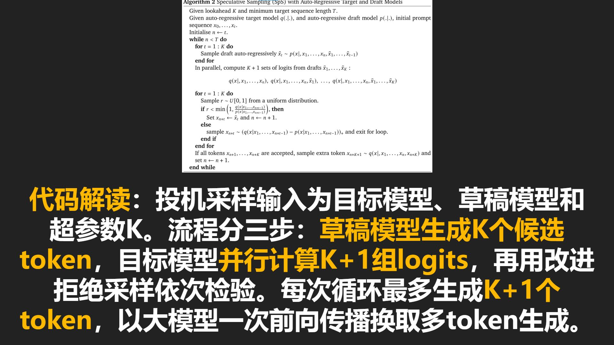](https://www.bilibili.com/video/BV1V6d6BCEzJ)
---

### [19] DeepSeek-V4逐图、逐公式解读【每天一个宝藏论文】
- 观看视频：[BV1Mgo5BwEST](https://www.bilibili.com/video/BV1Mgo5BwEST)
[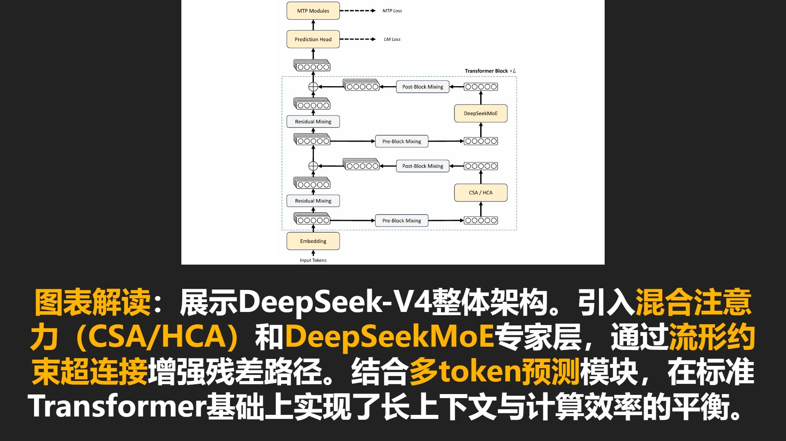](https://www.bilibili.com/video/BV1Mgo5BwEST)
---

### [18] SmoothQuant：大模型量化论文解读【每天一个宝藏论文】
- 观看视频：[BV1CkoPBbEyB](https://www.bilibili.com/video/BV1CkoPBbEyB)
[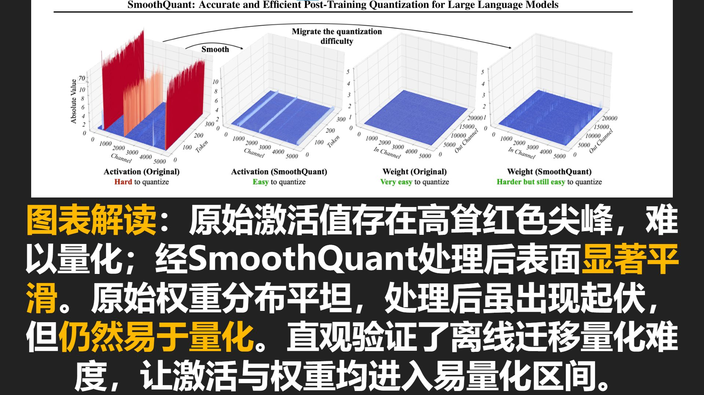](https://www.bilibili.com/video/BV1CkoPBbEyB)
---

### [17] FlashAttention-1论文解读 【每天一个宝藏论文】
- 观看视频：[BV1XPoNB5EQy](https://www.bilibili.com/video/BV1XPoNB5EQy)

---

### [16] LLM.int8()：大模型量化论文解读【每天一个宝藏论文】
- 观看视频：[BV1BeoNB9EQP](https://www.bilibili.com/video/BV1BeoNB9EQP)
[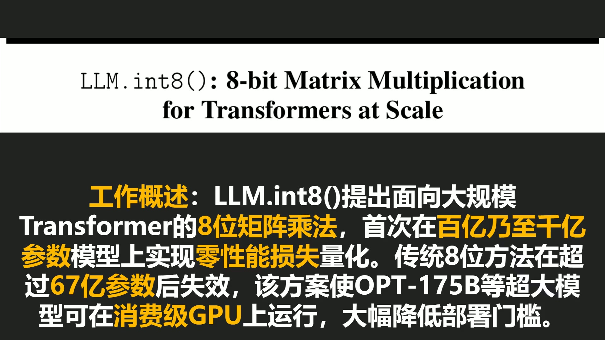](https://www.bilibili.com/video/BV1BeoNB9EQP)
---

### [15] PagedAttention：vLLM论文解读【每天一个宝藏论文】
- 观看视频：[BV1xJoNBPEqe](https://www.bilibili.com/video/BV1xJoNBPEqe)

---

### [14] AWQ：大语言模型量化论文解读 【每天一个宝藏论文】
- 观看视频：[BV1RuoFBvEm8](https://www.bilibili.com/video/BV1RuoFBvEm8)

---

### ［12］读2个多Agent共享KV Cache的论文【每周一个宝藏论文】
- 观看视频：[BV1B997BmEGr](https://www.bilibili.com/video/BV1B997BmEGr)

---

### ［10］大模型写算子：读两个KernelBench的改进工作【每周一个宝藏论文】
- 观看视频：[BV1M8QUBUESz](https://www.bilibili.com/video/BV1M8QUBUESz)

---

### [8] 读三个强化学习写算子的论文【每周一个宝藏论文】
- 观看视频：[BV1fVckzqE1S](https://www.bilibili.com/video/BV1fVckzqE1S)

---

### [6] Agent写算子：读三个Agent写算子的论文【每周一个宝藏论文】
- 观看视频：[BV1HVPkzEEx9](https://www.bilibili.com/video/BV1HVPkzEEx9)

---

### [4] 大模型写算子：一篇综述+2个数据集【每周一个宝藏论文】
- 观看视频：[BV1pJA6zkEH4](https://www.bilibili.com/video/BV1pJA6zkEH4)

---

### [2] 读上月新鲜出炉的综述：大模型写算子【每周一个宝藏论文】
- 观看视频：[BV1XcfBBGEUw](https://www.bilibili.com/video/BV1XcfBBGEUw)

---

## 每周一个宝藏实验

### [13] AutoDL上部署龙虾，它能帮忙测试算子性能吗？【每周一个宝藏实验】
- 观看视频：[BV1XMX5BZEGF](https://www.bilibili.com/video/BV1XMX5BZEGF)

---

### [11] 跑robust-kbench测试LLM写算子，附Agent提示词【每周一个宝藏实验】
- 观看视频：[BV1vxAszpE3P](https://www.bilibili.com/video/BV1vxAszpE3P)

---

### [9] 跑CUDA-L2测试和cuBLAS相比效果如何？【每周一个宝藏实验】
- 观看视频：[BV1QPwszCE39](https://www.bilibili.com/video/BV1QPwszCE39)

---

### [7] 跑KernelBench测试LLM将PyTorch转译为CUDA代码的能力（ICML2025）【每周一个宝藏实验】
- 观看视频：[BV1gzPyzuERu](https://www.bilibili.com/video/BV1gzPyzuERu)

---

### [5] 快速上手FuctionCall和React：极简易百词斩Agent【每周一个宝藏实验】
- 观看视频：[BV1nUAazDEma](https://www.bilibili.com/video/BV1nUAazDEma)

---

### [3] 从采摘200片三叶草开始训练一个简易无条件DDPM 【每周一个宝藏实验】
- 观看视频：[BV1PcfEBrEBs](https://www.bilibili.com/video/BV1PcfEBrEBs)

---

### [1]. 跑通TritonBench测试LLM的算子生成能力(ACL2025)【每周一个宝藏实验】
- 观看视频：[BV12xZBBwEKf](https://www.bilibili.com/video/BV12xZBBwEKf)

---

## 其他

*暂无视频*
